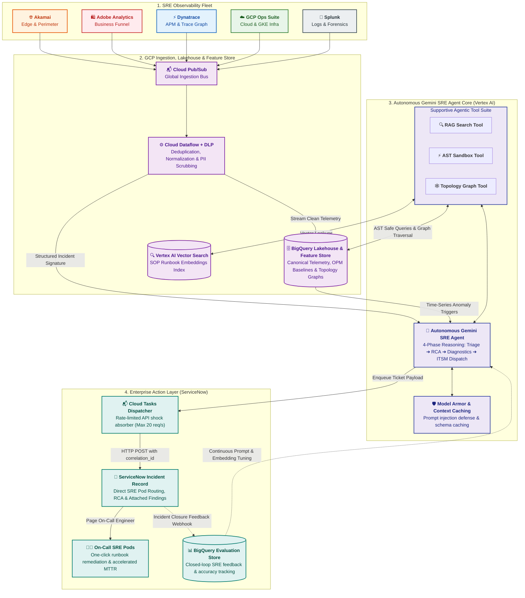

# Enterprise AIOps Platform Architecture Documentation

Welcome to the architectural specification repository for the **Enterprise AIOps Platform**. This platform provides intelligent, automated incident response, predictive anomaly detection, and root cause analysis for the Site Reliability Engineering (SRE) team of a global retail organization.

---

## 🌳 Architectural Documentation Tree

```
docs/
├── README.md                                          # 📍 You are here (Master Index & Architecture Navigation)
└── architecture/
    ├── 00_overview/
    │   └── aiops_platform_overview.md                 # 🏛️ High-Level Platform Design, Business Context & End-to-End Flows
    ├── 01_ingestion/
    │   ├── README.md                                  # ⚡ Ingestion Module Overview & Directory Index
    │   ├── ingestion_architecture.md                  # ⚙️ Ingestion Master Blueprint: First-Mile & Streaming Pipelines
    │   ├── source_telemetry_matrix.md                 # 📊 SRE Observability Fleet: Profiles & Canonical Mappings (5 Tools)
    │   ├── data_contracts_and_schemas.md              # 📜 Canonical Event Schemas (CEF/JSON/Parquet) & Cloud DLP
    │   └── ingestion_best_practices.md                # 💡 Resilience, Deduplication, SLIs & Watermarking
    ├── 02_storage_and_lakehouse/
    │   ├── lakehouse_architecture.md                  # 🗄️ BigQuery Lakehouse, Parquet on GCS, Partitioning & Retention
    │   └── data_processing_and_feature_store.md       # ⚡ Stateful Alert Windowing, Feature Store, Graph ETL & RAG Vectorization
    ├── 03_intelligence_and_reasoning/
    │   └── aiops_intelligence_layer.md                # 🤖 Autonomous Gemini SRE Agent, Supportive Tooling & Guardrails
    └── 04_itsm_and_remediation/
        └── servicenow_integration.md                  # 🎫 ServiceNow ITSM Integration, CMDB Sync, Dispatch & HITL Remediation
```

---

## 🗺️ High-Level Platform Map



---

## 🚀 Quick Navigation by Domain

| Role / Focus Area | Recommended Reading Path |
| :--- | :--- |
| **Enterprise AI Architects** | 1. [aiops_platform_overview.md](file:///c:/Users/ToanBX/dev/personal/aiops_architect/docs/architecture/00_overview/aiops_platform_overview.md)<br/>2. [aiops_intelligence_layer.md](file:///c:/Users/ToanBX/dev/personal/aiops_architect/docs/architecture/03_intelligence_and_reasoning/aiops_intelligence_layer.md)<br/>3. [data_processing_and_feature_store.md](file:///c:/Users/ToanBX/dev/personal/aiops_architect/docs/architecture/02_storage_and_lakehouse/data_processing_and_feature_store.md)<br/>4. [servicenow_integration.md](file:///c:/Users/ToanBX/dev/personal/aiops_architect/docs/architecture/04_itsm_and_remediation/servicenow_integration.md) |
| **Data & Pipeline Engineers** | 1. [ingestion_architecture.md](file:///c:/Users/ToanBX/dev/personal/aiops_architect/docs/architecture/01_ingestion/ingestion_architecture.md)<br/>2. [source_telemetry_matrix.md](file:///c:/Users/ToanBX/dev/personal/aiops_architect/docs/architecture/01_ingestion/source_telemetry_matrix.md)<br/>3. [data_contracts_and_schemas.md](file:///c:/Users/ToanBX/dev/personal/aiops_architect/docs/architecture/01_ingestion/data_contracts_and_schemas.md)<br/>4. [data_processing_and_feature_store.md](file:///c:/Users/ToanBX/dev/personal/aiops_architect/docs/architecture/02_storage_and_lakehouse/data_processing_and_feature_store.md) |
| **SRE & Operations Engineers** | 1. [source_telemetry_matrix.md](file:///c:/Users/ToanBX/dev/personal/aiops_architect/docs/architecture/01_ingestion/source_telemetry_matrix.md)<br/>2. [servicenow_integration.md](file:///c:/Users/ToanBX/dev/personal/aiops_architect/docs/architecture/04_itsm_and_remediation/servicenow_integration.md)<br/>3. [ingestion_best_practices.md](file:///c:/Users/ToanBX/dev/personal/aiops_architect/docs/architecture/01_ingestion/ingestion_best_practices.md) |
| **Security & Compliance** | 1. [data_contracts_and_schemas.md#dlp](file:///c:/Users/ToanBX/dev/personal/aiops_architect/docs/architecture/01_ingestion/data_contracts_and_schemas.md)<br/>2. [aiops_intelligence_layer.md#guardrails](file:///c:/Users/ToanBX/dev/personal/aiops_architect/docs/architecture/03_intelligence_and_reasoning/aiops_intelligence_layer.md) |
