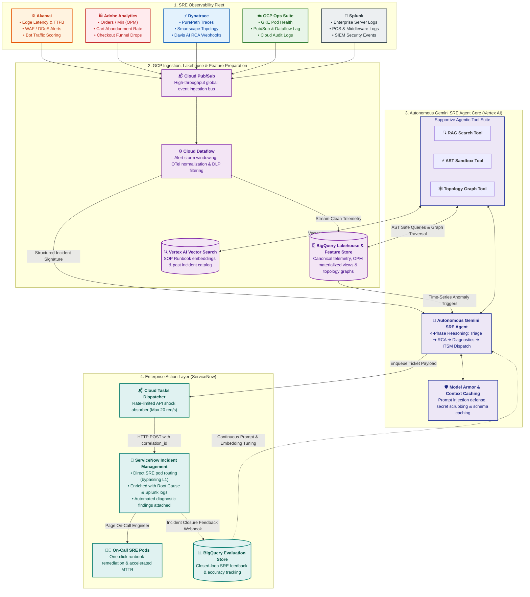

# Enterprise AIOps Platform - High-Level Architecture Overview

## 1. Executive Summary & Business Objective

Modern global enterprise operations face extreme telemetry fragmentation. For a large multi-channel retail organization, operations span thousands of edge locations, extensive cloud footprints, and millions of customer transactions per hour.

The **Enterprise AIOps Platform** consolidates disparate observability streams from the SRE team's 5 core tools—**Google Cloud Platform (GCP)**, **Dynatrace**, **Akamai**, **Splunk**, and **Adobe Analytics**—into a centralized intelligence engine natively hosted on Google Cloud Platform. The platform correlates business transactions with technical performance to automate incident triage, accelerate root cause identification, and trigger proactive remediation in **ServiceNow**.

```mermaid
flowchart LR
    subgraph Sources["Observability Telemetry"]
        direction TB
        S1["🌐 Akamai"]
        S2["🛍️ Adobe Analytics"]
        S3["⚡ Dynatrace"]
        S4["☁️ GCP Operations"]
        S5["📜 Splunk"]
    end

    subgraph GCP["GCP AIOps Core"]
        direction TB
        Ingest["High-Throughput Ingestion<br/>(Pub/Sub + Dataflow)"]
        Lakehouse["Unified Data Lakehouse & Features<br/>(BigQuery + Feature Store)"]
        AI["Autonomous Gemini SRE Agent<br/>(Supportive Tools & RAG)"]
    end

    subgraph Action["Enterprise Action"]
        direction TB
        SNOW["ServiceNow ITSM"]
        SRE["SRE Remediation"]
    end

    Sources ==> Ingest
    Ingest --> Lakehouse
    Lakehouse --> AI
    AI ==> SNOW
    SNOW --> SRE
    SNOW -.->|Closed-Loop Feedback| Lakehouse

    classDef s fill:#ECEFF1,stroke:#37474F,stroke-width:2px,color:#263238;
    classDef g fill:#EDE7F6,stroke:#512DA8,stroke-width:2px,color:#311B92;
    classDef a fill:#E0F2F1,stroke:#00695C,stroke-width:2px,color:#004D40;

    class S1,S2,S3,S4,S5 s;
    class Ingest,Lakehouse,AI g;
    class SNOW,SRE a;
```

---

## 2. Core Architectural Pillars

### 2.1 Multi-Source Ingestion to GCP Core
While telemetry originates from diverse specialized tools across edge networks, cloud platforms, and enterprise data centers, **all centralized stream processing, analytical storage, and AI reasoning workloads run natively on Google Cloud Platform (GCP)**. This prevents vendor lock-in across tool providers while consolidating data for cross-domain ML models.

### 2.2 ServiceNow as the Definitive ITSM System of Record
**ServiceNow** is the enterprise system of record for all incident lifecycles, configuration item (CMDB) topologies, on-call schedules, and automated remediation audit logs. The AIOps layer communicates bidirectionally via standard ServiceNow REST APIs to enrich existing records, generate consolidated incidents, and bypass manual L1 triage.

### 2.3 Event-Driven Streaming & Elastic Scale
The platform is built on an event-driven architecture using **Cloud Pub/Sub** and **Cloud Dataflow (Apache Beam)**. It comfortably sustains normal loads of 150,000+ Events Per Second (EPS) and auto-scales to absorb peak promotional traffic (e.g., Black Friday / Cyber Monday surges exceeding 500,000 EPS) without message loss or latency degradation.

### 2.4 Actionable AI & Autonomous Incident Diagnostics
Rather than producing passive dashboards, the AI architecture utilizes the **Autonomous Gemini SRE Agent** with **Supportive Function Calling Tools** to execute tangible operational workflows:
* De-duplicating cascading alerts into unified incident signatures.
* Retrieving matching Standard Operating Procedures (SOPs) from **Vertex AI Vector Search**.
* Automatically executing non-destructive diagnostic queries and posting synthesized findings to ServiceNow tickets.
* Capturing closed-loop SRE feedback upon ticket closure to continuously evaluate and tune prompts.

---

## 3. End-to-End Architectural Flow

---

## 4. Architectural Domain Map & Detailed References

| Architecture Domain | Scope & Responsibilities | Deep-Dive Specification |
| :--- | :--- | :--- |
| **01. Ingestion Architecture** | Transport protocols, Pub/Sub topologies, Dataflow Beam pipelines, Cloud DLP scrubbing, dead-letter queues, and unified telemetry matrix for all 5 observability tools. | • [01_ingestion/README.md](file:///c:/Users/ToanBX/dev/personal/aiops_architect/docs/architecture/01_ingestion/README.md) • [source_telemetry_matrix.md](file:///c:/Users/ToanBX/dev/personal/aiops_architect/docs/architecture/01_ingestion/source_telemetry_matrix.md) |
| **02. Storage, Lakehouse & Data Processing** | BigQuery dataset designs, table partitioning by ingestion time, Parquet on GCS cold storage tiering, stateful alert clustering, time-series resampling, and topology graph ETL. | • [lakehouse_architecture.md](file:///c:/Users/ToanBX/dev/personal/aiops_architect/docs/architecture/02_storage_and_lakehouse/lakehouse_architecture.md) • [data_processing_and_feature_store.md](file:///c:/Users/ToanBX/dev/personal/aiops_architect/docs/architecture/02_storage_and_lakehouse/data_processing_and_feature_store.md) |
| **03. Intelligence & Reasoning** | Autonomous Gemini SRE Agent runtime, 4-phase reasoning lifecycle, supportive function calling tools (RAG, AST Sandbox, Topology Graph), Model Armor guardrails, and context caching. | [aiops_intelligence_layer.md](file:///c:/Users/ToanBX/dev/personal/aiops_architect/docs/architecture/03_intelligence_and_reasoning/aiops_intelligence_layer.md) |
| **04. ITSM & Remediation** | ServiceNow Incident Management integration, bidirectional lifecycle synchronization, CMDB topological sync, and automated diagnostic execution. | [servicenow_integration.md](file:///c:/Users/ToanBX/dev/personal/aiops_architect/docs/architecture/04_itsm_and_remediation/servicenow_integration.md) |
