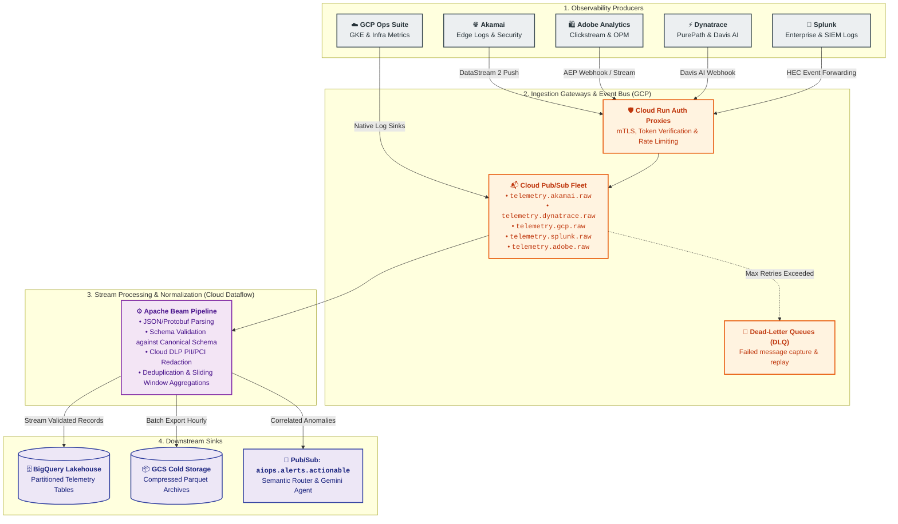

# Ingestion Layer Master Architecture Guide

## 1. Overview & Architectural Role

The **Ingestion Layer** is the high-throughput, fault-tolerant gateway of the Enterprise AIOps Platform. It is responsible for continuously capturing, authenticating, buffering, validating, and normalizing heterogeneous telemetry streams from the SRE team's 5 observability tools: **Akamai**, **Dynatrace**, **GCP Operations Suite**, **Splunk**, and **Adobe Analytics**.

All telemetry is ingested into **Google Cloud Platform (GCP)**, where it is cleansed, de-identified of sensitive PCI/PII data via **Cloud DLP**, and routed concurrently to **BigQuery** (for historical baselining and BQML) and the **Vertex AI Intelligence Layer** (for sub-minute alert routing and automated triage).

---

## 2. Ingestion Matrix & Protocol Specifications

The table below outlines the end-to-end ingestion profile across all five SRE monitoring sources:

| Source System | Emitted Telemetry Types | Ingestion Mechanism | Target Pub/Sub Topic | Peak Throughput (EPS) | Daily Data Volume | Ingestion SLA (Latency) |
| :--- | :--- | :--- | :--- | :--- | :--- | :--- |
| **Akamai** | Edge Request Logs, TTFB, WAF Triggers, DDoS Vectors, Bot Scores | Akamai DataStream 2 HTTPS Push ➔ Cloud Run Ingress Gateway | `telemetry.akamai.raw` | 150,000 EPS | 4 – 6 TB / day | $< 10$ seconds |
| **Dynatrace** | PurePath Spans, Smartscape Topology, Davis AI Problem Webhooks | Dynatrace Webhook ➔ Cloud Run Gateway; OTel Exporter | `telemetry.dynatrace.raw` | 80,000 EPS | 2 – 4 TB / day | $< 5$ seconds |
| **GCP Ops Suite** | GKE Pod Metrics, Pub/Sub & Dataflow Metrics, Cloud Audit Logs | Native Cloud Logging Log Router Sinks & Managed Prometheus | `telemetry.gcp.raw` | 100,000 EPS | 3 – 5 TB / day | Sub-second – 1 min |
| **Splunk** | Enterprise Infrastructure Logs, POS Logs, SIEM Notable Events | Splunk HTTP Event Collector (HEC) Forwarder ➔ Cloud Run Gateway | `telemetry.splunk.raw` | 90,000 EPS | 3 – 6 TB / day | 1 – 3 minutes |
| **Adobe Analytics** | Real-time Clickstream, Orders Per Minute (OPM), Cart Drops | AEP Streaming Connector / Webhooks; Hourly Raw Data Feeds | `telemetry.adobe.raw` | 40,000 EPS | 1 – 2 TB / day | 1 – 2 minutes |
| **Total Ingestion Fleet** | **Unified Multi-Domain Telemetry** | **Consolidated Hybrid Ingestion** | **5 Partitioned Topics** | **460,000 EPS (Peak)** | **13 – 23 TB / day** | **Near Real-Time** |

---

## 3. Core Architectural Patterns

### 3.1 Dedicated Topic Per Tool Architecture
To ensure complete fault isolation, independent scaling, and distinct IAM access control, each source tool publishes to a dedicated Cloud Pub/Sub topic. If a surge in Akamai edge logs occurs during a DDoS attack, it does not saturate or cause head-of-line blocking for Dynatrace code-level problem webhooks.

### 3.2 Dual-Tier Ingestion Gateway (Cloud Run + Pub/Sub)
External webhook and streaming producers (Akamai, Splunk, Dynatrace, Adobe) do not connect directly to Pub/Sub with static service account keys. Instead, they authenticate against a lightweight, horizontally autoscaling **Cloud Run Ingestion Gateway**:
* Validates incoming HMAC signatures, bearer tokens, or mTLS certificates against **GCP Secret Manager**.
* Enforces per-tool rate limiting and token bucket throttling.
* Buffers payloads directly into the appropriate regional Pub/Sub topic using IAM Workload Identity.

### 3.3 Dead-Letter Queues (DLQ) & Poison Message Isolation
Each Pub/Sub subscription is configured with a Dead-Letter Queue:
* Maximum Delivery Attempts: `5`
* Exponential Backoff: Minimum `1s`, Maximum `60s`
* After 5 unsuccessful delivery or parsing attempts in Dataflow, messages are diverted to `telemetry.<source>.dlq` for forensic analysis without halting the streaming pipeline.

### 3.4 Scalability & Cyber Monday Surge Handling
* **Normal Load**: 150,000 EPS (~30 MB/sec aggregate throughput).
* **Peak Promotional Load**: 460,000+ EPS (~120 MB/sec aggregate throughput).
* **Elastic Autoscaling**: Cloud Dataflow automatically scales worker pools (from 10 up to 100 `n2-standard-4` workers) based on Pub/Sub `oldest_unacked_message_age` and CPU utilization.

---

## 4. Ingestion Documentation Sub-Modules

Explore the granular specifications within the Ingestion Architecture:

1. 📜 **[Data Contracts & Canonical Schemas](file:///c:/Users/ToanBX/dev/personal/aiops_architect/docs/architecture/01_ingestion/data_contracts_and_schemas.md)**: Universal telemetry schema (CEF), field typing, schema evolution, and Cloud DLP masking rules.
2. ⚙️ **[End-to-End Ingestion & Streaming Pipelines](file:///c:/Users/ToanBX/dev/personal/aiops_architect/docs/architecture/01_ingestion/streaming_pipelines.md)**: First-mile ingestion patterns, Apache Beam pipeline stages, stateful deduplication, windowing, and BigQuery write optimization.
3. 🌐 **[Akamai DataStream Connector](file:///c:/Users/ToanBX/dev/personal/aiops_architect/docs/architecture/01_ingestion/connectors/akamai_datastream.md)**: Edge access logs, WAF alerts, and token authentication.
4. ⚡ **[Dynatrace Ingestion Connector](file:///c:/Users/ToanBX/dev/personal/aiops_architect/docs/architecture/01_ingestion/connectors/dynatrace_ingestion.md)**: Davis AI problem webhooks, Smartscape entity graph synchronization, and OpenTelemetry spans.
5. ☁️ **[GCP Operations Ingestion Connector](file:///c:/Users/ToanBX/dev/personal/aiops_architect/docs/architecture/01_ingestion/connectors/gcp_ops_ingestion.md)**: Native Log Router sinks, Managed Prometheus metric scraping, and Cloud Audit ingestion.
6. 📜 **[Splunk HEC Connector](file:///c:/Users/ToanBX/dev/personal/aiops_architect/docs/architecture/01_ingestion/connectors/splunk_hec_ingestion.md)**: HTTP Event Collector forwarding, SIEM events, and the SRE forensic query proxy.
7. 🛍️ **[Adobe Analytics Streaming Connector](file:///c:/Users/ToanBX/dev/personal/aiops_architect/docs/architecture/01_ingestion/connectors/adobe_analytics_stream.md)**: AEP streaming events, clickstream batch feeds, and Orders Per Minute (OPM) extraction.
