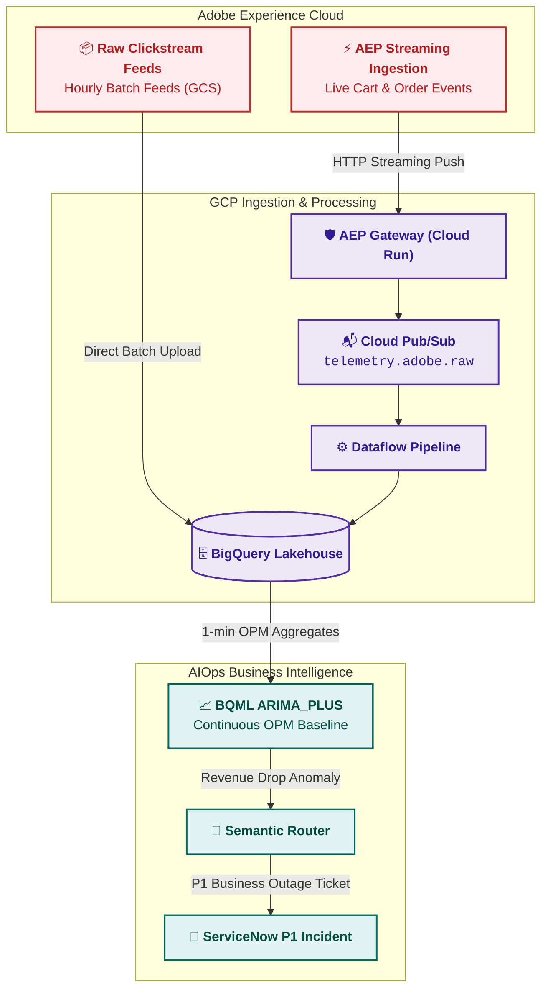

# Ingestion Connector: Adobe Analytics (Digital Experience & Business Telemetry)

## 1. Overview & Connector Role

**Adobe Analytics** captures customer journey events, checkout funnels, and real-time revenue KPIs across digital web portals and mobile applications.

The **Adobe Analytics Connector** bridges the gap between digital retail business health and IT operational monitoring. By ingesting streaming clickstream and business transaction events into GCP, the AIOps platform enables **Silent Outage Detection**—detecting when business revenue drops due to UI/client bugs even when backend infrastructure returns HTTP 200 OK.

---

## 2. Ingestion Mechanics

### 2.1 AEP Streaming Connector
* **Protocol**: Real-time HTTP POST event stream from Adobe Experience Platform (AEP) Edge Network to Cloud Run Gateway.
* **Latency**: 1 – 2 minutes from user browser interaction to BigQuery availability.
* **Event Filtering**: Only high-value conversion events (`purchase`, `scCheckout`, `scAdd`, `paymentError`) are streamed in real time.

### 2.2 Raw Clickstream Hourly Data Feeds
* **Delivery**: Compressed TSV/Parquet clickstream data feeds exported hourly from Adobe Data Warehouse to Google Cloud Storage (`gs://aiops-adobe-datafeeds/`).
* **Ingestion**: BigQuery Data Transfer Service (DTS) automatically loads feeds into partitioned analytical tables for historical baseline training.

---

## 3. Data Schema & Business KPI Mappings

| Adobe Raw Field | Canonical Field | Business KPI Description | ML Baseline Model |
| :--- | :--- | :--- | :--- |
| `hitid_high` + `hitid_low` | `event_id` | Unique clickstream hit identifier | Event deduplication |
| `date_time` | `timestamp` | UTC user interaction timestamp | Time-series forecasting |
| `events` (`event1`, `purchase`)| `metrics[opm]` | Orders Per Minute (OPM) count | BQML `ARIMA_PLUS` Anomaly Detection |
| `scAdd` / `scCheckout` | `business_context.funnel_stage` | Checkout Funnel progression | Funnel conversion drop rate |
| `revenue` | `business_context.estimated_revenue_loss_usd` | Transaction Gross Value ($) | Financial outage severity ranking |
| `user_agent` / `browser` | `business_context.user_cohort` | Client browser & OS version | Client-side release bug isolation |
| `payment_gateway_status` | `log_payload.error_code` | Third-party payment gateway error | Gateway vendor failover trigger |

---

## 4. Silent Outage Detection Architecture

1. **Continuous 1-Minute Aggregation**: Dataflow aggregates Orders Per Minute (OPM) and Cart Additions across 60-second tumbling windows.
2. **ARIMA_PLUS Evaluation**: BigQuery ML evaluates the real-time OPM against seasonal retail historical baselines (accounting for day-of-week, hour-of-day, and promotional events).
3. **Automated P1 Alerting**: If OPM drops below 3 standard deviations ($Z < -3.0$) for 3 consecutive minutes, a high-priority business incident is immediately pushed to ServiceNow with estimated dollar loss per minute.
