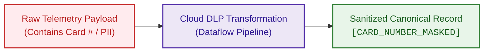

# Telemetry Data Contracts, Canonical Schemas & DLP Specifications

## 1. Overview & Objectives

In a heterogeneous enterprise observability ecosystem, each tool emits telemetry in proprietary, non-standard formats (e.g., Dynatrace PurePath JSON, Akamai DataStream records, Splunk CIM, Adobe HIT clickstream, GCP LogEntry). 

To enable centralized ML anomaly detection, Vertex AI LLM correlation, and cross-domain root-cause analysis, the Ingestion Layer enforces a **Canonical Telemetry Event Contract**. All incoming raw streams are mapped and validated into this unified schema inside **Cloud Dataflow** before writing to **BigQuery** or publishing to the **Vertex AI Reasoning Bus**.

---

## 2. Canonical Telemetry Event Schema

The Canonical Schema is formally defined in **Apache Avro** and **JSON Schema** formats, supporting backward and forward schema evolution.

### 2.1 JSON Schema Specification (`aiops.canonical.event.v1`)

```json
{
  "$schema": "https://json-schema.org/draft/2020-12/schema",
  "title": "AIOpsCanonicalEvent",
  "type": "object",
  "required": ["event_id", "timestamp", "source_tool", "domain", "severity", "entity"],
  "properties": {
    "event_id": {
      "type": "string",
      "format": "uuid",
      "description": "Globally unique deterministic or UUIDv4 event identifier for deduplication."
    },
    "timestamp": {
      "type": "string",
      "format": "date-time",
      "description": "UTC ISO-8601 timestamp when the event occurred at source."
    },
    "ingestion_timestamp": {
      "type": "string",
      "format": "date-time",
      "description": "UTC ISO-8601 timestamp when GCP Dataflow processed the record."
    },
    "source_tool": {
      "type": "string",
      "enum": ["AKAMAI", "DYNATRACE", "GCP_OPS", "SPLUNK", "ADOBE_ANALYTICS"],
      "description": "The originating observability tool."
    },
    "domain": {
      "type": "string",
      "enum": ["EDGE_SECURITY", "APM_TRACES", "INFRASTRUCTURE", "ENTERPRISE_LOGS", "BUSINESS_TELEMETRY"],
      "description": "Functional observability domain."
    },
    "severity": {
      "type": "string",
      "enum": ["CRITICAL", "HIGH", "MEDIUM", "LOW", "INFORMATIONAL"],
      "description": "Normalized enterprise severity level."
    },
    "entity": {
      "type": "object",
      "required": ["service_name", "environment"],
      "properties": {
        "service_name": { "type": "string", "example": "checkout-api" },
        "environment": { "type": "string", "enum": ["production", "staging", "development"] },
        "host": { "type": "string", "example": "gke-prod-us-central1-pool-01" },
        "container_name": { "type": "string", "example": "checkout-service-pod-7d4f9" },
        "cloud_provider": { "type": "string", "enum": ["GCP", "AWS", "AZURE", "EDGE_AKAMAI", "ON_PREM"] },
        "region": { "type": "string", "example": "us-central1" },
        "cmdb_ci_id": { "type": "string", "description": "ServiceNow CMDB Configuration Item sys_id" }
      }
    },
    "metrics": {
      "type": "array",
      "items": {
        "type": "object",
        "required": ["name", "value", "unit"],
        "properties": {
          "name": { "type": "string", "example": "response_time_p99" },
          "value": { "type": "number", "example": 2450.5 },
          "unit": { "type": "string", "example": "ms" },
          "dimensions": { "type": "object", "additionalProperties": { "type": "string" } }
        }
      }
    },
    "log_payload": {
      "type": "object",
      "properties": {
        "message": { "type": "string", "description": "DLP-sanitized log message or exception string." },
        "stack_trace": { "type": "string", "description": "DLP-sanitized code call stack." },
        "trace_id": { "type": "string", "example": "4bf92f3577b34da6a3ce929d0e0e4736" },
        "span_id": { "type": "string", "example": "00f067aa0ba902b7" },
        "error_code": { "type": "string", "example": "HTTP_504_GATEWAY_TIMEOUT" }
      }
    },
    "business_context": {
      "type": "object",
      "properties": {
        "orders_per_minute": { "type": "number", "example": 420.0 },
        "cart_abandonment_rate": { "type": "number", "example": 0.185 },
        "estimated_revenue_loss_usd": { "type": "number", "example": 15400.0 },
        "funnel_stage": { "type": "string", "enum": ["BROWSE", "CART", "CHECKOUT", "PAYMENT"] },
        "user_cohort": { "type": "string", "example": "iOS_App_v18.2" }
      }
    },
    "raw_attributes": {
      "type": "object",
      "description": "Original raw tool attributes retained for forensics (DLP sanitized).",
      "additionalProperties": true
    }
  }
}
```

---

## 3. Tool-to-Canonical Field Mapping Matrix

| Canonical Field | Akamai Mapping | Dynatrace Mapping | GCP Ops Suite Mapping | Splunk Mapping | Adobe Analytics Mapping |
| :--- | :--- | :--- | :--- | :--- | :--- |
| `event_id` | `reqId` | `problemId` / PurePath Span ID | `insertId` | `_cd` / `event_id` | `hitid_high` + `hitid_low` |
| `timestamp` | `start` (epoch) | `startTime` | `timestamp` | `_time` (epoch) | `date_time` (UTC) |
| `source_tool` | `"AKAMAI"` | `"DYNATRACE"` | `"GCP_OPS"` | `"SPLUNK"` | `"ADOBE_ANALYTICS"` |
| `domain` | `"EDGE_SECURITY"` | `"APM_TRACES"` | `"INFRASTRUCTURE"` | `"ENTERPRISE_LOGS"` | `"BUSINESS_TELEMETRY"` |
| `severity` | Calculated from WAF action / HTTP 5xx | Davis AI Severity (`AVAILABILITY`, `PERFORMANCE`) | `severity` (`CRITICAL`, `ERROR`) | `urgency` / `alert_level` | Anomaly deviation magnitude ($Z$-score) |
| `entity.service_name` | `cpCode` / Host header | Dynatrace `entityName` / Service Tag | `resource.labels.container_name` | `source` / `index` | `reportSuiteID` / App ID |
| `metrics` | TTFB, Bytes Transferred, WAF rule score | Response Time (p95/p99), CPU %, GC pause ms | Container CPU, Memory limit %, Pub/Sub lag | Transaction volume, Search runtime | Orders Per Minute (OPM), Cart Adds, GMV |
| `log_payload.trace_id` | `edgeTraceId` | PurePath `traceId` | `trace` (`projects/.../traces/...`) | CIM field `trace_id` | `marketing_cloud_visitor_id` |
| `business_context` | Geolocation, ISP, Bot Score | User Session tags, Cart Value | N/A | POS store ID, Terminal ID | Orders/Min, Cart Drop %, Funnel stage |

---

## 4. Cloud DLP (Data Loss Prevention) Sanitization Rules

To ensure strict compliance with **PCI-DSS**, **GDPR**, and **CCPA**, all incoming text payloads, log messages, stack traces, and query strings pass through **Google Cloud Data Loss Prevention (Cloud DLP)** inside the Dataflow pipeline before persistent storage in BigQuery.

### 4.1 In-Flight DLP De-Identification Templates



### 4.2 Configured InfoTypes & Transformation Strategies

| InfoType Category | Detected Patterns | Transformation Method | Output Format in BigQuery |
| :--- | :--- | :--- | :--- |
| **Credit Card Numbers** | Visa, MasterCard, Amex, Discover | **Masking**: Mask all characters except last 4 | `************1234` |
| **CVV / CVV2** | 3-4 digit card security codes | **Complete Redaction** | `[CVV_REDACTED]` |
| **Email Addresses** | User email headers and query strings | **Crypto-Deterministic Hash (HMAC-SHA256)** | `hash_e4a8b71...` (enables cross-session cohorting without PII exposure) |
| **Phone Numbers** | US/International phone formats | **Character Replacement** | `[PHONE_REDACTED]` |
| **Authentication Tokens** | Bearer tokens, API Keys, JWT signatures | **Regex Redaction** | `Bearer [TOKEN_REDACTED]` |
| **Passwords / Passphrases** | Form body passwords, connection strings | **String Replacement** | `password=[REDACTED]` |

---

## 5. Schema Evolution & Governance

1. **Forward Compatibility**: New optional fields can be added without breaking existing Dataflow stream parsers.
2. **Schema Registry**: Canonical Avro schemas are stored and versioned in a centralized GCP Cloud Storage schema registry bucket (`gs://aiops-schema-registry/v1/`).
3. **Validation Enforcement**: Messages failing canonical JSON Schema validation are rejected by Dataflow and directed to the Dead-Letter Queue (`telemetry.<source>.dlq`) with an attached `validation_error_code`.
