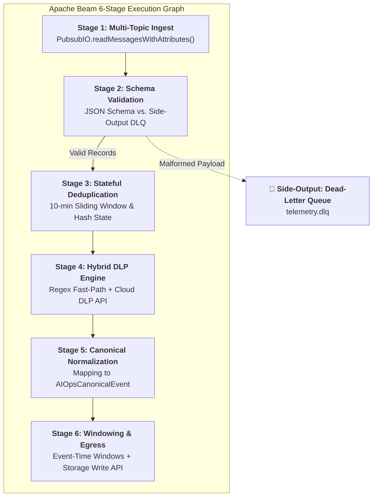
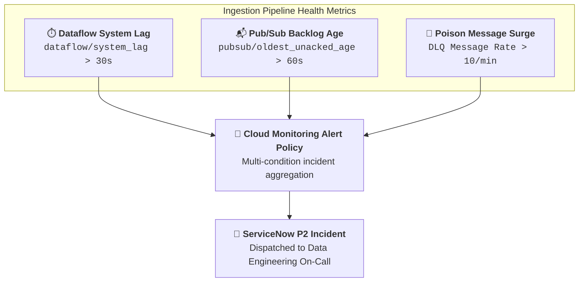

# Ingestion Layer & Streaming Pipelines Master Architecture Guide

This document serves as the authoritative, end-to-end architectural blueprint for the **Enterprise AIOps Ingestion & Stream Processing Engine**. It specifies the complete telemetry lifecycle: from first-mile source extraction across hybrid and multi-cloud environments, through secure ingress gateways and Pub/Sub event-bus buffering, to real-time Apache Beam stream processing on Google Cloud Dataflow.

---

## 1. Overview & Architectural Role

The **Ingestion Layer** is the high-throughput, fault-tolerant gateway of the Enterprise AIOps Platform. It continuously captures, authenticates, buffers, validates, scrubs, and normalizes heterogeneous telemetry streams from the SRE team's 5 observability tools (**Akamai**, **Dynatrace**, **GCP Operations Suite**, **Splunk**, and **Adobe Analytics**) as well as legacy on-premise infrastructure.

All telemetry is ingested into **Google Cloud Platform (GCP)**, de-identified of sensitive PCI/PII data via a **Hybrid Cloud DLP Engine**, and routed concurrently to **BigQuery** (for baseline analytics and ML), **GCS** (for compressed Parquet cold storage), and **Vertex AI / ServiceNow** (for automated incident response).

```mermaid
flowchart TD
    %% 1. PRODUCERS
    subgraph Sources["1. Heterogeneous Observability Sources"]
        direction TB
        Akamai["🌐 <b>Akamai Edge</b><br/>DataStream 2 & WAF Logs"]
        Dyna["⚡ <b>Dynatrace SaaS</b><br/>Davis AI & PurePath"]
        Splunk["📜 <b>Splunk Enterprise</b><br/>SIEM & POS Logs (HEC)"]
        Adobe["🛍️ <b>Adobe Analytics</b><br/>AEP Streaming Clickstream & OPM"]
        Legacy["💾 <b>Legacy On-Premise</b><br/>Monitoring Databases & Daemons"]
        GCPOps["☁️ <b>GCP Native</b><br/>GKE, Audit Logs & Metrics"]
    end

    %% 2. NETWORK & SECURITY PERIMETER
    subgraph Ingress_Perimeter["2. First-Mile Ingress & Security Perimeter (GCP)"]
        direction TB
        CloudArmor["🛡️ <b>Cloud Armor WAF</b><br/>IP Allowlist & Rate Limiting"]
        ExtLB["🌐 <b>Global External Application Load Balancer</b>"]
        VPN["🔒 <b>Cloud Interconnect / Cloud VPN</b><br/>Private Cross-Cloud & On-Prem Transit"]
        CloudRunGW["⚙️ <b>Cloud Run Ingestion Gateway Fleet</b><br/>Bearer Token Auth & Publisher Batching"]
        SecretMgr[("🔐 <b>GCP Secret Manager</b><br/>API Key & Token Vault")]
        CloudSched["⏱️ <b>Cloud Scheduler</b><br/>Cron Polling Trigger (Every 1m)"]
        PollerJob["🏃‍♂️ <b>Cloud Run Poller Job</b><br/>Stateful High-Watermark Querying"]
        LogRouter["🚦 <b>Cloud Logging Log Router</b><br/>Direct Internal Sinks"]
    end

    %% 3. EVENT BUS
    subgraph Event_Bus["3. Cloud Pub/Sub Shock Absorber Fleet"]
        direction TB
        T_Akamai["📬 <code>telemetry.akamai.raw</code>"]
        T_Dyna["📬 <code>telemetry.dynatrace.raw</code>"]
        T_Splunk["📬 <code>telemetry.splunk.raw</code>"]
        T_Adobe["📬 <code>telemetry.adobe.raw</code>"]
        T_Legacy["📬 <code>telemetry.legacy.raw</code>"]
        T_GCP["📬 <code>telemetry.gcp.raw</code>"]
        DLQ_Fleet["🚨 <code>telemetry.*.dlq</code> (Dead-Letter Queues)"]
    end

    %% 4. STREAM ETL
    subgraph Dataflow_Core["4. Cloud Dataflow (Apache Beam) Stream Processing"]
        direction TB
        BeamPipeline["⚙️ <b>Apache Beam 6-Stage Streaming Topology</b><br/>• Multi-Topic Ingest<br/>• Schema Validation<br/>• Stateful Deduplication (10m Buffer)<br/>• 2-Tier Hybrid DLP Scrubbing<br/>• Canonical Normalization (CEF/Avro)<br/>• Event-Time Windowing & Write API"]
    end

    %% 5. OUTPUTS
    subgraph Storage_Sinks["5. Ingestion Storage Sinks & Action Routing"]
        direction TB
        BQ_Table[("🗄️ <b>BigQuery Lakehouse</b><br/>Date-Partitioned & Clustered Tables")]
        GCS_Parquet[("📦 <b>GCS Cold Storage</b><br/>Hive-Partitioned Snappy Parquet")]
        Actionable_Topic["🧠 <b>Pub/Sub: <code>aiops.alerts.actionable</code></b><br/>To Vertex AI Agent & ServiceNow ITSM"]
        Late_Data_Sink[("📦 <b>GCS Late-Data Archive</b><br/>Out-of-Bounds (>15m) Telemetry")]
    end

    %% CONNECTIONS
    Akamai -->|"Public HTTPS POST"| CloudArmor
    Dyna -->|"Public HTTPS Webhook"| CloudArmor
    Adobe -->|"Streaming HTTP Push"| CloudArmor
    Splunk -->|"HEC Event Forwarding"| CloudArmor

    CloudArmor --> ExtLB
    ExtLB --> CloudRunGW
    CloudRunGW -.->|"Verify Bearer Token"| SecretMgr
    
    Legacy -->|"Private Query"| VPN
    VPN --> PollerJob
    CloudSched -->|"Trigger (Every 1m)"| PollerJob

    GCPOps -->|"Direct Internal Route"| LogRouter

    CloudRunGW -->|"Batched Async Publish"| T_Akamai
    CloudRunGW -->|"Batched Async Publish"| T_Dyna
    CloudRunGW -->|"Batched Async Publish"| T_Splunk
    CloudRunGW -->|"Batched Async Publish"| T_Adobe
    PollerJob -->|"Batched Publish"| T_Legacy
    LogRouter -->|"Native Pub/Sub Sink"| T_GCP

    T_Akamai --> BeamPipeline
    T_Dyna --> BeamPipeline
    T_Splunk --> BeamPipeline
    T_Adobe --> BeamPipeline
    T_Legacy --> BeamPipeline
    T_GCP --> BeamPipeline

    T_Akamai -.->|"Max Retries Exceeded"| DLQ_Fleet
    T_Dyna -.->|"Max Retries Exceeded"| DLQ_Fleet
    T_Splunk -.->|"Max Retries Exceeded"| DLQ_Fleet
    T_Adobe -.->|"Max Retries Exceeded"| DLQ_Fleet

    BeamPipeline -->|"Stream Canonical Records"| BQ_Table
    BeamPipeline -->|"Hourly Batch Parquet"| GCS_Parquet
    BeamPipeline -->|"High-Severity Actionable Alerts"| Actionable_Topic
    BeamPipeline -.->|"Late Data (>15m Lateness)"| Late_Data_Sink

    %% STYLING
    classDef srcStyle fill:#ECEFF1,stroke:#37474F,stroke-width:2px,color:#263238;
    classDef secStyle fill:#E3F2FD,stroke:#1565C0,stroke-width:2px,color:#0D47A1;
    classDef psStyle fill:#FFF3E0,stroke:#E65100,stroke-width:2px,color:#BF360C;
    classDef dfStyle fill:#F3E5F5,stroke:#7B1FA2,stroke-width:2px,color:#4A148C;
    classDef sinkStyle fill:#E8F5E9,stroke:#2E7D32,stroke-width:2px,color:#1B5E20;

    class Akamai,Dyna,Splunk,Adobe,Legacy,GCPOps srcStyle;
    class CloudArmor,ExtLB,VPN,CloudRunGW,SecretMgr,CloudSched,PollerJob,LogRouter secStyle;
    class T_Akamai,T_Dyna,T_Splunk,T_Adobe,T_Legacy,T_GCP,DLQ_Fleet psStyle;
    class BeamPipeline dfStyle;
    class BQ_Table,GCS_Parquet,Actionable_Topic,Late_Data_Sink sinkStyle;
```

---

## 2. Ingestion Matrix & Protocol Specifications

| Source System | Emitted Telemetry Types | Ingestion Mechanism | Target Pub/Sub Topic | Peak Throughput (EPS) | Daily Data Volume | Ingestion SLA (Latency) | Dead-Letter Topic |
| :--- | :--- | :--- | :--- | :--- | :--- | :--- | :--- |
| **Akamai** | Edge Access Logs, TTFB, WAF Triggers, DDoS Vectors, Bot Scores | DataStream 2 HTTPS Push ➔ Cloud Run Gateway | `telemetry.akamai.raw` | 150,000 EPS | 4 – 6 TB / day | $< 10$ seconds | `telemetry.akamai.dlq` |
| **Dynatrace** | PurePath Spans, Smartscape Topology, Davis AI Problem Webhooks | Davis AI Webhooks ➔ Cloud Run Gateway; OTel Exporter | `telemetry.dynatrace.raw` | 80,000 EPS | 2 – 4 TB / day | $< 5$ seconds | `telemetry.dynatrace.dlq` |
| **GCP Ops Suite** | GKE Pod Metrics, Pub/Sub & Dataflow Metrics, Cloud Audit Logs | Native Cloud Logging Log Router Sinks | `telemetry.gcp.raw` | 100,000 EPS | 3 – 5 TB / day | Sub-second – 1 min | `telemetry.gcp.dlq` |
| **Splunk** | Enterprise Infrastructure Logs, POS Logs, SIEM Notable Events | Splunk HEC Forwarder ➔ Cloud Run Gateway | `telemetry.splunk.raw` | 90,000 EPS | 3 – 6 TB / day | 1 – 3 minutes | `telemetry.splunk.dlq` |
| **Adobe Analytics** | Real-time Clickstream, Orders Per Minute (OPM), Cart Drops | AEP Streaming Connector / Webhooks | `telemetry.adobe.raw` | 40,000 EPS | 1 – 2 TB / day | 1 – 2 minutes | `telemetry.adobe.dlq` |
| **Legacy Systems** | On-Premise Relational DBs & Daemon Health Metrics | Scheduled Cloud Run Poller Job via Cloud VPN | `telemetry.legacy.raw` | 10,000 EPS | 500 GB / day | $< 1$ minute | `telemetry.legacy.dlq` |
| **Total Ingestion Fleet** | **Unified Multi-Domain Telemetry** | **Consolidated Hybrid Ingestion** | **6 Dedicated Topics** | **470,000 EPS (Peak)** | **14 – 24 TB / day** | **Near Real-Time** | — |

---

## 3. First-Mile Ingestion Architecture (Source to Cloud)

To accommodate varied source capabilities across cloud and on-premise environments, telemetry enters GCP via three specialized transport patterns:

### 3.1 Pattern A: Push-Based Ingestion (Modern SaaS & Edge)
Used by **Akamai DataStream 2**, **Dynatrace**, **Splunk HEC**, and **Adobe Analytics**.
* **Transport**: HTTPS `POST` requests sending compressed JSON or newline-delimited JSON payloads.
* **Edge Security**: Traffic enters via **Cloud Armor WAF** attached to a Global External Application Load Balancer:
  - **Source IP Allowlisting**: Restricted to verified egress CIDR ranges of Akamai, Dynatrace, and Adobe infrastructure.
  - **Token Bucket Rate Limiting**: Max 50,000 requests/second per source CIDR to prevent volumetric DoS attacks.
* **Ingress Gateway Fleet**: Stateless, containerized **Cloud Run services** that:
  1. Inspect the `Authorization: Bearer <API_KEY>` header.
  2. Verify credentials against local in-memory cache synchronized with **GCP Secret Manager** (supporting zero-downtime key rotation every 30-90 days).
  3. Buffer incoming requests and perform high-performance publisher batching (`batching.max_messages = 1000`, `batching.max_delay = 50ms`) before calling `pubsub.publish()`.

### 3.2 Pattern B: Pull-Based Polling (Legacy & Air-Gapped Systems)
Used for legacy on-premise monitoring databases (e.g., Oracle/SQL Server operational tables, custom monitoring daemons) unable to push outbound webhooks.
* **Transport**: Private connectivity via **Dedicated Cloud Interconnect** or **HA Cloud VPN**.
* **Orchestration**: **Cloud Scheduler** triggers a containerized **Cloud Run Job** on a 1-minute cron schedule.
* **Pagination & Watermarking**: The poller maintains a high-watermark timestamp in Cloud Storage/Firestore, extracts only delta records, transforms them into JSON, and publishes them into `telemetry.legacy.raw`.

### 3.3 Pattern C: Direct Cloud-Native Routing (GCP Operations Suite)
Used for GKE cluster logs, Cloud Audit Logs, VPC Flow Logs, and Cloud Monitoring metrics.
* **Transport**: GCP internal backbone using **Cloud Logging Log Router**.
* **Zero-Compute Ingress**: Ingestion filters route events directly into `telemetry.gcp.raw` without intermediate compute or proxy layers.

---

## 4. Decoupled Buffer Layer: Cloud Pub/Sub Fleet

Cloud Pub/Sub provides horizontal scalability, zero-maintenance partition management, and strict isolation between monitoring domains.

### 4.1 Topic Topology & Configuration
* **Dedicated Topics**: Each source publishes to an isolated topic (`telemetry.<source>.raw`). A surge in edge logs during a DDoS attack on Akamai cannot saturate or delay critical Dynatrace code-level problem webhooks.
* **Retention Policy**: Topics retain messages for **7 days** (14 days for actionable alerts) enabling rapid backfilling and replay during downstream Dataflow maintenance or failure recovery.
* **Subscription Type**: High-performance pull subscriptions consumed by Dataflow workers via `PubsubIO`.

### 4.2 Poison Message Isolation & DLQ Strategy
To prevent malformed payloads ("poison pills") from causing infinite retry loops and stalling Dataflow workers:
* **Ack Deadline**: Set to `60 seconds` (accommodates batching and DLP scrubbing).
* **Max Delivery Attempts**: `5`.
* **Dead-Letter Redirection**: If a message fails schema parsing or crashes a worker 5 times consecutively, Pub/Sub automatically forwards it to `telemetry.<source>.dlq` with custom delivery attempt metadata and publishes an alert to Cloud Monitoring.

---

## 5. Cloud Dataflow (Apache Beam) Stream Processing Engine

The stream processing tier runs an autoscaling **Apache Beam** pipeline on **Google Cloud Dataflow (Streaming Engine)** implementing a unified 6-stage transformation graph.

### 5.1 Detailed Pipeline Stages

#### Stage 1: High-Throughput Ingestion (`PubsubIO`)
* Reads concurrently from all raw Pub/Sub subscriptions using `PubsubIO.readMessagesWithAttributes()`.
* Retains transport-level attributes: `X-Akamai-Request-ID`, `dynatrace-event-token`, client IP, and ingress timestamps.

#### Stage 2: Schema Validation & DLQ Side-Output
* Parses incoming payloads against standard schema definitions.
* Valid records pass to Stage 3. Unparseable JSON or payloads violating mandatory field typing (`timestamp`, `source_tool`) are branched to a **Side-Output PCollection** and written directly to the Dead-Letter Queue without halting pipeline execution.

#### Stage 3: Stateful Event Deduplication
Due to upstream HTTP retries from Akamai or Splunk forwarders, duplicate records are common.
* **Stateful DoFn**: Implements `@StateId("seen_hashes") ValueState<Boolean>` with an associated `@TimerId("gc_timer")`.
* **Deduplication Key**: Computed SHA-256 hash of `[source_tool + original_event_id + event_timestamp]`.
* **Sliding Buffer**: Holds state for a 10-minute rolling buffer before garbage collecting expired keys.

#### Stage 4: High-Throughput Hybrid Cloud DLP Engine
Processing 470,000 EPS through the external Cloud DLP API directly is cost-prohibitive and quota-limiting. We employ a **2-tier Hybrid DLP Architecture**:
1. **Tier 1 (In-Worker Regex Fast-Path)**: Apache Beam worker memory executes compiled regex matching with the **Luhn Algorithm** to instantly mask credit card numbers, CVVs, and standard SSN patterns directly on the worker CPU ($0$ additional network latency, $0$ API cost).
2. **Tier 2 (Scoped Cloud DLP API Batching)**: Only unstructured free-form text fields (`raw_log`, `stack_trace`, `user_agent_payload`) are batched into groups of 500 and dispatched asynchronously over gRPC channels to the **Cloud DLP API** for advanced dictionary and context-aware PII scrubbing.

#### Stage 5: Canonical Normalization
Transforms heterogeneous source formats into the standardized `AIOpsCanonicalEvent` Avro contract:
* Maps `Dynatrace Davis Problem` $\rightarrow$ Standard Anomaly entity with affected topology nodes.
* Maps `Akamai Origin 504 surges` $\rightarrow$ Standard Network/Edge degradation entity.
* Maps `Adobe OPM Drop` $\rightarrow$ Standard Business KPI Impact entity.
* **Alert Branching**: High-severity anomalies (`severity IN ('CRITICAL', 'FATAL')`) are cloned and published immediately to `aiops.alerts.actionable` for consumption by Vertex AI and automated ServiceNow incident creation.

#### Stage 6: Event-Time Windowing & BigQuery Storage Write API
* **Event-Time Watermarks**: Pipeline windows events using the source's native `event_timestamp`, rather than the GCP ingestion timestamp.
* **Allowed Lateness**: Configured with a `15-minute` allowed lateness window. Events arriving later than 15 minutes are branched to the `Late_Data_Sink` in GCS to prevent corrupting real-time analytical baseline calculations.
* **BigQuery Storage Write API**: Writes canonical events via `BigQueryIO.write().withMethod(Method.STORAGE_WRITE_API)` ensuring exactly-once streaming insertion, sub-second query availability, and zero data duplication.

---

## 6. Downstream Storage Optimization (BigQuery & GCS)

To support both instant AI root-cause analysis and cost-effective long-term ML training:

### 6.1 BigQuery Lakehouse Design
* **Table Partitioning**: Partitioned by day on `event_timestamp` (`_PARTITIONDATE`), with a 90-day hot partition expiration.
* **Table Clustering**: Multi-column clustered on `source_tool`, `severity`, and `service_name`.
* **Query Performance**: Clustering allows Vertex AI agents and SRE dashboards to filter across 50 TB of logs in $< 800\text{ ms}$ while scanning $< 100\text{ MB}$ of data.

### 6.2 GCS Cold Storage Parquet Archiving
* In parallel with BigQuery writes, Dataflow aggregates clean records into 1-hour tumbling windows.
* Flushes data to GCS using `FileIO.write()` configured with **Snappy-compressed Apache Parquet format**.
* Organized in Hive-style folder structures: `gs://aiops-telemetry-lake/raw/source_tool=akamai/year=2026/month=08/day=26/`.

---

## 7. Performance Sizing, Reliability & Observability SLAs

### 7.1 Elastic Compute Sizing
* **Worker Fleet**: `n2-standard-4` (4 vCPU, 16 GB RAM) autoscaling dynamically from **10 workers** (normal load: 150,000 EPS) up to **100 workers** (promotional peak: 470,000+ EPS).
* **Streaming Engine**: Managed GCP Streaming Engine enabled to offload window state storage from worker memory.
* **Backpressure Management**: Flow control limits maximum active Pub/Sub reads based on downstream BigQuery commit latency.
* **Latency SLA**: End-to-end processing (Source $\rightarrow$ Pub/Sub $\rightarrow$ Dataflow $\rightarrow$ BigQuery) is maintained under 3 seconds (p99).

### 7.2 SRE Observability & Alerting Policies
The ingestion infrastructure is self-monitoring using GCP Cloud Monitoring metrics linked to ServiceNow:

1. **Pipeline Processing Lag**: Alert triggered if `dataflow.googleapis.com/job/system_lag` exceeds `30 seconds`.
2. **Shock Absorber Backlog**: Alert triggered if `pubsub.googleapis.com/subscription/oldest_unacked_message_age` exceeds `60 seconds`.
3. **Dead-Letter Surge**: Alert triggered if any DLQ topic receives $> 10\text{ messages/minute}$, immediately dispatching a high-priority incident to the Data Engineering on-call queue in **ServiceNow**.

---

## 8. Ingestion Sub-Modules & Connector References

Explore the granular schema definitions and connector specifications within the Ingestion Architecture:

1. 📜 **[Data Contracts & Canonical Schemas](file:///c:/Users/ToanBX/dev/personal/aiops_architect/docs/architecture/01_ingestion/data_contracts_and_schemas.md)**: Universal telemetry schema (CEF), field typing, schema evolution, and Cloud DLP masking rules.
2. 🌐 **[Akamai DataStream Connector](file:///c:/Users/ToanBX/dev/personal/aiops_architect/docs/architecture/01_ingestion/connectors/akamai_datastream.md)**: Edge access logs, WAF alerts, and token authentication.
3. ⚡ **[Dynatrace Ingestion Connector](file:///c:/Users/ToanBX/dev/personal/aiops_architect/docs/architecture/01_ingestion/connectors/dynatrace_ingestion.md)**: Davis AI problem webhooks, Smartscape entity graph synchronization, and OpenTelemetry spans.
4. ☁️ **[GCP Operations Ingestion Connector](file:///c:/Users/ToanBX/dev/personal/aiops_architect/docs/architecture/01_ingestion/connectors/gcp_ops_ingestion.md)**: Native Log Router sinks, Managed Prometheus metric scraping, and Cloud Audit ingestion.
5. 📜 **[Splunk HEC Connector](file:///c:/Users/ToanBX/dev/personal/aiops_architect/docs/architecture/01_ingestion/connectors/splunk_hec_ingestion.md)**: HTTP Event Collector forwarding, SIEM events, and the SRE forensic query proxy.
6. 🛍️ **[Adobe Analytics Streaming Connector](file:///c:/Users/ToanBX/dev/personal/aiops_architect/docs/architecture/01_ingestion/connectors/adobe_analytics_stream.md)**: AEP streaming events, clickstream batch feeds, and Orders Per Minute (OPM) extraction.
