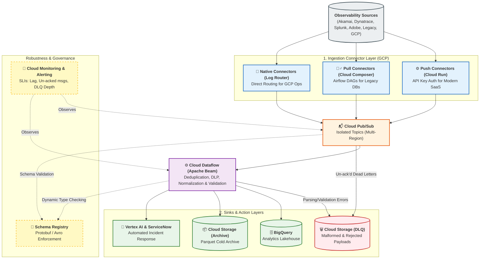

# Ingestion Layer & Streaming Pipelines Architecture

This document outlines the **Enterprise AIOps Ingestion Engine**, which captures telemetry from various observability sources, processes it in real-time, and routes it to downstream analytics and incident response systems.

---

## 1. Simplified Architecture Overview

The architecture follows a streamlined, connector-based approach to securely ingest data from hybrid and multi-cloud environments. The design ensures high throughput, strict security (via API Keys), and real-time processing.

---

## 2. The Connector Architecture

We utilize three specialized connector patterns to ingest telemetry securely into GCP. 

### 2.1 Push Connectors (Modern SaaS & Edge)
Used by sources that can push webhooks in real-time (**Akamai**, **Dynatrace**, **Splunk HEC**, **Adobe Analytics**).
* **Ingress**: Traffic enters via **Cloud Armor WAF** (IP Allowlisting & Rate Limiting).
* **Compute**: Stateless **Cloud Run** services.
* **Authentication**: Requires secure **API Keys** passed in HTTP headers (`Authorization: Bearer <API_KEY>`). The keys are validated in real-time against **GCP Secret Manager**.
* **Action**: Batches validated payloads and publishes to Cloud Pub/Sub.

### 2.2 Pull Connectors (Legacy & Air-Gapped Systems)
Used by on-premise relational databases or air-gapped systems that cannot push outbound traffic.
* **Orchestration**: **Cloud Composer (Apache Airflow)** schedules and runs Directed Acyclic Graphs (DAGs) to periodically extract data.
* **Network**: Queries run securely over a **Cloud VPN** or **Cloud Interconnect**.
* **Action**: Uses pre-built Airflow operators to extract delta records, convert them to JSON, and publish to Cloud Pub/Sub (or drop into Cloud Storage for downstream processing).
* **Advantage**: Easier to maintain, debug, and monitor complex data extraction pipelines using the Airflow UI, with a massive ecosystem of pre-built operators for legacy systems.

### 2.3 Native Connectors (GCP Operations Suite)
Used natively by **Google Kubernetes Engine (GKE)** and **Cloud Audit Logs**.
* **Mechanism**: Leverages **Cloud Logging Log Router Sinks** to route logs natively.
* **Advantage**: Zero-compute ingestion with sub-second latency and no egress costs.

---

## 3. Decoupled Buffer & Stream Processing

### 3.1 Cloud Pub/Sub (The Event Bus)
* **Isolation**: Each connector publishes to a dedicated topic (e.g., `telemetry.akamai.raw`). This prevents traffic spikes in one source from impacting others.
* **Resilience**: Features Dead-Letter Queues (DLQ) to catch and isolate unparseable or malformed payloads.

### 3.2 Cloud Dataflow (Apache Beam)
A unified streaming pipeline processes all telemetry in real-time:
1. **Deduplication**: Removes duplicate events using a 10-minute sliding window.
2. **Hybrid DLP Engine**: Masks sensitive PII/PCI data using fast in-memory regex (for credit cards/SSNs) and the Cloud DLP API (for unstructured text).
3. **Normalization**: Converts all varied telemetry formats into a standard canonical schema.
4. **Routing**: Delivers clean data to BigQuery, GCS, and high-severity alerts to ServiceNow.

---

## 4. Reliability & Robustness Patterns

To ensure enterprise-grade ingestion, the architecture implements several robust engineering patterns:

### 4.1 Schema Management & Evolution
As source APIs (like Dynatrace or Splunk) evolve, breaking schema changes can cascade and fail Dataflow jobs or BigQuery inserts. 
* **Mechanism**: We utilize the **Pub/Sub Schema Registry** supporting Protobuf and Avro. 
* **Validation**: Connectors are required to conform to the registered schema before publishing. Dataflow jobs also query the registry to dynamically handle backward-compatible schema evolutions (e.g., adding a new field) without requiring pipeline restarts.

### 4.2 Bad Data Handling (Dead-Letter Queues - DLQs)
Invalid JSON, corrupted payloads, or unauthorized events must not block the main processing stream.
* **Pub/Sub DLQs**: If Dataflow cannot acknowledge a message (e.g., severe crashing on a payload) after 5 delivery attempts, Pub/Sub routes it to a native Pub/Sub DLQ topic.
* **Dataflow Side-Outputs**: If a payload parses successfully but fails validation (e.g., missing required `timestamp`), the `DoFn` emits the record to a dedicated "side-output".
* **Storage**: Both streams route bad records to a dedicated **Cloud Storage DLQ Bucket** for inspection, alerting, and eventual replay.

### 4.3 Failure Tolerance & Resiliency
* **Multi-Region Routing**: Critical telemetry topics are configured for cross-region routing to ensure ingestion survives a single GCP zone/region outage.
* **Task Retries**: Cloud Composer DAGs (Pull Connectors) utilize Airflow's built-in exponential backoff retries for transient API failures.
* **Auto-Scaling**: Cloud Dataflow Streaming pipelines are configured with Auto-scaling (up to a defined `maxNumWorkers`) to gracefully absorb massive traffic spikes (e.g., DDoS attacks logged by Akamai).

### 4.4 Pipeline Observability & Alerting
The ingestion pipelines must be strictly monitored to prevent "silent failures" where data stops flowing.
* **Service Level Indicators (SLIs)**: 
  * Pub/Sub: `oldest_unacked_message_age` (Target: < 5 minutes).
  * Dataflow: `system_lag` and `data_watermark_age`.
  * DLQ Depth: Alert if DLQ bucket size increases rapidly.
* **Alerting Engine**: **Cloud Monitoring** continuously tracks these SLIs. Violations trigger alerts routed directly to ServiceNow (via webhook) to page the internal Data Platform SRE team.

---

## 5. Sub-Modules & Detailed Guides

For granular details on specific source connectors, refer to the individual connector documentation:
* [Akamai DataStream Connector](connectors/akamai_datastream.md)
* [Dynatrace Ingestion Connector](connectors/dynatrace_ingestion.md)
* [GCP Operations Ingestion Connector](connectors/gcp_ops_ingestion.md)
* [Splunk HEC Connector](connectors/splunk_hec_ingestion.md)
* [Adobe Analytics Streaming Connector](connectors/adobe_analytics_stream.md)
