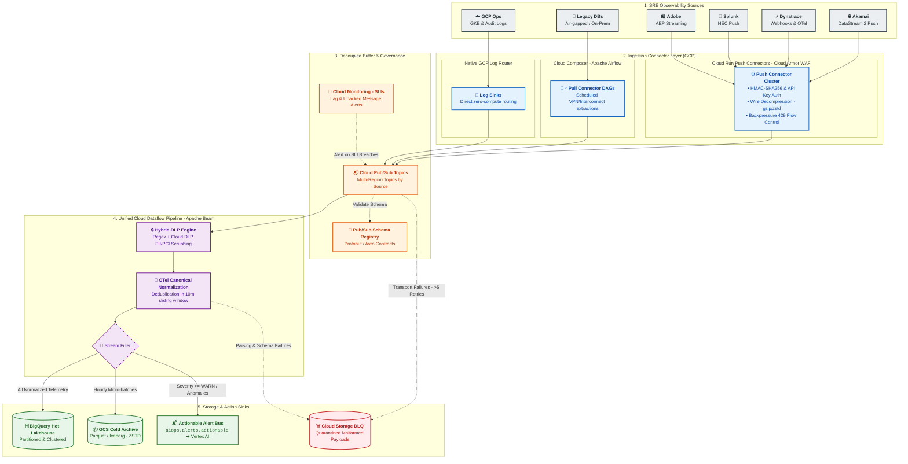
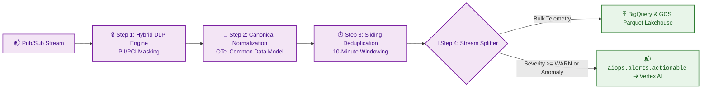

# Ingestion Layer & Streaming Pipelines Architecture

This document outlines the **Enterprise AIOps Ingestion Engine**, which captures high-throughput telemetry from multi-cloud and edge observability sources, standardizes and sanitizes it in real time, and routes it to downstream analytics and incident response systems natively on **Google Cloud Platform (GCP)**.

---

## 1. High-Level Ingestion Architecture

The ingestion architecture follows a decoupled, connector-based pattern capable of handling 150,000 to 500,000+ Events Per Second (EPS) with sub-second latency and zero data loss.

---

## 2. The Ingestion Connector Layer

Telemetry sources exhibit different networking capabilities and security constraints. We utilize three distinct connector patterns to ingest telemetry securely into GCP:

### 2.1 Push Connectors (Modern SaaS & Edge Ingress)
Used by sources capable of real-time outbound streaming (**Akamai DataStream 2**, **Dynatrace Webhooks**, **Splunk HEC**, **Adobe Analytics AEP**).
* **Ingress Security**: Traffic passes through **Cloud Armor WAF** with strict IP allowlisting (filtering for vendor CIDR ranges) and volumetric DDoS rate limiting.
* **Compute Layer**: Auto-scaling, stateless **Cloud Run** container services deployed across multiple zones.
* **Authentication & Webhook Validation**:
  * **API Keys & Tokens**: Verified dynamically against **GCP Secret Manager** with in-memory caching.
  * **HMAC-SHA256 Signatures**: Validates webhook payload authenticity using vendor signature headers (e.g., `X-Akamai-Signature`, `X-Adobe-Signature`) to prevent request spoofing.
* **Wire Compression**: Enforces `Content-Encoding: gzip` / `zstd` on inbound streams, reducing cross-cloud data transfer volume and egress bandwidth costs by up to 70%.
* **Backpressure & Flow Control**: If downstream Pub/Sub publishing encounters transient backpressure, Cloud Run returns `HTTP 429 (Too Many Requests)` or `HTTP 503` with a `Retry-After` header, prompting upstream SaaS forwarders to buffer and retry exponentially.

### 2.2 Pull Connectors (Legacy & Air-Gapped Systems)
Used by on-premise relational databases, mainframes, or network appliances that cannot push outbound traffic.
* **Orchestration**: **Cloud Composer (Managed Apache Airflow)** schedules and executes extraction DAGs.
* **Networking**: Traffic travels over private, encrypted tunnels via **Cloud VPN** or **Cloud Interconnect**.
* **Extraction & Retries**: Airflow operators extract delta records, convert them to canonical JSON/Avro, and publish to Cloud Pub/Sub with automatic exponential backoff retries.

### 2.3 Native Connectors (GCP Operations Suite)
Used natively by Google Cloud Platform workloads (**Google Kubernetes Engine (GKE)**, **Cloud Run**, **Cloud Audit Logs**).
* **Mechanism**: Leverages **Cloud Logging Log Router Sinks** pointing directly to Cloud Pub/Sub topics.
* **Advantage**: Zero-compute, zero-maintenance ingestion with sub-second delivery latency and zero egress cost.

---

## 3. Decoupled Buffer & Stream Processing

### 3.1 Cloud Pub/Sub (The Multi-Region Event Bus)
* **Topic Isolation**: Dedicated, isolated topics per source (e.g., `telemetry.akamai.raw`, `telemetry.dynatrace.raw`, `telemetry.splunk.raw`) prevent single-source traffic storms (such as a DDoS attack logged by Akamai) from starving other telemetry streams.
* **Multi-Region Durability**: Topics are configured with multi-region message routing policies to ensure continuous ingestion availability during single-region GCP outages.

### 3.2 Cloud Dataflow (Unified Apache Beam Streaming Pipeline)
A unified, horizontally auto-scaling streaming pipeline processes incoming telemetry in four sequential stages:

1. **Hybrid DLP Engine**: Fast, in-memory regex tokenizers redact high-risk payment card numbers (PCI-DSS) and social security numbers. Unstructured log bodies are asynchronously scrubbed using the **Cloud Data Loss Prevention (DLP) API**.
2. **Canonical Normalization**: Standardizes disparate formats (Akamai JSON, Splunk HEC, Dynatrace PurePath, Adobe clickstream) into an **OpenTelemetry-aligned canonical schema** (`aiops_lakehouse.telemetry_canonical`).
3. **Sliding Window Deduplication**: Removes duplicate events within a 10-minute sliding window based on `(source_tool, source_event_id, timestamp)`.
4. **Intelligent Stream Splitting**:
   * **Bulk Analytical Stream**: Routes 100% of clean telemetry to BigQuery (Hot Tier) and GCS Parquet (Cold Tier).
   * **Actionable Alert Stream**: High-severity anomalies and warning events (`severity >= WARN` or Davis AI problems) are extracted and published to the high-priority Pub/Sub topic `aiops.alerts.actionable` for consumption by the **Vertex AI Semantic Router**.

---

## 4. Reliability, Robustness & Governance Patterns

### 4.1 Schema Management & Dynamic Evolution
* **Pub/Sub Schema Registry**: Enforces Protobuf and Avro schema contracts at topic ingress.
* **Schema Drift Protection**: Incoming records that introduce backward-compatible fields are parsed dynamically into `raw_attributes JSON`, preventing Dataflow worker crashes while preserving full fidelity.

### 4.2 Multi-Tier Dead-Letter Queues (DLQs)
To prevent unparseable or poisoned payloads from blocking the pipeline:
1. **Transport-Level DLQ (Pub/Sub)**: If Dataflow fails to acknowledge a message after 5 delivery attempts, Pub/Sub diverts it to a native dead-letter topic (`telemetry.*.dlq`).
2. **Application-Level DLQ (Dataflow Side-Output)**: Payloads that parse structurally but fail semantic validation (e.g., corrupted timestamps) are emitted via Beam side-outputs.
3. **Storage & Replay**: Both DLQ streams persist to a date-partitioned **Cloud Storage DLQ Bucket** (`gs://aiops-dlq-bucket/YYYY/MM/DD/`) for offline inspection, alerting, and automated replay.

### 4.3 Ingestion Service Level Indicators (SLIs) & Alerting
The platform team continuously monitors pipeline health in **Cloud Monitoring**:

| Metric Name | Target SLI | Alert Severity | Action upon Breach |
| :--- | :--- | :--- | :--- |
| **`oldest_unacked_message_age`** | $< 5$ minutes | **P1 (Critical)** | Pages Data Platform SRE via ServiceNow webhook |
| **`dataflow/system_lag`** | $< 120$ seconds | **P2 (Major)** | Triggers automated worker auto-scaling |
| **`dataflow/watermark_age`** | $< 180$ seconds | **P2 (Major)** | Alerts on upstream source timestamp drift |
| **`dlq_message_count`** | $< 100$ msgs/hour | **P3 (Warning)** | Flags upstream schema violation for review |

---

## 5. Sub-Modules & Connector References

For granular implementation guides and code samples for each source connector:
* [Akamai DataStream Connector](connectors/akamai_datastream.md)
* [Dynatrace Ingestion Connector](connectors/dynatrace_ingestion.md)
* [GCP Operations Ingestion Connector](connectors/gcp_ops_ingestion.md)
* [Splunk HEC Connector](connectors/splunk_hec_ingestion.md)
* [Adobe Analytics Streaming Connector](connectors/adobe_analytics_stream.md)
* [Ingestion Best Practices Guide](ingestion_best_practices.md)
