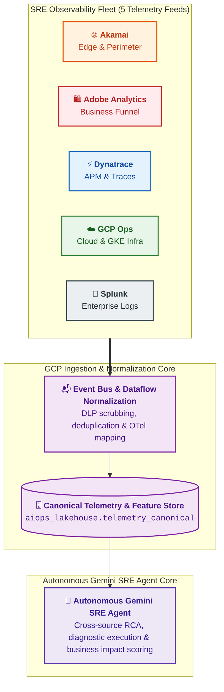

# SRE Observability Fleet - Source Telemetry Matrix

## 1. Executive Overview

The **Autonomous Gemini SRE Agent** correlates telemetry across 5 core observability tools used by enterprise SRE teams. Instead of viewing these tools as isolated monitoring silos, the AIOps platform models them as high-dimensional feature feeds that map to specific operational and business domains:

---

## 2. Comprehensive Tool Telemetry Profiles

### 2.1 Akamai (Edge & Perimeter Observability)
* **Domain**: Edge CDN, DNS, Web Application Firewall (WAF), DDoS mitigation, and Bot Management.
* **Emitted Telemetry**:
  * Edge HTTP latency and Time to First Byte (TTFB).
  * HTTP status distributions (502/503/504 edge vs. origin error rates).
  * WAF security triggers, DDoS mitigation vectors, and Bot Manager classification scores.
* **Ingestion Channel**: Akamai **DataStream 2** HTTPS Push to Cloud Run Ingress ➔ `telemetry.akamai.raw`.
* **Agent Reasoning Value**:
  1. Distinguishes regional ISP/CDN network degradation from core backend microservice crashes.
  2. Isolates bot-driven traffic spikes to prevent unnecessary container autoscaling.

---

### 2.2 Dynatrace (APM, Distributed Tracing & Topology)
* **Domain**: Full-stack Application Performance Monitoring (APM), code-level distributed tracing (PurePath), runtime dependency mapping (Smartscape), and Davis AI problem detection.
* **Emitted Telemetry**:
  * Distributed trace spans with OpenTelemetry headers (`trace_id`, `span_id`).
  * JVM/CLR thread pool saturation, Garbage Collection (GC) pauses, and memory heap metrics.
  * Smartscape entity topology DAGs and Davis AI root cause problem webhooks.
* **Ingestion Channel**: Real-time problem webhooks ➔ `telemetry.dynatrace.raw`; scheduled REST API sync for Smartscape DAGs (`/api/v2/entities`).
* **Agent Reasoning Value**:
  1. Directly identifies the failing class, method, or SQL database lock from PurePath stack traces.
  2. Traverses Smartscape dependency graphs to calculate upstream and downstream blast radius.

---

### 2.3 Google Cloud Operations Suite (Cloud & Platform Infrastructure)
* **Domain**: Native GCP infrastructure, Google Kubernetes Engine (GKE), serverless runtimes, and Cloud Audit Logs.
* **Emitted Telemetry**:
  * Node/Pod CPU and Memory saturation, container `CrashLoopBackOff` restart counts.
  * Cloud Pub/Sub unacknowledged message age and Dataflow system watermarks.
  * Cloud Audit Logs (identifying recent CI/CD deployments and configuration changes).
* **Ingestion Channel**: Zero-compute **Cloud Logging Log Router Sinks** ➔ `telemetry.gcp.raw`; Google Managed Service for Prometheus (GMP).
* **Agent Reasoning Value**:
  1. Correlates sudden application error spikes with recent Kubernetes deployments or configuration drift.
  2. Evaluates infrastructure resource starvation (OOM kills, CPU throttling).

---

### 2.4 Splunk (Enterprise Logging & SIEM Forensics)
* **Domain**: Enterprise centralized log repository, physical Point-of-Sale (POS) logs, middleware message queues (Kafka, IBM MQ), and SIEM events.
* **Emitted Telemetry**:
  * Unstructured application logs, stack traces, and database connection pool exceptions.
  * POS terminal hardware and peripheral transaction logs.
  * Splunk Enterprise Security (ES) notable security events.
* **Ingestion Channel**: Splunk **HTTP Event Collector (HEC)** ➔ `telemetry.splunk.raw`; on-demand REST API for time-windowed SPL queries ($\pm 10\text{ minutes}$).
* **Agent Reasoning Value**:
  1. Performs semantic error log clustering across dozens of microservices.
  2. Pulls forensic log context matching the incident's `trace_id` for inclusion in ServiceNow work notes.

---

### 2.5 Adobe Analytics (Digital Experience & Business Telemetry)
* **Domain**: Customer conversion funnels, e-commerce checkout telemetry, and digital revenue transactions.
* **Emitted Telemetry**:
  * Real-time Orders Per Minute (OPM), Cart Additions (`scAdd`), Checkout Funnel Drop-offs (`scCheckout`).
  * Payment gateway third-party failure responses.
  * User cohort attributes (geographic region, device type, app version).
* **Ingestion Channel**: Adobe Experience Platform (AEP) Streaming Ingestion ➔ `telemetry.adobe.raw`.
* **Agent Reasoning Value**:
  1. **Silent Outage Detection**: Identifies frontend or payment bugs where technical infrastructure appears green but business transactions are failing.
  2. **Financial Impact Scoring**: Calculates real-time estimated revenue loss (USD/min) to drive accurate incident prioritization (P1 vs. P3) in ServiceNow.

---

## 3. Canonical Field Mapping Matrix (`telemetry_canonical`)

All 5 feeds are standardized into the OpenTelemetry-aligned canonical schema in BigQuery:

| Canonical Field | Type | Akamai Mapping | Dynatrace Mapping | GCP Ops Mapping | Splunk Mapping | Adobe Analytics Mapping |
| :--- | :--- | :--- | :--- | :--- | :--- | :--- |
| **`event_id`** | `STRING` | `requestId` | `ProblemID` / `spanId` | `insertId` | `_cd` / `eventId` | `event_id` |
| **`timestamp`** | `TIMESTAMP` | `startEpoch` | `StartTime` | `timestamp` | `_time` | `timestamp` |
| **`source_tool`** | `STRING` | `'akamai'` | `'dynatrace'` | `'gcp_ops'` | `'splunk'` | `'adobe_analytics'` |
| **`severity`** | `STRING` | Derived from HTTP status | `ProblemSeverity` | `severity` | Derived from log level | Derived from conversion drop |
| **`entity.service_name`** | `STRING` | `property_name` | `ImpactedEntity` | `resource.labels.container_name` | `source` / `service` | Funnel Name (e.g., `'checkout'`) |
| **`entity.host`** | `STRING` | `edge_ip` | `HostName` | `resource.labels.node_name` | `host` | N/A (Client Browser/App) |
| **`entity.cmdb_ci_id`** | `STRING` | CMDB CI mapping | CMDB CI mapping | CMDB CI mapping | CMDB CI mapping | CMDB CI mapping |
| **`log_payload.trace_id`** | `STRING` | `X-Trace-ID` | `PurePathTraceId` | `trace` | `trace_id` | `trace_id` |
| **`log_payload.message`** | `STRING` | Request URI & Error | Error message | `textPayload` / `jsonPayload` | `_raw` | N/A |
| **`business_context.orders_per_minute`** | `FLOAT64` | N/A | N/A | N/A | N/A | `orders_per_minute` |
| **`business_context.estimated_revenue_loss_usd`** | `FLOAT64` | N/A | N/A | N/A | N/A | Calculated deviation |

---

## 4. Cross-Domain Architectural Linkages

* [Ingestion Master Blueprint & Streaming Pipelines](file:///c:/Users/ToanBX/dev/personal/aiops_architect/docs/architecture/01_ingestion/ingestion_architecture.md)
* [Data Contracts & Canonical Schemas](file:///c:/Users/ToanBX/dev/personal/aiops_architect/docs/architecture/01_ingestion/data_contracts_and_schemas.md)
* [Unified Lakehouse & AI Feature Store](file:///c:/Users/ToanBX/dev/personal/aiops_architect/docs/architecture/02_storage_and_lakehouse/lakehouse_and_feature_store.md)
* [Autonomous Gemini SRE Agent Architecture](file:///c:/Users/ToanBX/dev/personal/aiops_architect/docs/architecture/03_intelligence_and_reasoning/aiops_intelligence_layer.md)
