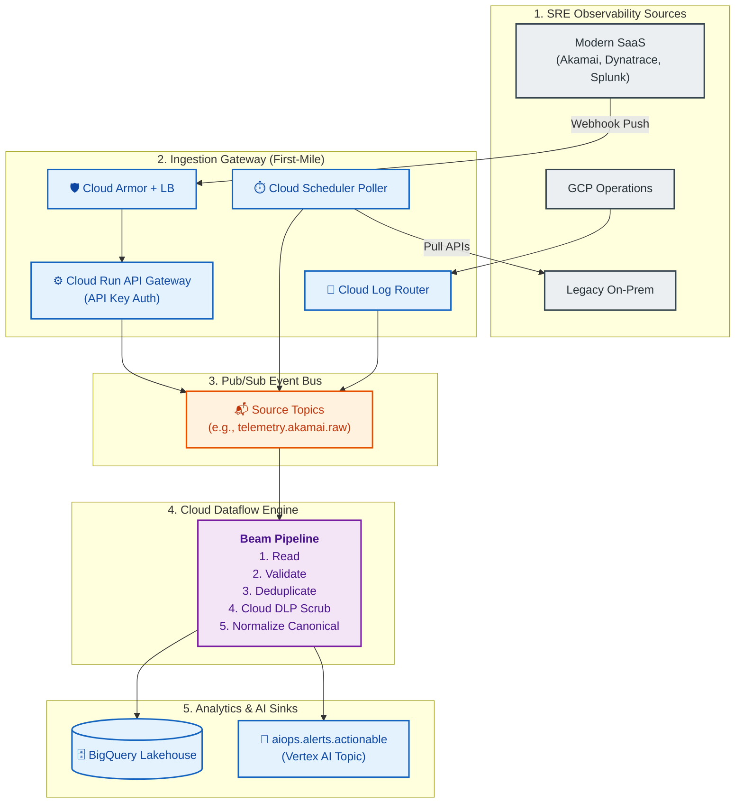

# End-to-End Ingestion & Streaming Pipelines

This document details the complete ingestion lifecycle—from securely extracting raw telemetry at the source to processing it in real-time with Google Cloud Dataflow.

---

## 1. First-Mile Source Ingestion

To securely extract telemetry from external SRE tools into GCP Pub/Sub, we utilize three standard patterns:

1. **Push-Based API Gateway (Modern SaaS)**: Tools (Akamai, Dynatrace, Adobe, Splunk) push JSON payloads to a **Cloud Run API Gateway** protected by Cloud Armor (WAF). The gateway authenticates requests using **API Keys** stored in Secret Manager and publishes to Pub/Sub.
2. **Pull-Based Polling (Legacy Systems)**: **Cloud Scheduler** triggers a containerized Cloud Run Job that paginates legacy APIs/databases and batches records into Pub/Sub.
3. **Direct Cloud Integration (GCP Native)**: GCP native telemetry (GKE, Cloud Audit) uses **Cloud Logging Sinks** to route directly to Pub/Sub with no intermediate compute.

> [!CAUTION]
> **Security Perimeter**: API Keys are programmatically rotated every 30-90 days, protected by Cloud Armor IP Allowlisting, and subject to strict rate limits to prevent DoS attacks.

---

## 2. Stream Processing (Cloud Dataflow)

Once data securely lands in the Cloud Pub/Sub topics (`telemetry.<source>.raw`), a centralized **Cloud Dataflow (Apache Beam)** pipeline performs exactly-once stream processing across 6 core stages:

1. **Multi-Topic Ingest**: Subscribes to the fleet of Pub/Sub topics.
2. **Parser & Validator**: Parses JSON/Protobuf and drops schema-invalid records to a Dead-Letter Queue (DLQ).
3. **Stateful Deduplication**: Uses a 10-minute sliding window to drop retried/duplicate webhooks.
4. **Cloud DLP Scrubbing**: Batches and sends payloads to the Cloud DLP API to mask PII/PCI data.
5. **Canonical Normalization**: Maps diverse tool schemas into the unified `AIOpsCanonicalEvent` structure.
6. **Sinks & Routing**: 
   - Writes the clean canonical stream to **BigQuery** (Storage Write API).
   - Routes high-priority actionable alerts to the `aiops.alerts.actionable` topic for the Vertex AI Intelligence layer.

---

## 3. End-to-End Architecture Diagram

---

## 4. Performance & Autoscaling

The ingestion architecture is designed as a highly elastic "shock absorber":
* **Peak Throughput**: Tested to handle 460,000+ Events Per Second during promotional surges (e.g., Black Friday).
* **Elastic Scaling**: Dataflow dynamically scales from 10 to 100 `n2-standard-4` workers based on the Pub/Sub backlog (`oldest_unacked_message_age`) and CPU utilization.
* **Latency**: End-to-end processing latency (Source $\rightarrow$ Pub/Sub $\rightarrow$ Dataflow $\rightarrow$ BigQuery) is consistently maintained under 3 seconds (p99).
