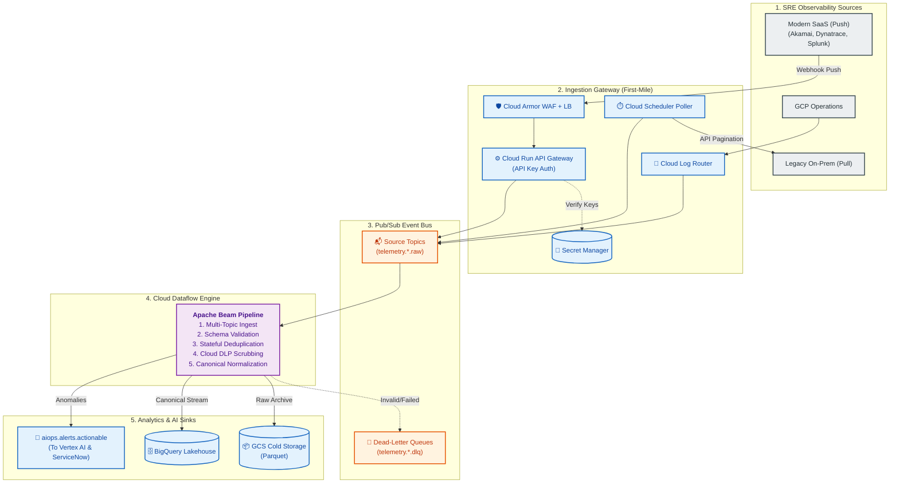

# End-to-End Ingestion & Streaming Pipelines

This document details the complete ingestion lifecycle—from securely extracting raw telemetry at external multi-cloud and on-premise sources to processing it in real-time with Google Cloud Dataflow. This architecture adheres to the core principles of high-throughput scalability, event-driven decoupling, and zero single points of failure.

---

## 1. First-Mile Source Ingestion (Cross-Cloud & Hybrid)

To securely extract telemetry from external SRE tools (spanning AWS, Azure, on-premise, and edge networks) into GCP Pub/Sub, we utilize three standard ingestion patterns:

### 1.1 Push-Based API Gateway (Modern SaaS)
The primary method for modern observability tools (e.g., Dynatrace, Akamai DataStream, Adobe Analytics, Splunk).
* **Mechanism**: Source systems actively HTTP `POST` JSON/Protobuf payloads to a public-facing GCP endpoint via webhooks or HTTP Event Collectors (HEC).
* **GCP Infrastructure**: A **Cloud Run API Gateway** deployed behind a Global External HTTP(S) Load Balancer equipped with **Cloud Armor (WAF)**.
* **Security & Auth**: Requests are authenticated using **API Keys (Bearer Tokens)**. Keys are dynamically resolved from **Secret Manager**, programmatically rotated every 30-90 days, and protected by Cloud Armor IP Allowlisting and strict token-bucket rate limiting.

### 1.2 Pull-Based Polling (Legacy & On-Premise)
For legacy databases or older on-premise monitoring systems that cannot push data.
* **Mechanism**: GCP actively queries the legacy system's APIs or databases on a fixed schedule.
* **GCP Infrastructure**: **Cloud Scheduler** triggers a containerized **Cloud Run Job**, which paginates legacy APIs and publishes batched records into Pub/Sub.

### 1.3 Direct Cloud Integration (GCP Native)
For telemetry generated within the GCP core (e.g., GKE metrics, Cloud Audit Logs).
* **Mechanism**: Native **Cloud Logging Log Router Sinks** securely route logs directly into Pub/Sub with zero intermediate compute or latency.

---

## 2. Cloud Pub/Sub Event Bus (Decoupling Layer)

To ensure fault isolation and act as a "shock absorber" during high-traffic events (e.g., Black Friday surges), all first-mile ingestion flows into dedicated, decoupled Cloud Pub/Sub topics.

### 2.1 Topic Sizing & Partitions
| Topic Name | Purpose | Message Retention | Dead-Letter Topic (DLQ) |
| :--- | :--- | :--- | :--- |
| `telemetry.akamai.raw` | High-volume edge access & security logs | 7 days | `telemetry.akamai.dlq` |
| `telemetry.dynatrace.raw` | PurePath traces & Davis AI webhooks | 7 days | `telemetry.dynatrace.dlq` |
| `telemetry.gcp.raw` | GCP Ops, GKE metrics & audit sinks | 7 days | `telemetry.gcp.dlq` |
| `telemetry.splunk.raw` | Splunk HEC forwarder logs | 7 days | `telemetry.splunk.dlq` |
| `telemetry.adobe.raw` | AEP clickstream & business funnel events | 7 days | `telemetry.adobe.dlq` |
| `aiops.alerts.actionable` | Downstream: Enriched alerts for Vertex AI | 14 days | `aiops.alerts.dlq` |

### 2.2 Dead-Letter Queues (Poison Message Isolation)
Each subscription enforces a strict Dead-Letter Queue (DLQ) policy. After 5 unsuccessful delivery or Dataflow processing attempts, messages are diverted to `telemetry.<source>.dlq` for forensic analysis, ensuring the main pipeline never halts.

---

## 3. Stream Processing (Cloud Dataflow)

A centralized **Cloud Dataflow (Apache Beam)** pipeline performs exactly-once stream processing across 6 core stages:

1. **Multi-Topic Ingest (`PubsubIO`)**: Subscribes to the fleet of raw Pub/Sub topics.
2. **Parser & Validator**: Parses incoming JSON/Protobuf and enforces schema validation against the Canonical Schema. Invalid records are side-output to the DLQ.
3. **Stateful Deduplication**: Uses Apache Beam `@StateId` and a 10-minute sliding window to deduplicate retried webhooks (hash of `source + event_id + timestamp`).
4. **Cloud DLP Scrubbing**: Asynchronously batches text payloads to the **Cloud DLP API** to redact PCI/PII data (e.g., credit cards, passwords) before downstream storage.
5. **Canonical Normalization**: Translates diverse tool schemas into a unified, cross-domain `AIOpsCanonicalEvent` Avro record.
6. **Sinks & Routing**: 
   - **Data Lake (BigQuery)**: Streams valid canonical events to partitioned BigQuery tables using the Storage Write API.
   - **Cold Storage (GCS)**: Outputs hourly batched archives in **Parquet format** for efficient ML training storage.
   - **Actionable AI (Pub/Sub)**: Routes high-severity anomalies to the `aiops.alerts.actionable` topic, which feeds the Vertex AI Intelligence layer and subsequently **ServiceNow** for automated ITSM incident creation.

---

## 4. End-to-End Architecture Diagram

---

## 5. Performance, Autoscaling & Observability

To adhere to strict reliability and observability standards, the pipeline is fully self-monitored:

### 5.1 Elastic Autoscaling
* **Peak Throughput**: Architected to absorb 460,000+ Events Per Second during peak retail events.
* **Elastic Scaling**: Dataflow dynamically scales from 10 up to 100 `n2-standard-4` workers based on the Pub/Sub backlog (`oldest_unacked_message_age`) and CPU utilization.
* **Latency SLA**: End-to-end processing (Source $\rightarrow$ Pub/Sub $\rightarrow$ Dataflow $\rightarrow$ Sink) is maintained under 3 seconds (p99).

### 5.2 System Observability
The AIOps pipeline is instrumented with GCP Cloud Monitoring to alert on its own health:
1. `dataflow.googleapis.com/job/system_lag`: Alerts if processing lag exceeds 30 seconds.
2. `pubsub.googleapis.com/subscription/oldest_unacked_message_age`: Alerts if the shock absorber backlog exceeds 60 seconds.
3. **DLQ Alert**: Alerts the Data Engineering on-call team via ServiceNow if the Dead-Letter Queue receives $> 10$ messages per minute.
