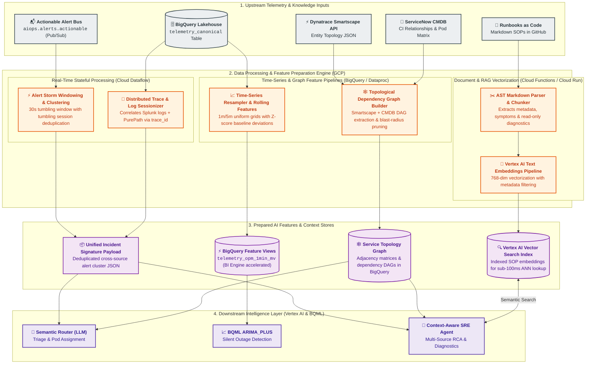
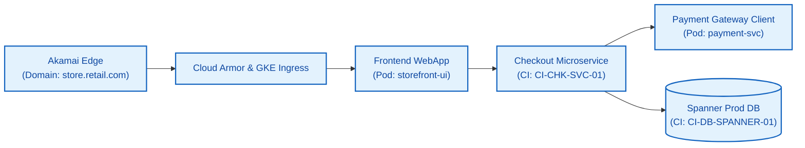
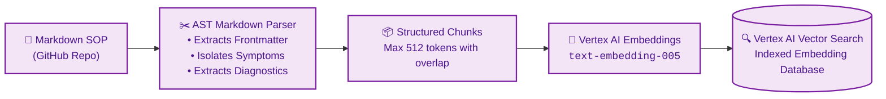

# Data Processing & AI Feature Preparation Architecture

## 1. Executive Summary & Objective

The **Data Processing & AI Feature Preparation Layer** serves as the critical bridge between raw canonical telemetry stored in the **BigQuery Unified Lakehouse** and the AI reasoning models hosted on **Google Cloud Platform (Vertex AI & BigQuery ML)**.

Raw telemetry streams into the platform at rates between **150,000 and 500,000+ Events Per Second (EPS)**. Large Language Models (LLMs) and predictive time-series models cannot consume raw, high-cardinality event streams directly due to context window limits, token latency, and noise. This layer implements stateful stream processing, topological graph extraction, time-series resampling, and document vectorization to synthesize raw telemetry into high-value **AI-ready features**, **incident signatures**, and **RAG embeddings**.



---

## 2. Core Data Processing Pipelines

### 2.1 Pipeline 1: Real-Time Stateful Alert Clustering & Incident Windowing
When a critical system fails (e.g., payment gateway database saturation), 50+ individual alerts cascade across tools within seconds:
* **Akamai**: 504 Gateway Timeout rate spikes.
* **GCP Operations**: GKE ingress connection pool exhaustion.
* **Dynatrace**: Davis AI problem notification for `checkout-service`.
* **Splunk**: Spike in database connection timeout logs.

#### Processing Mechanism (Apache Beam on Cloud Dataflow)
1. **Trigger & Windowing**: Incoming high-severity alerts (`severity >= WARN`) from `aiops.alerts.actionable` are buffered in a **30-second tumbling window** with a 10-second allowed lateness watermark.
2. **Correlation Keying**: Alerts are grouped by shared topological identifiers (`entity.service_name`, `entity.cmdb_ci_id`, or `network.domain`).
3. **Synthesis**: The worker aggregates the alert storm into a single structured **Incident Signature JSON**:

```json
{
  "incident_signature_id": "sig-2026-08-26-chk-001",
  "window_start": "2026-08-26T06:30:00Z",
  "window_end": "2026-08-26T06:30:30Z",
  "primary_impacted_service": "checkout-service",
  "alert_count": 48,
  "sources_involved": ["akamai", "dynatrace", "splunk", "gcp_ops"],
  "symptoms": [
    "Akamai: HTTP 504 rate = 14.2% on /api/v2/checkout",
    "Dynatrace: Thread pool starvation in CheckoutService.processPayment()",
    "Splunk: 320 DB connection timeout exceptions on spanner-prod-01",
    "GCP Ops: Pod memory pressure warning on gke-checkout-pod-x89"
  ],
  "correlated_trace_ids": ["9f8a7b6c5d4e3f2a1b0c9d8e7f6a5b4c"]
}
```

---

### 2.2 Pipeline 2: Time-Series Metric Resampling & Baseline Feature Store
Predictive machine learning models like **BigQuery ML `ARIMA_PLUS`** require regularly sampled, uniformly spaced time-series data without missing intervals or null gaps.

#### Processing Architecture (BigQuery Materialized Views & Scheduled Tasks)
1. **Continuous Resampling**: The raw clickstream from Adobe Analytics and system metrics from GCP Ops arrive at irregular intervals. The resampler aggregates events into strict **1-minute** and **5-minute** time buckets.
2. **Missing Value Imputation**: Forward-fills zero values for business metrics (such as Orders Per Minute during maintenance windows) to prevent ARIMA model fitting errors.
3. **Statistical Baseline Calculation**: Calculates rolling 7-day and 30-day seasonal averages ($z\text{-score} = \frac{x - \mu}{\sigma}$) to detect sudden deviation percentages.

```sql
-- Production Feature View for Real-Time Anomaly Baseline Detection
CREATE MATERIALIZED VIEW `aiops_lakehouse.telemetry_opm_1min_mv`
PARTITION BY DATE(window_start)
CLUSTER BY service_name
AS
SELECT
  TIMESTAMP_TRUNC(timestamp, MINUTE) AS window_start,
  entity.service_name,
  SUM(COALESCE(business_context.orders_per_minute, 0.0)) AS total_opm,
  AVG(COALESCE(business_context.cart_abandonment_rate, 0.0)) AS avg_abandon_rate,
  COUNT(1) AS raw_event_count
FROM
  `aiops_lakehouse.telemetry_canonical`
WHERE
  source_tool = 'adobe_analytics'
GROUP BY
  window_start,
  service_name;
```

---

### 2.3 Pipeline 3: Dynamic Topology Graph Construction & CMDB Traversal
Accurate root-cause isolation requires understanding the directed service dependency graph.



#### Graph ETL Workflow
1. **Ingestion**: A scheduled Cloud Composer DAG extracts topology entities and relationships hourly from **Dynatrace Smartscape API** (`/api/v2/entities`) and **ServiceNow CMDB** (`cmdb_rel_ci`).
2. **Graph Modeling**: Relationships are persisted in BigQuery as an adjacency table:

```sql
CREATE TABLE `aiops_lakehouse.topology_service_graph` (
  parent_ci STRING NOT NULL,
  parent_service_name STRING NOT NULL,
  child_ci STRING NOT NULL,
  child_service_name STRING NOT NULL,
  relation_type STRING NOT NULL, -- 'CALLS', 'RUNS_ON', 'DEPENDS_ON'
  sre_owner_pod STRING NOT NULL,
  last_synced_at TIMESTAMP NOT NULL
)
PARTITION BY DATE(last_synced_at)
CLUSTER BY parent_service_name, child_service_name;
```

3. **Graph Traversal for LLM Context**: When an alert fires on `storefront-ui`, the pipeline executes a recursive Breadth-First Search (BFS) in BigQuery to extract the top-3 upstream and downstream dependencies, formatting the output as an indented ASCII dependency graph in the LLM prompt.

---

### 2.4 Pipeline 4: Cross-Source Trace & Log Sessionization
During an outage, troubleshooting requires correlating asynchronous logs from Splunk with synchronous APM traces from Dynatrace.

#### Correlation Process
1. **Canonical Header Extraction**: OpenTelemetry headers (`trace_id`, `span_id`, `traceparent`) propagated through HTTP headers are parsed in Cloud Dataflow.
2. **Session Reconstruction**: When an incident signature is generated, a high-speed BigQuery query extracts all log entries and traces matching the `trace_id` within a $\pm 10\text{-minute}$ window across both Splunk and Dynatrace tables.
3. **Sanitized Context Block**: Unneeded debug log lines are stripped, and the top-5 error stack traces and database queries are attached as markdown evidence.

---

### 2.5 Pipeline 5: RAG Document Vectorization & Runbook ETL Pipeline
SOP Runbooks are managed in Git ("Runbooks as Code") as Markdown files. The RAG data processing pipeline transforms them into semantically searchable vectors.



#### Runbook Structure & Extraction Schema
Every SOP Markdown document contains structured YAML frontmatter:

```markdown
---
sop_id: SOP-CHK-DB-001
service_name: checkout-service
cmdb_ci: CI-CHK-SVC-01
owner_pod: Checkout-Backend-Pod
tags: [spanner, connection_pool, timeout, 504]
diagnostics:
  - name: check_spanner_sessions
    type: bigquery_sql
    query: "SELECT host, count(1) as active_conn FROM `aiops_lakehouse.telemetry_canonical` WHERE source_tool = 'splunk' AND log_payload.message LIKE '%Spanner%' GROUP BY 1 LIMIT 20"
---

# Spanner Connection Pool Exhaustion Runbook

## Symptoms
* Sudden spike in HTTP 504 errors from Akamai.
* Dynatrace flags Spanner client connection wait times > 5000ms.

## Remediation Steps
1. Verify active database session locks via Spanner admin console.
2. Scale up checkout service container replicas by 20%.
```

---

### 2.6 Pipeline 6: Closed-Loop Model Evaluation & Ground Truth Dataset Preparation
To support continuous prompt and embedding improvement, the data processing layer continuously extracts ground truth data from **ServiceNow Incident Closures**:

1. **Webhook Extraction**: When an SRE closes a ticket, ServiceNow triggers a webhook with:
   * `incident_id`, `actual_root_cause`, `ai_root_cause_prediction`
   * `sre_accuracy_rating` (1 to 5 stars)
   * `false_positive_flag` (true / false)
2. **Dataset Generation**: An automated Cloud Dataflow / BigQuery SQL job joins the incident's original AI input prompt with the SRE's post-mortem resolution, appending the record to `aiops_lakehouse.agent_evaluations`.
3. **Automated Drift Detection**: If the rolling 7-day retrieval recall drops below **88%**, an automated GitHub Action issues an alert to re-tune vector embeddings or prompt templates.

---

## 3. Data Processing SLA, Resiliency & Resource Guidelines

| Pipeline | Latency Target (SLA) | Compute Engine | Resiliency & Fallback |
| :--- | :--- | :--- | :--- |
| **Alert Storm Windowing** | $< 35$ seconds | Cloud Dataflow (Streaming) | Pub/Sub multi-region topic buffer; dead-letter queue on parse failure. |
| **Metric Resampling** | Sub-second read | BigQuery Materialized Views + BI Engine | Pre-aggregated caches with automated incremental refresh. |
| **Topology Graph Sync** | $< 10$ minutes | Cloud Composer (Airflow) + BigQuery | Retains last known valid topology graph if upstream API times out. |
| **Trace Sessionizer** | $< 2$ seconds | BigQuery Clustered Query | Scans partitioned tables with strict $\pm 10\text{m}$ time bounds. |
| **SOP Vectorization** | $< 60$ seconds on Git Push | Cloud Functions / Vertex Embeddings | GitHub Actions validation on Markdown schema before ingestion. |
| **Feedback Loop ETL** | Hourly batch | BigQuery Scheduled Queries | Replay capability from date-partitioned raw webhook storage. |

---

## 4. Summary & Cross-Domain Linkages

This data processing specification provides the necessary structured inputs for the following architecture modules:
* [Lakehouse Architecture Specification](file:///c:/Users/ToanBX/dev/personal/aiops_architect/docs/architecture/02_storage_and_lakehouse/lakehouse_architecture.md)
* [AIOps Intelligence Layer Specification](file:///c:/Users/ToanBX/dev/personal/aiops_architect/docs/architecture/03_intelligence_and_reasoning/aiops_intelligence_layer.md)
* [ServiceNow Integration & Remediation Guide](file:///c:/Users/ToanBX/dev/personal/aiops_architect/docs/architecture/04_itsm_and_remediation/servicenow_integration.md)
