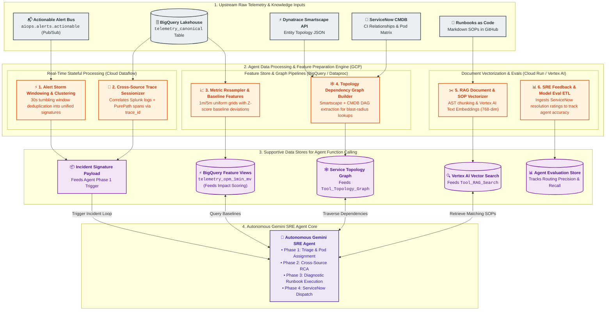

# Data Processing & AI Feature Preparation Architecture

## 1. Executive Summary & Objective

The **Data Processing & AI Feature Preparation Layer** serves as the critical data engineering backbone for the **Autonomous Gemini SRE Agent**, hosted natively on **Google Cloud Platform (GCP)**.

Raw telemetry streams into the platform at rates between **150,000 and 500,000+ Events Per Second (EPS)**. Large Language Models (LLMs) cannot consume raw, high-cardinality event streams directly due to context window limits, token latency, and noise. 

This layer implements stateful stream processing, topological graph extraction, time-series resampling, document vectorization, and evaluation ETL to synthesize raw telemetry into high-value **supportive data structures** directly consumed by the agent's function-calling tools:



---

## 2. The 6 Agent-Supportive Data Pipelines

### 2.1 Pipeline 1: Stateful Alert Storm Windowing & Incident Clustering
* **Agent Support Role**: Generates the structured `Incident Signature JSON` that triggers **Phase 1 (Triage & Assignment)** of the Gemini SRE Agent.
* **Mechanism (Cloud Dataflow / Apache Beam)**:
  1. Buffers high-priority incoming alerts (`severity >= WARN`) in a **30-second tumbling window**.
  2. Groups cascading alerts across tools (Akamai 504s, GKE pod restarts, Dynatrace problems, Splunk database errors) by shared topological keys (`entity.service_name` or `entity.cmdb_ci_id`).
  3. Synthesizes 50+ raw alert events into a compact, token-efficient JSON payload:

```json
{
  "incident_signature_id": "sig-2026-08-26-chk-001",
  "window_start": "2026-08-26T06:30:00Z",
  "window_end": "2026-08-26T06:30:30Z",
  "primary_impacted_service": "checkout-service",
  "alert_count": 48,
  "sources_involved": ["akamai", "dynatrace", "splunk", "gcp_ops"],
  "symptoms": [
    "Akamai: HTTP 504 rate = 14.2% on /api/v2/checkout",
    "Dynatrace: Thread pool starvation in CheckoutService.processPayment()",
    "Splunk: 320 DB connection timeout exceptions on spanner-prod-01",
    "GCP Ops: Pod memory pressure warning on gke-checkout-pod-x89"
  ],
  "correlated_trace_ids": ["9f8a7b6c5d4e3f2a1b0c9d8e7f6a5b4c"]
}
```

---

### 2.2 Pipeline 2: Metric Resampling & Fast Baseline Feature Store
* **Agent Support Role**: Provides the agent with sub-second statistical baseline lookups during **Phase 2 (Deep RCA & Financial Impact Scoring)**.
* **Mechanism (BigQuery Materialized Views & BI Engine)**:
  1. Aggregates high-frequency business clickstream and infrastructure telemetry into strict **1-minute** and **5-minute** time buckets.
  2. Calculates rolling 7-day seasonal averages and $z$-score deviation baselines.
  3. Enabled with BigQuery BI Engine to allow the Gemini Agent to evaluate whether a technical alert corresponds to real business revenue loss in $< 500\text{ms}$.

```sql
-- Production Feature View for Real-Time Anomaly Baseline Detection
CREATE MATERIALIZED VIEW `aiops_lakehouse.telemetry_opm_1min_mv`
PARTITION BY DATE(window_start)
CLUSTER BY service_name
AS
SELECT
  TIMESTAMP_TRUNC(timestamp, MINUTE) AS window_start,
  entity.service_name,
  SUM(COALESCE(business_context.orders_per_minute, 0.0)) AS total_opm,
  AVG(COALESCE(business_context.cart_abandonment_rate, 0.0)) AS avg_abandon_rate,
  COUNT(1) AS raw_event_count
FROM
  `aiops_lakehouse.telemetry_canonical`
WHERE
  source_tool = 'adobe_analytics'
GROUP BY
  window_start,
  service_name;
```

---

### 2.3 Pipeline 3: Dynamic Topology Graph ETL & CMDB Traversal
* **Agent Support Role**: Directly powers `Tool_Topology_Graph`, enabling the agent to identify responsible SRE pods and upstream/downstream blast radius.
* **Mechanism**:
  1. A scheduled Cloud Composer DAG extracts dependency trees hourly from **Dynatrace Smartscape API** (`/api/v2/entities`) and **ServiceNow CMDB** (`cmdb_rel_ci`).
  2. Persists relationships into an adjacency graph table in BigQuery:

```sql
CREATE TABLE `aiops_lakehouse.topology_service_graph` (
  parent_ci STRING NOT NULL,
  parent_service_name STRING NOT NULL,
  child_ci STRING NOT NULL,
  child_service_name STRING NOT NULL,
  relation_type STRING NOT NULL, -- 'CALLS', 'RUNS_ON', 'DEPENDS_ON'
  sre_owner_pod STRING NOT NULL,
  last_synced_at TIMESTAMP NOT NULL
)
PARTITION BY DATE(last_synced_at)
CLUSTER BY parent_service_name, child_service_name;
```

---

### 2.4 Pipeline 4: Cross-Source Trace & Log Sessionizer
* **Agent Support Role**: Prepares correlated forensic evidence blocks consumed by `Tool_Diagnostic_Sandbox`.
* **Mechanism**:
  1. OpenTelemetry headers (`trace_id`, `span_id`) propagated through HTTP requests are indexed upon ingestion.
  2. When an incident is triggered, the pipeline queries BigQuery across both Splunk error logs and Dynatrace PurePaths within a $\pm 10\text{-minute}$ window matching `trace_id`.
  3. Formats the correlated trace stack and database query text as markdown evidence for the agent.

---

### 2.5 Pipeline 5: RAG Document Vectorization & Runbook ETL
* **Agent Support Role**: Builds and synchronizes the vector embeddings powering `Tool_RAG_Search`.
* **Mechanism**:
  1. Markdown SOPs managed in Git ("Runbooks as Code") are parsed via an AST parser upon GitHub push.
  2. Frontmatter metadata, symptom descriptions, and diagnostic commands are separated into structured chunks (max 512 tokens with overlap).
  3. Vectors are generated using the **Vertex AI Text Embeddings API** (`text-embedding-005`, 768 dimensions) and indexed in **Vertex AI Vector Search** for sub-100ms Approximate Nearest Neighbor (ANN) retrieval.

```markdown
---
sop_id: SOP-CHK-DB-001
service_name: checkout-service
cmdb_ci: CI-CHK-SVC-01
owner_pod: Checkout-Backend-Pod
tags: [spanner, connection_pool, timeout, 504]
diagnostics:
  - name: check_spanner_sessions
    type: bigquery_sql
    query: "SELECT host, count(1) as active_conn FROM `aiops_lakehouse.telemetry_canonical` WHERE source_tool = 'splunk' AND log_payload.message LIKE '%Spanner%' GROUP BY 1 LIMIT 20"
---

# Spanner Connection Pool Exhaustion Runbook

## Symptoms
* Sudden spike in HTTP 504 errors from Akamai.
* Dynatrace flags Spanner client connection wait times > 5000ms.

## Remediation Steps
1. Verify active database session locks via Spanner admin console.
2. Scale up checkout service container replicas by 20%.
```

---

### 2.6 Pipeline 6: Closed-Loop SRE Feedback & Evaluation Dataset Preparation
* **Agent Support Role**: Captures human ground-truth feedback from ServiceNow to power continuous prompt tuning and agent evaluation.
* **Mechanism**:
  1. When an SRE closes or resolves an incident, ServiceNow triggers a webhook with engineer accuracy ratings (1–5 stars), confirmed root causes, and false-positive flags.
  2. An automated BigQuery SQL job joins the incident's original AI diagnosis with the human post-mortem resolution, streaming records into `aiops_lakehouse.agent_evaluations`.
  3. Evaluates rolling 7-day Routing Precision ($> 92\%$) and SOP Retrieval Recall@3 ($> 88\%$).

---

## 3. Data Processing SLA, Resiliency & Tool Mapping

| Data Pipeline | Target Latency (SLA) | Compute Engine | Supported Agent Capability / Tool |
| :--- | :--- | :--- | :--- |
| **1. Alert Storm Windowing** | $< 35$ seconds | Cloud Dataflow (Streaming) | **Agent Incident Trigger** (`Incident Signature JSON`) |
| **2. Metric Resampling** | Sub-second read | BigQuery Materialized Views + BI Engine | **Financial Impact Scoring** (Phase 2 RCA) |
| **3. Topology Graph Sync** | $< 10$ minutes | Cloud Composer (Airflow) + BigQuery | **`Tool_Topology_Graph`** (Pod Assignment & Blast Radius) |
| **4. Trace Sessionizer** | $< 2$ seconds | BigQuery Clustered Query | **`Tool_Diagnostic_Sandbox`** (Cross-source correlation) |
| **5. SOP Vectorization** | $< 60$ seconds on Git Push | Cloud Functions + Vertex Embeddings | **`Tool_RAG_Search`** (Runbook & Post-Mortem Lookup) |
| **6. Feedback Loop ETL** | Hourly batch | BigQuery Scheduled Queries | **Agent Evaluation & Continuous Learning** |

---

## 4. Summary & Cross-Domain Linkages

This data processing specification directly interfaces with the following modules:
* [High-Level Platform Architecture](file:///c:/Users/ToanBX/dev/personal/aiops_architect/docs/architecture/00_overview/aiops_platform_overview.md)
* [SRE Observability Fleet - Source Telemetry Matrix](file:///c:/Users/ToanBX/dev/personal/aiops_architect/docs/architecture/01_ingestion/source_telemetry_matrix.md)
* [Autonomous Gemini SRE Agent Architecture](file:///c:/Users/ToanBX/dev/personal/aiops_architect/docs/architecture/03_intelligence_and_reasoning/aiops_intelligence_layer.md)
* [ServiceNow Integration & Remediation Guide](file:///c:/Users/ToanBX/dev/personal/aiops_architect/docs/architecture/04_itsm_and_remediation/servicenow_integration.md)
