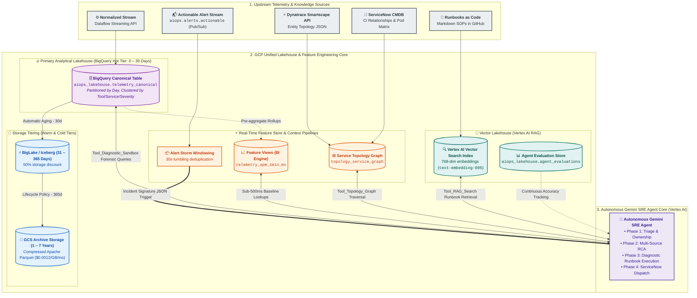

# Unified Lakehouse, Data Processing & AI Feature Store Architecture

## 1. Executive Summary & Objectives

The **AIOps Unified Lakehouse & AI Feature Store Layer** provides the core analytical storage, real-time feature engineering, and semantic knowledge retrieval foundation for the **Autonomous Gemini SRE Agent**, hosted natively on **Google Cloud Platform (GCP)**.

Raw telemetry streams into the platform at rates between **150,000 and 500,000+ Events Per Second (EPS)**. Large Language Models (LLMs) cannot consume raw, high-cardinality event streams directly due to context window limits, token latency, and noise. 

This layer serves three tightly coupled operational workloads:
1. **Primary Analytical Lakehouse**: High-throughput storage of standardized OpenTelemetry events in **BigQuery**, optimized with daily partitioning, columnar clustering, and Row-Level Security.
2. **Real-Time AI Feature Store & Pipelines**: Stateful stream windowing, time-series metric rollups, trace sessionization, and topological dependency graphs that feed the agent's function-calling tools.
3. **Vector Lakehouse & Knowledge Store**: Sub-100ms semantic search over Markdown Standard Operating Procedures (SOP Runbooks as Code) via **Vertex AI Vector Search**.



---

## 2. BigQuery Canonical Lakehouse Design

### 2.1 Primary Analytical Table: `telemetry_canonical`
All normalized telemetry from Akamai, Dynatrace, GCP Operations, Splunk, and Adobe Analytics is written to a centralized, columnar BigQuery table.

* **Partitioning Strategy**: Partitioned by day on `DATE(timestamp)`.
* **Clustering Keys**: `source_tool`, `entity.service_name`, `severity`.
* **Rationale**: Over $95\%$ of SRE forensic investigations and automated agent queries filter by time window, tool, and service. Partition pruning and clustering reduce bytes scanned by over $85\%$, ensuring sub-2-second query execution and predictable BigQuery costs.

```sql
CREATE OR REPLACE TABLE `aiops_lakehouse.telemetry_canonical`
(
  event_id STRING NOT NULL,
  timestamp TIMESTAMP NOT NULL,
  ingestion_timestamp TIMESTAMP NOT NULL,
  source_tool STRING NOT NULL,
  domain STRING NOT NULL,
  severity STRING NOT NULL,
  entity STRUCT<
    service_name STRING,
    environment STRING,
    host STRING,
    container_name STRING,
    cloud_provider STRING,
    region STRING,
    cmdb_ci_id STRING
  >,
  metrics ARRAY<STRUCT<
    name STRING,
    value FLOAT64,
    unit STRING,
    dimensions JSON
  >>,
  log_payload STRUCT<
    message STRING,
    stack_trace STRING,
    trace_id STRING,
    span_id STRING,
    error_code STRING
  >,
  business_context STRUCT<
    orders_per_minute FLOAT64,
    cart_abandonment_rate FLOAT64,
    estimated_revenue_loss_usd FLOAT64,
    funnel_stage STRING,
    user_cohort STRING
  >,
  raw_attributes JSON
)
PARTITION BY DATE(timestamp)
CLUSTER BY source_tool, entity.service_name, severity;
```

---

## 3. The 6 Agent-Supportive Data & Feature Pipelines

```
Data Processing Pipeline                           Supportive Feature for the Agent
─────────────────────────────────────────────      ──────────────────────────────────────────────
1. Alert Storm Windowing & Clustering         ➔   ⚡ Agent Trigger Payload (Incident Signature JSON)
2. Time-Series Resampling & Feature Views     ➔   📈 Sub-Second Baseline Context for Impact Scoring
3. Topology Graph ETL (Smartscape + CMDB)     ➔   🕸️ Tool_Topology_Graph (Pod Assignment & Blast Radius)
4. Cross-Source Trace Sessionization          ➔   🔗 Tool_Diagnostic_Sandbox (Correlating Logs + Traces)
5. SOP AST Vectorization Pipeline             ➔   🔍 Tool_RAG_Search (Runbook Retrieval via Vector Search)
6. Closed-Loop Feedback ETL                   ➔   📊 BigQuery Evaluation Store (Agent Accuracy Tracking)
```

---

### 3.1 Pipeline 1: Real-Time Alert Storm Windowing & Clustering
* **Agent Support Role**: Converts a burst of 50+ cascading alerts into a single, structured **`Incident Signature JSON`** that triggers **Phase 1 (Triage)** of the Gemini SRE Agent.
* **Mechanism (Cloud Dataflow / Apache Beam)**:
  1. Buffers incoming high-priority alerts (`severity >= WARN`) from `aiops.alerts.actionable` in a **30-second tumbling window**.
  2. Groups cascading alerts across tools (Akamai 504s, Dynatrace thread pool alerts, Splunk DB timeouts) by shared topological keys (`entity.service_name`).
  3. Emits a clean, token-efficient JSON payload:

```json
{
  "incident_signature_id": "sig-2026-08-26-chk-001",
  "window_start": "2026-08-26T06:30:00Z",
  "window_end": "2026-08-26T06:30:30Z",
  "primary_impacted_service": "checkout-service",
  "alert_count": 48,
  "sources_involved": ["akamai", "dynatrace", "splunk", "gcp_ops", "adobe_analytics"],
  "symptoms": [
    "Akamai: HTTP 504 rate = 14.2% on /api/v2/checkout",
    "Dynatrace: Thread pool starvation in CheckoutService.processPayment()",
    "Splunk: 320 DB connection timeout exceptions on spanner-prod-01",
    "Adobe: Orders Per Minute dropped by 85.8%"
  ],
  "correlated_trace_ids": ["9f8a7b6c5d4e3f2a1b0c9d8e7f6a5b4c"]
}
```

---

### 3.2 Pipeline 2: Metric Resampling & Fast Baseline Feature Store
* **Agent Support Role**: Provides the agent with sub-second statistical baseline lookups during **Phase 2 (Deep RCA & Financial Impact Scoring)**.
* **Mechanism (BigQuery Materialized Views & BI Engine)**:
  1. Aggregates high-frequency Adobe clickstream and GCP Ops metrics into strict **1-minute** time buckets.
  2. Pre-calculates 7-day seasonal rolling baselines.
  3. Accelerated via BigQuery BI Engine to allow the Gemini Agent to determine whether a technical alert corresponds to active revenue drop-offs in $< 100\text{ms}$.

```sql
CREATE MATERIALIZED VIEW `aiops_lakehouse.telemetry_opm_1min_mv`
PARTITION BY DATE(window_start)
CLUSTER BY service_name
AS
SELECT
  TIMESTAMP_TRUNC(timestamp, MINUTE) AS window_start,
  entity.service_name,
  SUM(COALESCE(business_context.orders_per_minute, 0.0)) AS total_opm,
  AVG(COALESCE(business_context.cart_abandonment_rate, 0.0)) AS avg_abandon_rate,
  COUNT(1) AS raw_event_count
FROM
  `aiops_lakehouse.telemetry_canonical`
WHERE
  source_tool = 'adobe_analytics'
GROUP BY
  window_start,
  service_name;
```

---

### 3.3 Pipeline 3: Dynamic Topology Graph ETL & CMDB Traversal
* **Agent Support Role**: Powers **`Tool_Topology_Graph`**, allowing the agent to determine the responsible SRE pod and compute upstream caller and downstream dependency blast radius.
* **Mechanism**:
  1. A scheduled Cloud Composer DAG extracts dependency trees hourly from **Dynatrace Smartscape API** (`/api/v2/entities`) and **ServiceNow CMDB** (`cmdb_rel_ci`).
  2. Persists adjacency relationships into BigQuery:

```sql
CREATE TABLE `aiops_lakehouse.topology_service_graph` (
  parent_ci STRING NOT NULL,
  parent_service_name STRING NOT NULL,
  child_ci STRING NOT NULL,
  child_service_name STRING NOT NULL,
  relation_type STRING NOT NULL, -- 'CALLS', 'RUNS_ON', 'DEPENDS_ON'
  sre_owner_pod STRING NOT NULL,
  last_synced_at TIMESTAMP NOT NULL
)
PARTITION BY DATE(last_synced_at)
CLUSTER BY parent_service_name, child_service_name;
```

---

### 3.4 Pipeline 4: Cross-Source Trace & Log Sessionizer
* **Agent Support Role**: Prepares correlated forensic evidence blocks consumed by **`Tool_Diagnostic_Sandbox`**.
* **Mechanism**:
  1. OpenTelemetry headers (`trace_id`, `span_id`) propagated through HTTP requests are indexed upon ingestion.
  2. When an incident signature is triggered, the pipeline queries BigQuery across both Splunk error logs and Dynatrace PurePaths within a $\pm 10\text{-minute}$ window matching `trace_id`.
  3. Formats the correlated trace stack and database query text as markdown evidence for the agent.

---

### 3.5 Pipeline 5: RAG Document Vectorization & Runbook ETL
* **Agent Support Role**: Builds and synchronizes the vector embeddings powering **`Tool_RAG_Search`**.
* **Mechanism**:
  1. Markdown SOPs managed in Git ("Runbooks as Code") are parsed via an AST parser upon GitHub push.
  2. Frontmatter metadata, symptom descriptions, and diagnostic commands are separated into structured chunks (max 512 tokens with overlap).
  3. Vectors are generated using the **Vertex AI Text Embeddings API** (`text-embedding-005`, 768 dimensions) and indexed in **Vertex AI Vector Search** for sub-100ms Approximate Nearest Neighbor (ANN) retrieval.

```markdown
---
sop_id: SOP-CHK-DB-001
service_name: checkout-service
cmdb_ci: CI-CHK-SVC-01
owner_pod: Checkout-Backend-Pod
tags: [spanner, connection_pool, timeout, 504]
diagnostics:
  - name: check_spanner_sessions
    type: bigquery_sql
    query: "SELECT host, count(1) as active_conn FROM `aiops_lakehouse.telemetry_canonical` WHERE source_tool = 'splunk' AND log_payload.message LIKE '%Spanner%' GROUP BY 1 LIMIT 20"
---

# Spanner Connection Pool Exhaustion Runbook

## Symptoms
* Sudden spike in HTTP 504 errors from Akamai.
* Dynatrace flags Spanner client connection wait times > 5000ms.

## Remediation Steps
1. Verify active database session locks via Spanner admin console.
2. Scale up checkout service container replicas by 20%.
```

---

### 3.6 Pipeline 6: Closed-Loop SRE Feedback & Model Evaluation ETL
* **Agent Support Role**: Captures human ground-truth feedback from ServiceNow to power continuous prompt tuning and agent accuracy tracking.
* **Mechanism**:
  1. When an SRE closes or resolves an incident, ServiceNow triggers a webhook with engineer accuracy ratings (1–5 stars), confirmed root causes, and false-positive flags.
  2. An automated BigQuery SQL job joins the incident's original AI diagnosis with the human post-mortem resolution, streaming records into `aiops_lakehouse.agent_evaluations`.
  3. Evaluates rolling 7-day Routing Precision ($> 92\%$) and SOP Retrieval Recall@3 ($> 88\%$).

---

## 4. Storage Tiering & Lifecycle Management

| Storage Tier | Data Age | Storage Technology | Cost Profile | Primary Query Engine |
| :--- | :--- | :--- | :--- | :--- |
| **Hot Tier** | 0 – 30 Days | BigQuery Active Storage | Standard Active Storage | BigQuery SQL / Gemini SRE Agent |
| **Warm Tier** | 31 – 365 Days | BigLake (Iceberg / Long-Term) | $50\%$ storage discount | BigQuery SQL / Dataproc Serverless |
| **Cold Tier** | 1 – 7 Years | GCS Archive Class (Parquet) | Ultra-low cost ($0.0012/\text{GB/mo}$) | BigLake External Queries |

---

## 5. Security, Governance & PII Compliance

1. **Cloud DLP Masking**: Ingestion pipelines utilize Cloud DLP to automatically redact PII/PCI data (credit cards, authentication tokens) before persistence in BigQuery.
2. **Row-Level Security (RLS)**: Applied to `telemetry_canonical` so SRE pods can only query telemetry for their assigned microservice domains.
3. **Customer-Managed Encryption Keys (CMEK)**: All data stored in BigQuery, Cloud Storage, and Vertex AI is encrypted at rest using Cloud KMS keys.

---

## 6. Data Processing SLA & Tool Mapping

| Data Pipeline | Target Latency (SLA) | Compute Engine | Supported Agent Capability / Tool |
| :--- | :--- | :--- | :--- |
| **1. Alert Storm Windowing** | $< 35$ seconds | Cloud Dataflow (Streaming) | **Agent Incident Trigger** (`Incident Signature JSON`) |
| **2. Metric Resampling** | Sub-second read | BigQuery Materialized Views + BI Engine | **Financial Impact Scoring** (Phase 2 RCA) |
| **3. Topology Graph Sync** | $< 10$ minutes | Cloud Composer (Airflow) + BigQuery | **`Tool_Topology_Graph`** (Pod Assignment & Blast Radius) |
| **4. Trace Sessionizer** | $< 2$ seconds | BigQuery Clustered Query | **`Tool_Diagnostic_Sandbox`** (Cross-source correlation) |
| **5. SOP Vectorization** | $< 60$ seconds on Git Push | Cloud Functions + Vertex Embeddings | **`Tool_RAG_Search`** (Runbook & Post-Mortem Lookup) |
| **6. Feedback Loop ETL** | Hourly batch | BigQuery Scheduled Queries | **Agent Evaluation & Continuous Learning** |

---

## 7. Related Architectural Specifications

* [High-Level Platform Architecture Overview](file:///c:/Users/ToanBX/dev/personal/aiops_architect/docs/architecture/00_overview/aiops_platform_overview.md)
* [SRE Observability Fleet - Source Telemetry Matrix](file:///c:/Users/ToanBX/dev/personal/aiops_architect/docs/architecture/01_ingestion/source_telemetry_matrix.md)
* [Autonomous Gemini SRE Agent & Reasoning Layer](file:///c:/Users/ToanBX/dev/personal/aiops_architect/docs/architecture/03_intelligence_and_reasoning/aiops_intelligence_layer.md)
* [ServiceNow ITSM Integration & Remediation Guide](file:///c:/Users/ToanBX/dev/personal/aiops_architect/docs/architecture/04_itsm_and_remediation/servicenow_integration.md)
