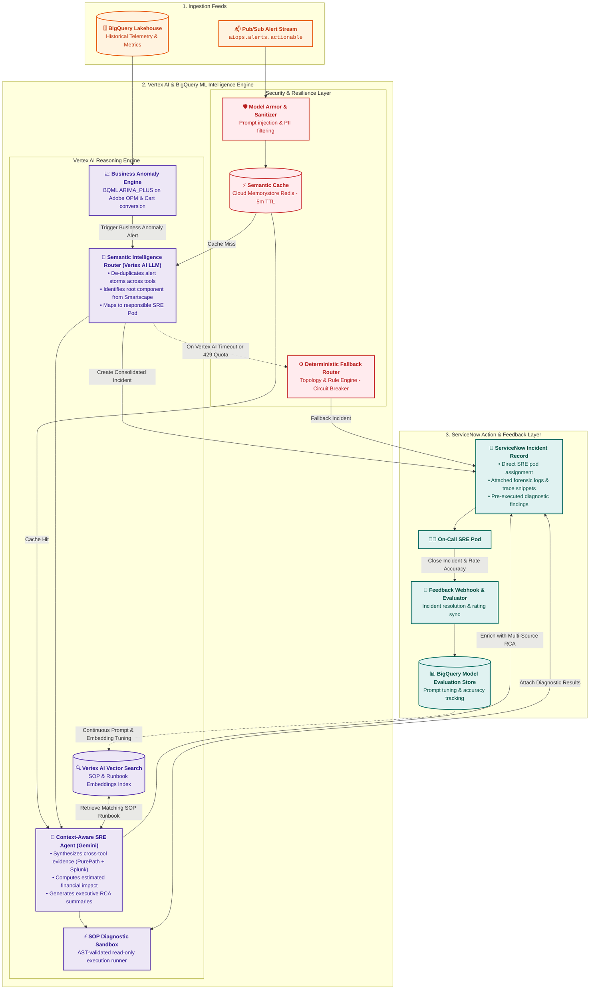

# AIOps Intelligence Layer - Architecture Specification

## 1. Executive Overview

The **AIOps Intelligence Layer** is the reasoning core of the platform, running natively on **Google Cloud Platform (Vertex AI & BigQuery ML)**. It transforms normalized telemetry streams into actionable operational decisions, performing:
1. **Semantic Alert Routing & De-Noising**: Clustering cascading alert storms into single root cause incidents.
2. **Context-Aware SRE Agent Execution**: Leveraging Gemini models to perform cross-source RCA and diagnostic runbook retrieval.
3. **Automated SOP Diagnostics**: Executing non-destructive verification steps and attaching synthesized evidence to **ServiceNow**.
4. **Silent Outage Business Anomaly Detection**: Detecting customer-impacting revenue drops via BQML time-series models.
5. **Continuous Closed-Loop Learning**: Gathering SRE resolution feedback to evaluate and tune reasoning prompts and vector embeddings.

---

## 2. Core Intelligence Modules

### 2.1 Semantic Intelligence Router
* **Engine**: Fine-tuned Gemini models on Vertex AI.
* **Function**: Ingests raw alert payloads from `aiops.alerts.actionable` in 30-second sliding windows.
* **Alert De-Noising**: When a core database fails, 50+ secondary alerts fire across Akamai (504s), GKE (pod restarts), Splunk (connection errors), and Dynatrace. The Semantic Router clusters these into a single master incident, preventing L1 queue saturation.
* **Routing**: Directly assigns the ticket to the specific SRE pod (e.g., `Checkout-Backend-Pod`) using ServiceNow CMDB topology mappings.

### 2.2 Context-Aware SRE Agent (Gemini)
* **Function**: Multi-modal reasoning engine that correlates technical telemetry with business impact.
* **Forensic Enrichment**: When an incident is assigned, the agent automatically executes:
  1. Dynatrace PurePath stack trace extraction for the top failing method.
  2. Targeted Splunk SPL queries for the affected host $\pm 10$ minutes.
  3. Adobe Analytics financial impact calculation (estimated revenue loss in USD per minute).
* **Summary Generation**: Writes an executive summary and technical diagnosis in clear markdown directly onto the ServiceNow incident work notes.

### 2.3 Automated SOP Runbook Execution Engine
* **Storage**: SOP runbooks are authored in Markdown with YAML Frontmatter ("Runbooks as Code") and indexed in **Vertex AI Vector Search**.
* **Autonomous Execution**:
  * The agent retrieves the top matching SOP via vector similarity.
  * The agent executes all read-only diagnostic SQL queries and REST checks defined in the SOP `diagnostics` block.
  * Diagnostic results are appended to the ticket before the engineer opens it.

### 2.4 Business Anomaly Engine (BQML)
* **Model**: BigQuery ML `ARIMA_PLUS` time-series forecasting.
* **Metric**: Real-time Orders Per Minute (OPM) and Cart Conversion Rate from Adobe Analytics.
* **Detection**: Detects "silent outages" where infrastructure metrics appear green but digital checkout is failing. Triggers a P1 incident when OPM deviates $> 3\sigma$ from predicted seasonal baselines.

---

## 3. Resilience, Circuit Breaker & Fallback Architecture

1. **Deterministic Rule Fallback Engine**: If Vertex AI encounters regional degradation, API latency spikes ($> 5$ seconds), or 429 Rate Limit exhaustion during major alert floods, a circuit breaker trips. Telemetry is automatically routed through a deterministic rule-based engine utilizing cached Dynatrace Smartscape topologies and static CMDB service ownership tables.
2. **Asynchronous Dead-Letter Queues (DLQ)**: Any alerts that fail both AI routing and deterministic parsing are written to `aiops.alerts.dlq` on Pub/Sub and archived in Cloud Storage for post-incident replay and pipeline diagnostics.

---

## 4. Security & Prompt Injection Defense

1. **Vertex AI Model Armor & Sanitization**: All telemetry payloads pass through an input sanitizer prior to LLM prompt construction. The sanitizer:
   * Strips known prompt injection delimiters (e.g., `Ignore previous instructions`, `SYSTEM PROMPT:`).
   * Enforces strict schema structure (JSON-only input boundaries).
   * Redacts sensitive secrets and API keys using regex tokenizers.
2. **Cloud DLP PII Masking**: Incoming telemetry is scrubbed for payment card numbers (PCI-DSS) and customer PII before entering BigQuery or the LLM context window.
3. **Least-Privilege Service Accounts**: Gemini Agent tool execution is isolated to dedicated GCP Service Accounts with fine-grained, read-only permissions across BigQuery datasets and external APIs.

---

## 5. Performance, Token Cost & Caching Strategy

1. **Semantic Cache (Cloud Memorystore Redis)**:
   * **Mechanism**: Vectorizes alert cluster signatures and queries a 5-minute TTL cache in Redis.
   * **Benefit**: Reuses RCA and runbook mappings for duplicate alerts, reducing LLM API calls by up to 70% during peak incident alert storms.
2. **Vertex AI Context Caching**:
   * **Mechanism**: Pre-caches static CMDB microservice schemas, SRE pod matrices, and runbook metadata in Vertex AI.
   * **Benefit**: Reduces prompt token latency by up to 80% and decreases per-incident reasoning cost by up to 75%.

---

## 6. Closed-Loop SRE Feedback & Continuous Model Observability

1. **Bidirectional ServiceNow Feedback Loop**:
   * Webhook on incident closure captures engineer feedback (`Root Cause Confirmed`, `False Positive`, rating from 1 to 5).
2. **Model Evaluation Store (BigQuery `aiops_lakehouse.agent_evaluations`)**:
   * Tracks Routing Accuracy ($> 92\%$), SOP Retrieval Recall@K ($> 88\%$), and Grounding/Faithfulness ($> 99\%$).
   * Low-accuracy ratings trigger automated GitHub Actions to tune prompts and re-index vector embeddings.

---

## 7. Sandboxed SOP Diagnostic Execution Specifications

1. **AST-Based SQL Validation**: Strict parser blocks destructive SQL (`INSERT`, `UPDATE`, `DELETE`, `DROP`, `ALTER`, `TRUNCATE`, `MERGE`). Only read-only `SELECT` queries with mandatory `LIMIT` ($\le 100$) are allowed.
2. **HTTP Method Restrictions**: External diagnostic API calls are restricted exclusively to idempotent `GET` requests. Mutating methods (`POST`, `PUT`, `PATCH`, `DELETE`) are blocked at the gateway.
3. **Timeout & Resource Quotas**: Diagnostic queries are limited to a hard 15-second execution timeout and maximum 1 GB BigQuery scan limit.
