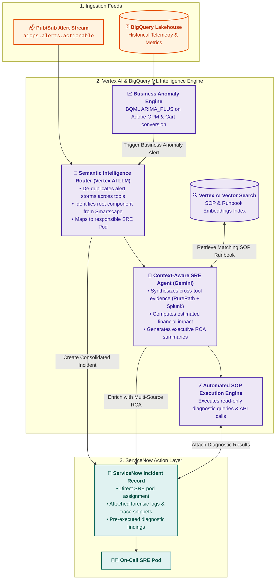

# AIOps Intelligence Layer - Architecture Specification

## 1. Executive Overview

The **AIOps Intelligence Layer** is the reasoning core of the platform, running natively on **Google Cloud Platform (Vertex AI & BigQuery ML)**. It transforms normalized telemetry streams into actionable operational decisions, performing:
1. **Semantic Alert Routing & De-Noising**: Clustering cascading alert storms into single root cause incidents.
2. **Context-Aware SRE Agent Execution**: Leveraging Gemini models to perform cross-source RCA and diagnostic runbook retrieval.
3. **Automated SOP Diagnostics**: Executing non-destructive verification steps and attaching synthesized evidence to **ServiceNow**.
4. **Silent Outage Business Anomaly Detection**: Detecting customer-impacting revenue drops via BQML time-series models.

---

## 2. Core Intelligence Modules

### 2.1 Semantic Intelligence Router
* **Engine**: Fine-tuned Gemini models on Vertex AI.
* **Function**: Ingests raw alert payloads from `aiops.alerts.actionable` in 30-second sliding windows.
* **Alert De-Noising**: When a core database fails, 50+ secondary alerts fire across Akamai (504s), GKE (pod restarts), Splunk (connection errors), and Dynatrace. The Semantic Router clusters these into a single master incident, preventing L1 queue saturation.
* **Routing**: Directly assigns the ticket to the specific SRE pod (e.g., `Checkout-Backend-Pod`) using ServiceNow CMDB topology mappings.

### 2.2 Context-Aware SRE Agent (Gemini)
* **Function**: Multi-modal reasoning engine that correlates technical telemetry with business impact.
* **Forensic Enrichment**: When an incident is assigned, the agent automatically executes:
  1. Dynatrace PurePath stack trace extraction for the top failing method.
  2. Targeted Splunk SPL queries for the affected host $\pm 10$ minutes.
  3. Adobe Analytics financial impact calculation (estimated revenue loss in USD per minute).
* **Summary Generation**: Writes an executive summary and technical diagnosis in clear markdown directly onto the ServiceNow incident work notes.

### 2.3 Automated SOP Runbook Execution Engine
* **Storage**: SOP runbooks are authored in Markdown with YAML Frontmatter ("Runbooks as Code") and indexed in **Vertex AI Vector Search**.
* **Autonomous Execution**:
  * The agent retrieves the top matching SOP via vector similarity.
  * The agent executes all read-only diagnostic SQL queries and REST checks defined in the SOP `diagnostics` block.
  * Diagnostic results are appended to the ticket before the engineer opens it.

### 2.4 Business Anomaly Engine (BQML)
* **Model**: BigQuery ML `ARIMA_PLUS` time-series forecasting.
* **Metric**: Real-time Orders Per Minute (OPM) and Cart Conversion Rate from Adobe Analytics.
* **Detection**: Detects "silent outages" where infrastructure metrics appear green but digital checkout is failing. Triggers a P1 incident when OPM deviates $> 3\sigma$ from predicted seasonal baselines.
