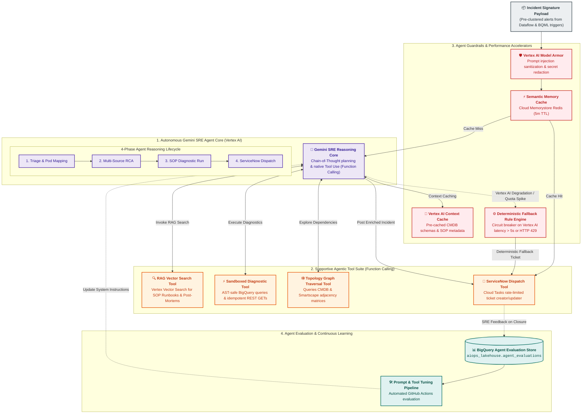
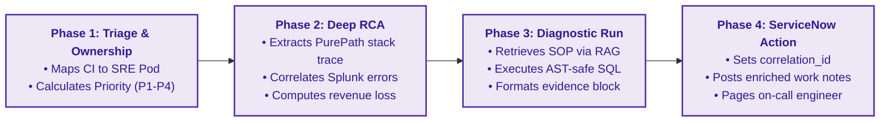
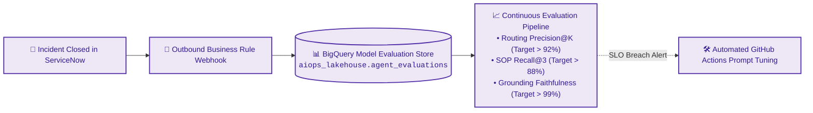

# AIOps Intelligence & Reasoning Layer - Agent-Centric Architecture

## 1. Executive Summary & Architectural Role

The **AIOps Intelligence & Reasoning Layer** is the cognitive core of the platform, powered natively by **Google Cloud Platform (Vertex AI & Gemini Models)**.

Instead of deploying fragmented LLMs and disconnected execution engines, this layer centers around a unified **Autonomous Gemini SRE Agent** equipped with a specialized **Supportive Agentic Tool Suite**, **Semantic Memory**, **Model Armor Guardrails**, and **Context Caching**.

The agent consumes structured `Incident Signature Payloads` emitted by the [Data Processing & Feature Preparation Layer](file:///c:/Users/ToanBX/dev/personal/aiops_architect/docs/architecture/02_storage_and_lakehouse/data_processing_and_feature_store.md) and autonomously executes a 4-phase reasoning plan to triage incidents, isolate root causes, run non-destructive diagnostics, and update **ServiceNow**.



---

## 2. Autonomous Gemini SRE Agent: The 4-Phase Reasoning Lifecycle

Rather than using separate, uncoordinated LLMs for triage and investigation, the **Gemini SRE Agent** executes a single, cohesive reasoning loop via function calling:



### Phase 1: Incident Triage & Pod Assignment
* **Objective**: Ingests the structured `Incident Signature Payload` and evaluates impact.
* **Tool Invocation**: Calls `Tool_Topology_Graph` to inspect parent-child microservice dependencies.
* **Outcome**: Assigns urgency, severity, and the responsible SRE pod (e.g., `Checkout-Backend-Pod` vs. `Network-Edge-Pod`), completely bypassing manual L1 helpdesk queues.

### Phase 2: Multi-Source Root Cause Analysis (RCA)
* **Objective**: Correlates technical telemetry with business performance.
* **Actions**:
  1. Identifies the failing code path or database session via Dynatrace PurePath trace IDs.
  2. Synthesizes concurrent Splunk server error logs matching the incident time window ($\pm 10\text{ minutes}$).
  3. Estimates real-time digital financial impact (e.g., *"$14.2k/min revenue drop based on Adobe Orders Per Minute deviation"*).

### Phase 3: RAG Retrieval & Sandboxed Diagnostic Execution
* **Objective**: Autonomous execution of standard diagnostic runbooks before engineer engagement.
* **Actions**:
  1. Calls `Tool_RAG_Search` to retrieve the relevant Standard Operating Procedure (SOP) from **Vertex AI Vector Search**.
  2. Extracts all read-only diagnostic checks from the SOP YAML frontmatter.
  3. Invokes `Tool_Diagnostic_Sandbox` to execute the queries safely against BigQuery and internal monitoring APIs.

### Phase 4: ServiceNow Dispatch & Action
* **Objective**: Publish the complete synthesized diagnosis to the enterprise system of record.
* **Actions**:
  1. Constructs the Markdown summary and diagnostic findings block.
  2. Invokes `Tool_ServiceNow_Dispatch` to create or update the incident in ServiceNow with `correlation_id = signature_id`.
  3. Automatically alerts the on-call engineer with complete diagnostic evidence pre-attached.

---

## 3. The Supportive Agentic Tool Suite (Function Calling)

The Gemini SRE Agent interacts with the enterprise ecosystem through four strictly governed tools:

```
┌────────────────────────────────────────────────────────────────────────┐
│                        Gemini SRE Agent Runtime                        │
└──────┬─────────────────┬─────────────────────┬──────────────────┬──────┘
       │                 │                     │                  │
       ▼                 ▼                     ▼                  ▼
 ┌───────────┐     ┌───────────┐         ┌───────────┐      ┌───────────┐
 │ Tool_RAG  │     │  Tool_    │         │ Tool_     │      │ Tool_     │
 │ Vector    │     │  Sandbox  │         │ Topology  │      │ ServiceNow│
 │ Search    │     │  Executor │         │ Graph     │      │ Dispatch  │
 └─────┬─────┘     └─────┬─────┘         └─────┬─────┘      └─────┬─────┘
       │                 │                     │                  │
       ▼                 ▼                     ▼                  ▼
 Vertex Vector     BigQuery Sandbox      BigQuery Graph       Cloud Tasks
  Index (SOPs)     (AST Validator)      (CMDB Adjacency)     (REST Buffer)
```

### 3.1 `Tool_RAG_Search` (Runbook & Post-Mortem Retrieval)
* **Underlying Service**: **Vertex AI Vector Search Index**.
* **Capabilities**: Executes Approximate Nearest Neighbor (ANN) vector search (768-dimension embeddings) filtered by `service_name` and `environment`.
* **Output**: Returns the top-matching Markdown SOP containing symptoms, diagnostic commands, and remediation runbook links.

### 3.2 `Tool_Diagnostic_Sandbox` (Read-Only Execution Environment)
* **Underlying Service**: BigQuery Client + Cloud Run Gateway with AST Validator.
* **Guardrails**:
  * **AST SQL Parsing**: Blocks mutating statements (`INSERT`, `UPDATE`, `DELETE`, `DROP`, `ALTER`, `TRUNCATE`, `MERGE`). Only `SELECT` queries with mandatory `LIMIT <= 100` are permitted.
  * **HTTP Gate**: Restricts external diagnostic API calls strictly to idempotent `GET` requests.
  * **Quotas**: Hard 15-second execution timeout and maximum 1 GB BigQuery scan limit.

### 3.3 `Tool_Topology_Graph` (Dependency Traversal)
* **Underlying Service**: BigQuery `aiops_lakehouse.topology_service_graph`.
* **Capabilities**: Executes recursive BFS traversal across Dynatrace Smartscape and ServiceNow CMDB CI relationships to return upstream caller and downstream dependency trees.

### 3.4 `Tool_ServiceNow_Dispatch` (ITSM Enriched Ticket Publisher)
* **Underlying Service**: Asynchronous Cloud Tasks Queue (`aiops-snow-dispatch-queue`).
* **Capabilities**: Submits enriched JSON payloads to ServiceNow with rate-limiting protection ($20\text{ req/s}$) and `correlation_id` deduplication.

---

## 4. Agent Guardrails, Security & Performance Acceleration

### 4.1 Vertex AI Model Armor & Input Sanitization
All raw telemetry strings and external API responses pass through an input sanitizer before entering the Gemini context window:
1. **Prompt Injection Defense**: Strips delimiter attacks (e.g., `Ignore previous instructions`, `SYSTEM PROMPT:`, `Assistant:`).
2. **Secret Redaction**: Regex tokenizers scrub API tokens, private keys, and passwords.
3. **Cloud DLP Integration**: Masks credit card numbers (PCI-DSS) and customer PII from log excerpts.

### 4.2 Vertex AI Context Caching
* **Mechanism**: Static CMDB microservice schemas, SRE pod matrices, system instructions, and tool definitions are pre-cached in Vertex AI Context Storage.
* **Impact**:
  * **Latency**: Reduces prompt token processing time by up to **80%**.
  * **Cost**: Decreases per-incident input token billing by up to **75%**.

### 4.3 Semantic Memory Cache (Cloud Memorystore Redis)
* **Mechanism**: Generates an embedding hash of the `Incident Signature` and queries a 5-minute TTL Redis cache.
* **Benefit**: Reuses RCA and diagnostic findings for recurring or duplicate alert bursts, avoiding redundant LLM invocations during major incidents.

### 4.4 Deterministic Rule Fallback Engine (Circuit Breaker)
* **Trigger Condition**: If Vertex AI experiences regional degradation, API latency spikes ($> 5\text{ seconds}$), or HTTP 429 quota exhaustion.
* **Action**: The circuit breaker trips immediately. Telemetry is routed through a deterministic Python rule engine using cached CMDB topology tables to assign the ticket, guaranteeing $100\%$ incident routing uptime.

---

## 5. Closed-Loop SRE Feedback & Model Observability

To prevent model hallucination drift and continuously improve diagnostic quality, the agent operates in a continuous learning loop:



### 5.1 Evaluation Metrics & Quality Targets
* **Routing Accuracy ($> 92\%$)**: Percentage of incidents assigned to the correct SRE pod without human re-assignment.
* **SOP Retrieval Recall@3 ($> 88\%$)**: Percentage of incidents where the relevant remediation runbook was among the top-3 retrieved.
* **Grounding & Faithfulness ($> 99\%$)**: Verification that all facts, metrics, and trace IDs in the ticket summary are grounded in raw telemetry.

---

## 6. Summary & Cross-Domain Linkages

This agent-centric specification interfaces directly with:
* [Platform Overview & End-to-End Blueprint](file:///c:/Users/ToanBX/dev/personal/aiops_architect/docs/architecture/00_overview/aiops_platform_overview.md)
* [Data Processing & Feature Preparation Architecture](file:///c:/Users/ToanBX/dev/personal/aiops_architect/docs/architecture/02_storage_and_lakehouse/data_processing_and_feature_store.md)
* [Unified Lakehouse Architecture](file:///c:/Users/ToanBX/dev/personal/aiops_architect/docs/architecture/02_storage_and_lakehouse/lakehouse_architecture.md)
* [ServiceNow Integration & Remediation Guide](file:///c:/Users/ToanBX/dev/personal/aiops_architect/docs/architecture/04_itsm_and_remediation/servicenow_integration.md)
