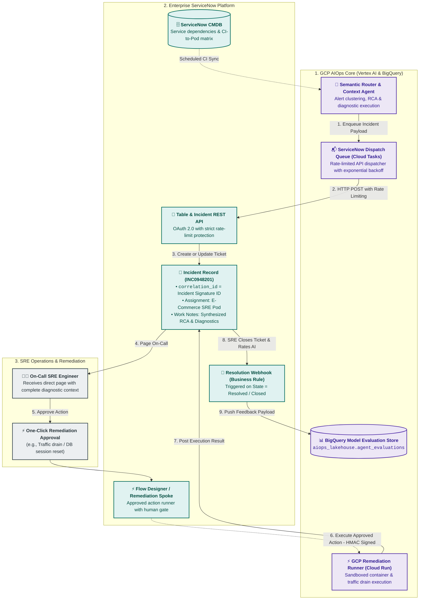
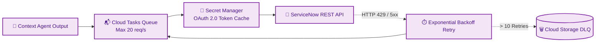
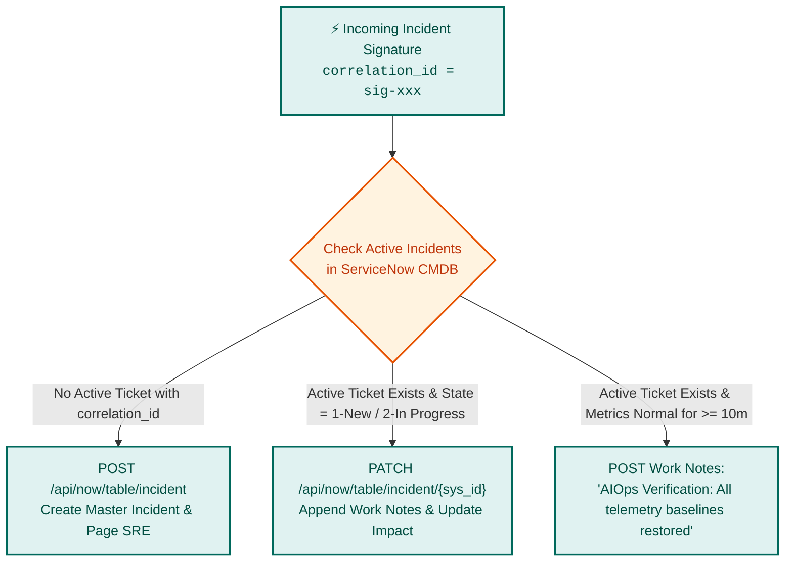
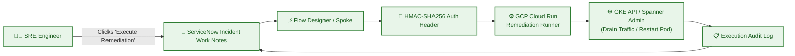
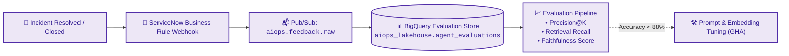

# ServiceNow ITSM Integration & Automated Remediation Architecture

## 1. Overview & Architectural Role

**ServiceNow** serves as the definitive enterprise system of record for IT Service Management (ITSM), Configuration Management Database (CMDB), on-call scheduling, and automated incident response workflows.

The **ServiceNow Integration Layer** bridges the **Google Cloud Platform (GCP) AIOps Core** with enterprise operational workflows. It performs:
1. **Intelligent Direct Pod Routing**: Bypasses manual L1 triage by routing enriched incidents directly to specialized SRE pods based on CMDB topology and ML classification.
2. **Contextual Incident Enrichment**: Automatically attaches synthesized Dynatrace root cause traces, Splunk log forensics, and Adobe revenue loss calculations to work notes.
3. **Automated SOP Diagnostics Attachment**: Pre-executes read-only diagnostic checks and posts structured evidence to tickets before an engineer begins investigation.
4. **Stateful Incident Deduplication**: Correlates ongoing alert storms using unique `correlation_id` signatures to update active incidents rather than spamming duplicate tickets.
5. **Human-in-the-Loop Remediation**: Orchestrates one-click remediation actions via ServiceNow Flow Designer calling back to sandboxed GCP remediation runners.
6. **Closed-Loop SRE Feedback ETL**: Captures post-incident resolution ratings and confirmed root causes to continuously evaluate and tune Vertex AI models.



---

## 2. Outbound Dispatch Architecture & API Resiliency

During severe infrastructure disruptions or peak retail events (e.g., Black Friday / Cyber Monday), hundreds of secondary alerts can fire simultaneously. Direct synchronous REST API calls risk **HTTP 429 (Too Many Requests)** throttling by ServiceNow instances.

### 2.1 Asynchronous Rate-Limited Dispatcher (Cloud Tasks)
* **Queue Configuration**: A dedicated **Cloud Tasks Queue** (`aiops-snow-dispatch-queue`) acts as a shock absorber.
* **Dispatch Rate**: Capped at $20\text{ requests/second}$ (configurable per enterprise ServiceNow license tier).
* **Exponential Backoff**: On HTTP 429, 500, or 503 responses, Cloud Tasks retries exponentially ($1\text{s}, 2\text{s}, 4\text{s}, 8\text{s}, \dots, 60\text{s}$) up to 10 attempts before routing to the dead-letter topic `aiops.snow.dlq`.



### 2.2 Enriched Incident Creation Payload Contract
* **Protocol**: HTTPS REST API (`/api/now/table/incident`).
* **Authentication**: OAuth 2.0 Client Credentials with cached bearer tokens.

```json
{
  "short_description": "P1 Anomaly: Checkout API Latency Surge causing $14.2k/min revenue drop",
  "urgency": "1",
  "impact": "1",
  "assignment_group": "E-Commerce SRE Pod",
  "cmdb_ci": "ci_sys_id_checkout_api",
  "correlation_id": "sig-2026-08-26-chk-001",
  "correlation_display": "GCP AIOps Engine",
  "work_notes": "### 🤖 AIOps Context-Aware RCA Summary\n- **Root Cause**: Database Connection Pool Exhausted on node `checkout-db-primary` (Dynatrace PurePath trace ID `4bf92f35...`).\n- **Business Impact**: Orders Per Minute dropped 38% (Adobe Analytics).\n- **Attached Forensics**: 12 matching Splunk error records found in past 10 minutes.\n\n### ⚡ Diagnostic SOP Execution Output (SOP-CHK-DB-001)\n- Redis Cache Hit Ratio: 99.2% (Healthy)\n- DB Connection Active Count: 100/100 (Saturated)\n- Spanner Active Sessions: 500/500 (Max Limit Reached)\n\n### 🔗 Quick Forensic Deep-Links\n- [Dynatrace PurePath Trace View](https://dynatrace.retail.internal/#purepath;id=4bf92f35)\n- [Splunk Forensic Dashboard](https://splunk.retail.internal/app/search/checkout_db_errors)"
}
```

---

## 3. Incident Lifecycle, Deduplication & State Synchronization

To avoid duplicate ticket spam when cascading alerts continue to arrive during an ongoing outage, the platform enforces strict lifecycle synchronization:



### 3.1 Deduplication & Update Rules
1. **Correlation Keying**: Every incident payload carries `correlation_id = incident_signature_id` (derived from the affected root CMDB CI and time window).
2. **Existing Incident Check**: Before creating a ticket, Cloud Tasks checks for existing records where `correlation_id = signature_id` and `incident_state NOT IN (6, 7)` (not Resolved or Closed).
3. **In-Flight Enrichment**: If an incident is already active, subsequent findings (e.g., additional Splunk logs or escalating financial impact) are appended to the existing ticket's `work_notes` with a `PATCH` request rather than opening a new ticket.
4. **Auto-Recovery Verification**: When telemetry baselines return to normal for $\ge 10\text{ minutes}$, the Semantic Router automatically posts an **Operational Recovery Note** to the incident, prompting the on-call engineer to verify and resolve the ticket.

---

## 4. Multi-Cloud CMDB Topological Mapping

To route incidents accurately without human intervention, multi-cloud telemetry entities are mapped continuously to ServiceNow CMDB Configuration Items (CIs):

| Telemetry Source | Entity Format / Identifier | ServiceNow CMDB Target Table | SRE Ownership Pod Resolution |
| :--- | :--- | :--- | :--- |
| **GCP GKE** | `k8s.pod.name`, `k8s.namespace.name` | `cmdb_ci_kubernetes_pod` / `cmdb_ci_appl` | `namespace` metadata ➔ Pod Matrix |
| **Dynatrace** | Smartscape Entity ID (`SERVICE-XXX`, `HOST-XXX`) | `cmdb_ci_service` / `cmdb_ci_server` | Dynatrace Management Zone tags |
| **Akamai** | Edge Property / CDN Hostname (`store.retail.com`) | `cmdb_ci_endpoint` / `cmdb_ci_web_server` | Edge Networking Pod |
| **Splunk** | Hostname / POS Terminal ID (`pos-lane-442`) | `cmdb_ci_vm_instance` / `cmdb_ci_pos` | Store Systems Support Pod |
| **Adobe Analytics** | Funnel Domain (`checkout`, `cart`, `search`) | `cmdb_ci_business_app` | Digital Experience SRE Pod |

### 4.1 Topology Synchronization Pipeline
* **Batch Sync**: A scheduled Cloud Composer DAG queries `/api/now/table/cmdb_rel_ci` nightly to refresh parent-child service dependency graphs in BigQuery (`aiops_lakehouse.topology_service_graph`).
* **Dynamic Resolution**: When an anomaly occurs on `storefront-ui`, the Semantic Router traverses the graph downward to identify if the root dependency is `checkout-service` or `spanner-db`, routing the ticket to the exact owner pod.

---

## 5. Human-in-the-Loop One-Click Automated Remediation

While diagnostics run autonomously, mutating remediation actions strictly enforce **Human-in-the-Loop (HITL)** governance:



1. **Remediation Trigger**: The Gemini SRE Agent attaches an approved runbook action block in ServiceNow work notes (e.g., `[Approve Traffic Drain for checkout-pod-x89]`).
2. **Execution Gate**: The on-call engineer clicks the approval button in the ServiceNow UI.
3. **Remediation Webhook**: **ServiceNow Flow Designer (Integration Hub)** sends a signed HTTPS POST request (`HMAC-SHA256`) to the **GCP Cloud Run Remediation Service**.
4. **Audit Logging**: The remediation runner executes the action (e.g., cordoning a degrading GKE node or scaling up database connection pools) and writes the complete terminal execution log back to ServiceNow `work_notes`.

---

## 6. Closed-Loop SRE Feedback & Continuous Model Learning

To continuously improve reasoning accuracy and avoid model hallucination drift, ServiceNow acts as the ground-truth data collection hub:



### 6.1 Feedback Webhook Payload Schema
When an engineer closes or resolves an incident, a ServiceNow **Business Rule** triggers an outbound REST webhook:

```json
{
  "event_type": "incident_closed_feedback",
  "incident_id": "INC0948201",
  "correlation_id": "sig-2026-08-26-chk-001",
  "assigned_sre_pod": "Checkout-Backend-Pod",
  "ai_predicted_root_cause": "Spanner Connection Pool Saturation",
  "actual_confirmed_root_cause": "Spanner Connection Pool Saturation",
  "sre_accuracy_rating": 5,
  "false_positive_flag": false,
  "diagnostics_usefulness_rating": 4,
  "resolution_code": "Resolved by Runbook (Scaled Pool Replicas)",
  "duration_seconds": 680,
  "closed_at": "2026-08-26T06:41:20Z"
}
```

### 6.2 BigQuery Model Evaluation Store
Feedback payloads stream directly into `aiops_lakehouse.agent_evaluations`:
* **Routing Accuracy Metric**: Target $> 92\%$ correct pod routing.
* **SOP Retrieval Recall@3**: Target $> 88\%$ relevant runbook retrieval.
* **Automated Alerting**: If the rolling 7-day accuracy drops below target thresholds, a GitHub Actions workflow is triggered to re-tune reasoning prompts and re-index vector embeddings.

---

## 7. Operational Impact & MTTD / MTTR Quantification

| Incident Lifecycle Stage | Traditional Manual Operations | AIOps + ServiceNow Platform | Time Savings / MTTR Reduction |
| :--- | :--- | :--- | :--- |
| **Detection (MTTD)** | 5 – 15 minutes (waiting for customer complaints or siloed alerts) | **$< 60$ seconds** (continuous BQML time-series & Davis AI webhooks) | **$85\%$ reduction** |
| **L1 Triage & Queue Routing** | 10 – 20 minutes (manual ticket dispatch by L1 helpdesk) | **Instant (< 2 seconds)** (Semantic Router direct pod routing) | **$100\%$ automation** |
| **SOP Runbook Retrieval** | 5 – 10 minutes (searching wikis and Confluence pages) | **Instant (< 1 second)** (Vertex AI Vector Search retrieves SOP) | **$100\%$ automation** |
| **Diagnostic Execution** | 10 – 25 minutes (running CLI queries across 5 tools) | **Pre-executed (< 10 seconds)** (findings attached before SRE arrival) | **$90\%$ reduction** |
| **Remediation Execution** | 15 – 30 minutes (manual command-line triage and execution) | **1 – 3 minutes** (one-click approved remediation runner) | **$80\%$ reduction** |
| **Total MTTR** | **45 – 100 minutes** | **8 – 15 minutes** | **$> 75\%$ MTTR Improvement** |

---

## 8. Security, Access Controls & Auditability

1. **OAuth 2.0 Client Credentials**: All outbound requests to ServiceNow authenticate via scoped OAuth 2.0 tokens cached securely in Cloud Memorystore with secrets in **GCP Secret Manager**.
2. **Least Privilege ACLs**:
   * GCP Service Account: `create` and `update` permissions on `incident` and `sys_journal_field`; `read-only` on `cmdb_ci` and `cmdb_rel_ci`.
   * Webhook Ingress: Enforces IP allowlisting and HMAC-SHA256 signature verification.
3. **Audit Trail Transparency**: Every automated diagnostic query and remediation execution is stamped with full parameter transparency in ServiceNow Work Notes, fulfilling strict enterprise compliance and post-incident review (PIR) mandates.

---

## 9. Related Architectural Specifications

* [High-Level Platform Architecture](file:///c:/Users/ToanBX/dev/personal/aiops_architect/docs/architecture/00_overview/aiops_platform_overview.md)
* [Ingestion Master Blueprint](file:///c:/Users/ToanBX/dev/personal/aiops_architect/docs/architecture/01_ingestion/ingestion_architecture.md)
* [Unified Lakehouse & AI Feature Store](file:///c:/Users/ToanBX/dev/personal/aiops_architect/docs/architecture/02_storage_and_lakehouse/lakehouse_and_feature_store.md)
* [Autonomous Gemini SRE Agent Architecture](file:///c:/Users/ToanBX/dev/personal/aiops_architect/docs/architecture/03_intelligence_and_reasoning/aiops_intelligence_layer.md)
