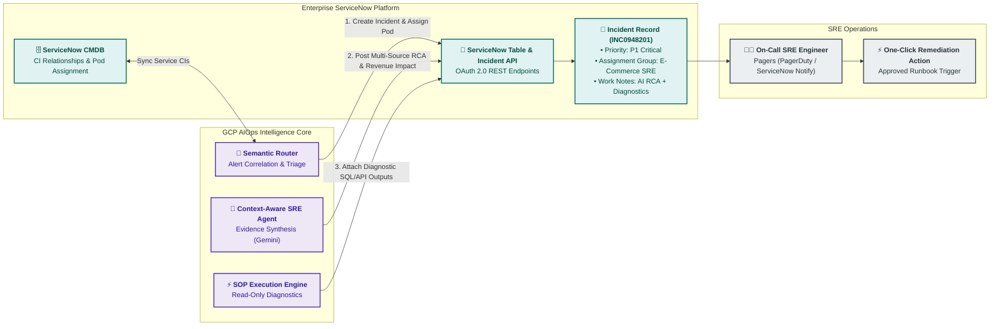

# ServiceNow ITSM Integration & Automated Remediation Architecture

## 1. Overview & Architectural Role

**ServiceNow** is the enterprise system of record for IT Service Management (ITSM), Configuration Management (CMDB), on-call scheduling, and incident response workflows.

The **ServiceNow Integration Layer** bridges the GCP AIOps Core with enterprise operational workflows. It enables:
1. **Intelligent Direct Routing**: Bypassing manual L1 triage by routing enriched incidents directly to specialized SRE pods based on CMDB topology and ML classification.
2. **Contextual Incident Enrichment**: Automatically attaching Dynatrace root cause traces, Splunk log forensics, and Adobe revenue loss calculations to tickets.
3. **Automated SOP Execution Results**: Executing read-only diagnostic steps defined in SOP runbooks and attaching findings before the on-call engineer investigates.



---

## 2. Bidirectional Integration Mechanics

### 2.1 Outbound from GCP to ServiceNow (Incident Creation & Updates)
* **Protocol**: HTTPS REST API (`/api/now/table/incident`).
* **Authentication**: OAuth 2.0 Client Credentials with secrets stored in **GCP Secret Manager**.
* **Payload Structure**:
  ```json
  {
    "short_description": "P1 Anomaly: Checkout API Latency Surge causing $14.2k/min revenue drop",
    "urgency": "1",
    "impact": "1",
    "assignment_group": "E-Commerce SRE Pod",
    "cmdb_ci": "ci_sys_id_checkout_api",
    "work_notes": "### 🤖 AIOps Context-Aware RCA Summary\n- **Root Cause**: Database Connection Pool Exhausted on node `checkout-db-primary` (Dynatrace PurePath trace ID `4bf92f35...`).\n- **Business Impact**: Orders Per Minute dropped 38% (Adobe Analytics).\n- **Attached Forensics**: 12 matching Splunk error records found in past 10 minutes.\n\n### ⚡ Diagnostic SOP Execution Output\n- Redis Cache Hit Ratio: 99.2% (Healthy)\n- DB Connection Active Count: 100/100 (Saturated)"
  }
  ```

### 2.2 CMDB Topological Synchronization
* **Frequency**: Nightly batch synchronization or event-driven webhook upon CI deployment.
* **Mechanism**: Maps GCP GKE services and Dynatrace Smartscape entities to ServiceNow Configuration Items (`cmdb_ci_service`, `cmdb_ci_appl`).

---

## 3. MTTD and MTTR Operational Impact

| Incident Lifecycle Stage | Traditional Manual Workflow | AIOps + ServiceNow Workflow | Time Savings / MTTR Reduction |
| :--- | :--- | :--- | :--- |
| **Detection (MTTD)** | 5 – 15 minutes (waiting for user complaints or siloed thresholds) | **$< 60$ seconds** (continuous BQML time-series & Davis AI webhooks) | **$85\%$ reduction** |
| **L1 Triage & Assignment**| 10 – 20 minutes (manual queue triage by L1 helpdesk) | **Instant (< 2 seconds)** (Semantic Router direct pod routing) | **$100\%$ automation** |
| **Diagnostic Runbook Search**| 5 – 10 minutes (searching Confluence/Wikis) | **Instant (< 1 second)** (Vertex AI Vector Search retrieves SOP) | **$100\%$ automation** |
| **Diagnostic Execution** | 10 – 25 minutes (running CLI queries across Splunk, Dynatrace, GCP) | **Pre-executed (< 10 seconds)** (findings already on ticket when engineer arrives)| **$90\%$ reduction** |
| **Overall MTTR** | **45 – 90 minutes** | **8 – 15 minutes** | **$> 75\%$ MTTR Improvement** |

---

## 4. Security, Access Controls & Auditability

* **Least Privilege**: The GCP service account is restricted solely to `create` and `update` permissions on `incident` and `sys_journal_field` tables, and `read-only` on `cmdb_ci`.
* **Audit Trail**: Every automated diagnostic query and remediation recommendation executed by the Gemini SRE Agent is logged with full parameter transparency in ServiceNow Work Notes for compliance and post-incident review (PIR).
