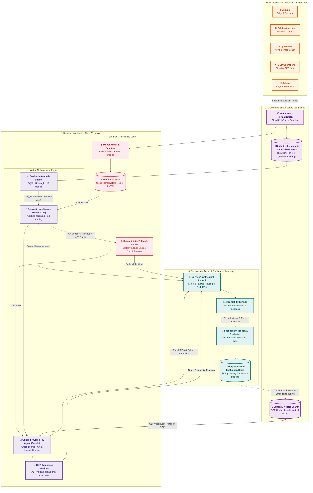
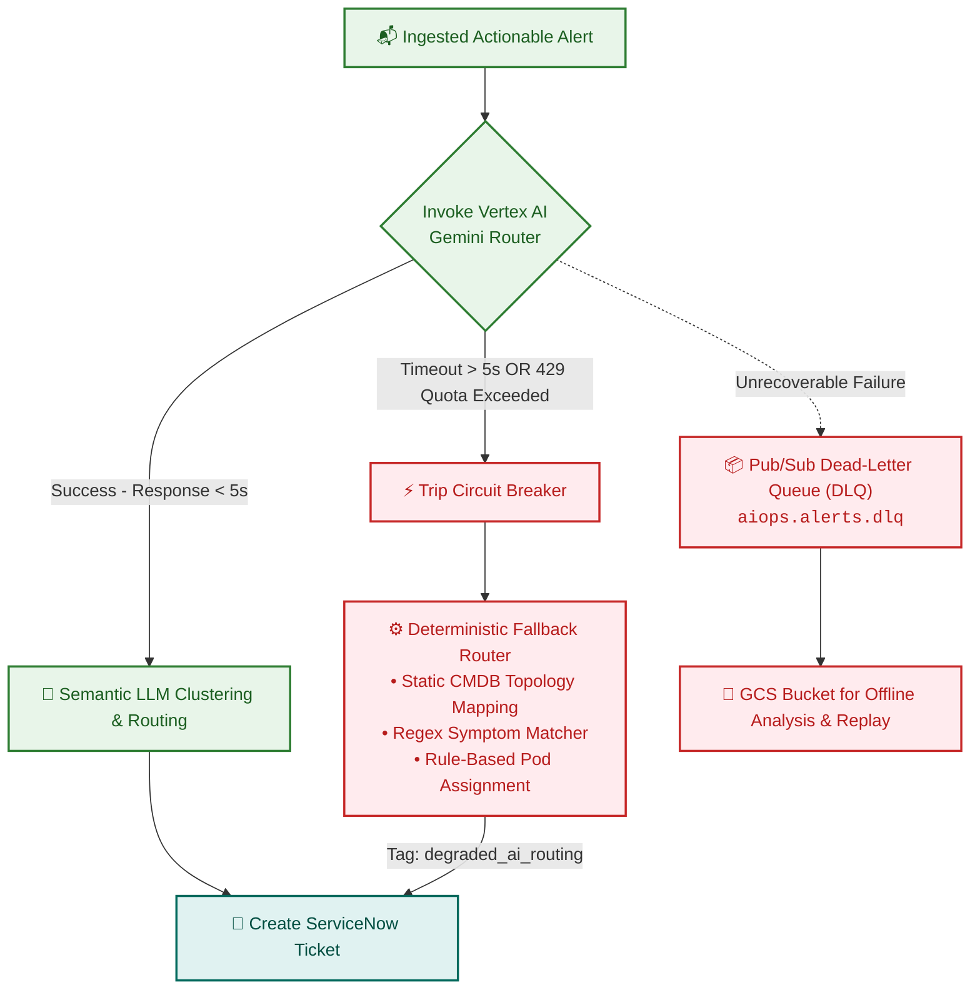
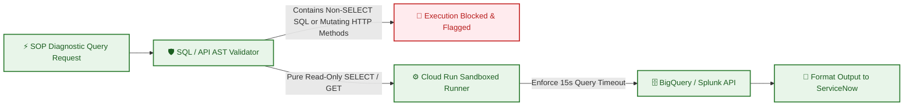

# AIOps Intelligence Layer - Architectural Design Document

> [!NOTE]
> This document is part of the modular [AIOps Architecture Documentation Tree](file:///c:/Users/ToanBX/dev/personal/aiops_architect/docs/README.md). You can also find the dedicated intelligence layer module at [03_intelligence_and_reasoning/aiops_intelligence_layer.md](file:///c:/Users/ToanBX/dev/personal/aiops_architect/docs/architecture/03_intelligence_and_reasoning/aiops_intelligence_layer.md).

## 1. Executive Summary

This document outlines the architectural blueprint for an enterprise **AIOps Intelligence Layer** designed to optimize incident response for the **Site Reliability Engineering (SRE) team of a global retail organization**. The system bridges the functional gap between multi-source observability feeds used by the SRE team—**Google Cloud Platform (GCP)**, **Dynatrace**, **Akamai**, **Splunk**, and **Adobe Analytics**—and the enterprise system of record (**ServiceNow**) by leveraging Semantic Intelligence and Context-Aware AI Agents natively on GCP.

**Business Driver**: For high-volume retail operations, every minute of downtime during peak trading windows (holiday seasons, promotional drops) results in hundreds of thousands of dollars in lost revenue and customer friction. SRE teams face overwhelming alert noise across fragmented tools. This AIOps layer correlates technical infrastructure metrics with live digital business transactions to minimize Mean Time to Detect (MTTD) and Mean Time to Resolve (MTTR).

---

## 2. Telemetry Ingestion from SRE Observability Tools

The AIOps system standardizes and ingests telemetry across the five primary tools in the SRE fleet:

| Observability Tool | Primary Domain & Role | Ingested Telemetry Types | Ingestion Mechanism into GCP |
| :--- | :--- | :--- | :--- |
| **Akamai** | Edge & Perimeter Observability | HTTP response codes, Time to First Byte (TTFB), WAF triggers, DDoS mitigation vectors, bot score/traffic classifications, origin health metrics. | Real-time push via **Akamai DataStream 2** to **Cloud Pub/Sub**; log archives batched to **Cloud Storage (GCS)** in Parquet/JSON. |
| **Dynatrace** | APM, Distributed Tracing & Topology | PurePath distributed call stacks, Smartscape entity graphs, code-level garbage collection/thread metrics, Davis AI problem & RCA webhooks. | **Dynatrace Webhooks** to **Cloud Run / Pub/Sub**; OpenTelemetry exporter; scheduled REST API pulls (`/api/v2/entities`) for topology updates. |
| **GCP Operations Suite** | Cloud Infrastructure & Platform Services | GKE pod CPU/Memory, container crash loops (`CrashLoopBackOff`), Pub/Sub message backlog age, Dataflow pipeline system lag, Cloud Audit Logs. | Native **GCP Log Router** sinks directly to **Cloud Pub/Sub**; metric exports via Managed Service for Prometheus (GMP) to **BigQuery**. |
| **Splunk** | Enterprise Log Hub & Security Forensics | Enterprise OS logs, POS/middleware audit logs, SAP backend logs, Splunk Enterprise Security (ES) notable events, SIEM alerts. | **Splunk HTTP Event Collector (HEC)** forwarding to **Cloud Pub/Sub**; on-demand REST API queries for targeted forensic lookups. |
| **Adobe Analytics** | Digital Experience & Business Telemetry | Real-time clickstream, Orders Per Minute (OPM), Cart Additions (`scAdd`), Checkout Funnel Drops (`scCheckout`), Payment gateway error rates. | **Adobe Experience Platform (AEP) Streaming Ingestion** to **Cloud Pub/Sub**; hourly raw data feeds to **GCS** and **BigQuery**. |

---

## 3. Critical Journeys & Intelligence Capabilities

### 3.1 Semantic Incident Routing & Noise Reduction
* **Problem**: When a cascading infrastructure failure occurs (e.g., database connection pool exhaustion), dozens of noisy alerts trigger across Akamai (504 gateway timeouts), GCP (high pod CPU), and Splunk (error logs), overwhelming L1 triage.
* **Solution**: The **Semantic Intelligence Router** (powered by Vertex AI Gemini) ingests the correlated alert stream from **Cloud Pub/Sub** in 30-second sliding windows. It parses unstructured payloads alongside **Dynatrace Smartscape** dependency graphs to isolate the root component. The router synthesizes a consolidated master incident and routes it directly to the responsible SRE pod via the **ServiceNow API**, bypassing manual L1 triage.

### 3.2 GitOps Alert & Rule Maintenance ("Alerts as Code")
* **Tooling**: **GitHub Actions** + **BigQuery**.
* **Problem**: Alerting thresholds across Dynatrace, GCP Monitoring, and Splunk become stale as services scale, causing alert fatigue and false positives.
* **Solution**: Monitoring rules are managed as code in Git repositories. The AIOps system tracks alert efficacy in BigQuery (e.g., alerts frequently closed without action). An automated agent generates Pull Requests in GitHub to tune thresholds, update Davis AI sensitivity, or retire redundant alert policies.

### 3.3 Context-Aware Incident Response & Automated SOP Execution
* **Problem**: When an alert fires (e.g., checkout degradation), SREs lose critical time searching for runbooks and running manual diagnostic CLI commands across tools.
* **Solution**: Upon incident generation, the **Context-Aware AI Agent (Gemini)** performs semantic similarity search against **Vertex AI Vector Search** to locate the matching Standard Operating Procedure (SOP).
* **SOP Format for Critical Retail Services**:
  * **Format**: "Runbooks as Code" using Markdown with YAML Frontmatter.
  * **Structure**:
    1. `metadata`: Target service (e.g., `checkout-service`), owner pod, required permissions.
    2. `symptoms`: "Adobe Analytics OPM drop > 20% AND Dynatrace p99 latency > 2.5s".
    3. `diagnostics`: SQL queries against BigQuery telemetry, Splunk forensic log filters ($\pm 10$ minutes), and Akamai edge cache status.
    4. `remediation`: Approved failover steps (e.g., route traffic away from degraded zone, switch payment gateway endpoint).
  * **Autonomous Diagnostics**: The agent executes all read-only diagnostic steps in real time via an AST-sandboxed runner and posts formatted findings directly onto the ServiceNow incident ticket before the SRE arrives.

### 3.4 Business Anomaly Detection ("Silent Outage" Prevention)
* **Problem**: A client-side JavaScript bug breaks the "Checkout" button after a release. Backend APIs return HTTP 200 OK because no requests arrive. Infrastructure monitoring shows green, but digital sales drop to zero.
* **Solution**: Live transaction metrics from **Adobe Analytics** (Orders Per Minute, Cart Conversion Rate) are streamed into BigQuery. **BigQuery ML (BQML)** runs continuous time-series forecasting (`ARIMA_PLUS`) that factors in seasonality, hour-of-day, and holiday trading peaks. When real-time orders deviate statistically ($> 3\sigma$) from predicted bounds, BQML triggers a P1 Business Anomaly Alert. The Semantic Router correlates this with recent CI/CD deployments and Akamai/Dynatrace telemetry to isolate the bug immediately.

---

## 4. Resilience, Circuit Breaker & Fallback Architecture

To guarantee high availability and eliminate single points of failure in the AI pipeline, the Intelligence Layer implements a comprehensive circuit breaker pattern:

1. **Deterministic Rule Fallback Engine**: If Vertex AI encounters regional degradation, API latency spikes ($> 5$ seconds), or 429 Rate Limit exhaustion during major alert floods, the circuit breaker trips. Telemetry is automatically routed through a deterministic rule-based engine utilizing cached Dynatrace Smartscape topologies and static CMDB service ownership tables.
2. **Asynchronous Dead-Letter Queues (DLQ)**: Any alerts that fail both AI routing and deterministic parsing are written to `aiops.alerts.dlq` on Pub/Sub and archived in Cloud Storage for post-incident replay and pipeline diagnostics.

---

## 5. Security & Prompt Injection Defense

Because raw log payloads from Akamai, Splunk, and Adobe Analytics can contain untrusted user input (e.g., malicious HTTP headers, search queries, or form inputs), strict security guardrails prevent prompt injection and data exfiltration:

1. **Vertex AI Model Armor & Sanitization**: All telemetry payloads pass through an input sanitizer prior to LLM prompt construction. The sanitizer:
   * Strips known prompt injection delimiters (e.g., `Ignore previous instructions`, `SYSTEM PROMPT:`, `Human:`).
   * Enforces strict schema structure (JSON-only input boundaries).
   * Redacts sensitive secrets and API keys using regex tokenizers.
2. **Cloud DLP PII Masking**: Incoming telemetry is scrubbed for payment card numbers (PCI-DSS) and customer PII before entering BigQuery or the LLM context window.
3. **Least-Privilege Service Accounts**: Gemini Agent tool execution is isolated to dedicated GCP Service Accounts with fine-grained, read-only permissions across BigQuery datasets and external APIs.

---

## 6. Performance, Token Cost & Caching Strategy

Alert storms can generate hundreds of duplicate or highly similar alerts within minutes. To prevent LLM rate limiting and unsustainable token costs, the architecture implements two-tier caching:

1. **Semantic Cache (Cloud Memorystore Redis)**:
   * **Mechanism**: When an alert storm arrives, the alert cluster signature is vectorized using Vertex AI Embeddings and queried against a 5-minute TTL vector index in Redis.
   * **Benefit**: If an identical incident signature was evaluated within the last 5 minutes, the existing RCA summary and runbook mapping are reused instantly, reducing LLM calls by up to 70% during P1 outages.
2. **Vertex AI Context Caching**:
   * **Mechanism**: Large static contexts—including enterprise CMDB microservice schemas, SRE pod ownership matrices, and standard SOP schemas—are stored in Vertex AI Context Cache.
   * **Benefit**: Reduces LLM input token processing latency by up to 80% and decreases per-incident reasoning costs by up to 75%.

---

## 7. Closed-Loop SRE Feedback & Continuous Model Observability

The Intelligence Layer integrates a closed-loop evaluation system to measure agent efficacy and drive continuous model improvement:

1. **Bidirectional ServiceNow Feedback Loop**:
   * When an SRE resolves an incident in ServiceNow, a webhook triggers containing:
     * **Resolution Code** (e.g., `Root Cause Confirmed`, `Incorrect SRE Pod`, `False Positive`).
     * **Engineer Rating** (1 to 5 stars or Thumbs Up/Down on AI diagnostics).
     * **Actual Remediated Component** vs **AI-Predicted Component**.
2. **Model Evaluation Store (BigQuery)**:
   * All feedback records are streamed into `aiops_lakehouse.agent_evaluations`.
   * **Key Metrics Monitored**:
     * **Routing Accuracy**: % of incidents accepted by the initially assigned SRE pod without reassignment (Target: $> 92\%$).
     * **SOP Retrieval Recall@K**: % of incidents where the recommended runbook was actively utilized (Target: $> 88\%$).
     * **Grounding & Faithfulness**: % of generated RCA statements verifiable against BigQuery/Splunk raw evidence (Target: $> 99\%$).
3. **Automated Vector Re-indexing**: Low-rated SOP matches automatically trigger prompt tuning jobs and runbook re-embedding pipelines via GitHub Actions.

---

## 8. Sandboxed SOP Diagnostic Execution Specifications

To guarantee that autonomous SOP execution can never cause operational damage, the Automated SOP Engine enforces strict execution guardrails:

1. **AST-Based SQL Validation**: All SQL queries extracted from runbooks pass through an Abstract Syntax Tree (AST) parser that strictly forbids `INSERT`, `UPDATE`, `DELETE`, `DROP`, `ALTER`, `TRUNCATE`, or `MERGE` statements. Only single-statement `SELECT` queries with mandatory `LIMIT` clauses ($\le 100$) are permitted.
2. **HTTP Method Restrictions**: External diagnostic API calls are restricted exclusively to idempotent `GET` requests. Mutating methods (`POST`, `PUT`, `PATCH`, `DELETE`) are blocked at the gateway.
3. **Timeout & Resource Quotas**: Diagnostic queries are limited to a hard 15-second execution timeout and maximum 1 GB BigQuery scan limit to prevent runaway resource exhaustion during active incident triage.

---

## 9. Scale Estimates & Ingestion Breakdown

Designing for an enterprise retail organization with global digital traffic and hundreds of physical stores entails the following ingestion profile:

| Source | Telemetry Type | Raw Volume / Day | Event Rate (EPS) | Ingestion Latency Target | Transport / Ingestion Protocol |
| :--- | :--- | :--- | :--- | :--- | :--- |
| **Akamai** | Edge Access Logs, WAF/DDoS Events | 4 - 6 TB | 50,000 - 150,000 | Sub-10 seconds | DataStream 2 HTTPS Push ➔ Cloud Pub/Sub |
| **Dynatrace** | PurePath Spans, Davis RCA Alerts | 2 - 4 TB | 20,000 - 80,000 | Sub-5 seconds | Webhook to Cloud Run / Pub/Sub + OpenTelemetry Collector |
| **GCP Operations Suite** | GKE Metrics, Pub/Sub/Dataflow Metrics, Audit Logs | 3 - 5 TB | 40,000 - 100,000 | Sub-second to 1 min | Cloud Logging Log Router Sink ➔ Pub/Sub / BigQuery |
| **Splunk** | Enterprise & Middleware Logs, SIEM Alerts | 3 - 6 TB | 30,000 - 90,000 | 1 - 3 minutes | Splunk HEC ➔ Cloud Pub/Sub; REST API for ad-hoc forensic queries |
| **Adobe Analytics** | Real-time Clickstream, Order & Cart Events | 1 - 2 TB | 10,000 - 40,000 | 1 - 2 minutes | AEP Streaming Ingestion ➔ Pub/Sub; Daily/hourly batch to GCS |
| **Total Fleet** | **Consolidated Multi-Source Telemetry** | **13 - 23 TB / day** | **150,000 - 460,000 EPS** | **Near Real-Time** | **Normalized via Cloud Dataflow ➔ 3,000 - 10,000 Actionable EPS** |

---

## 10. Security, Compliance & Data Governance

* **PCI-DSS & PII Masking (Cloud DLP)**: Retail transactions contain payment card data and customer PII. Streaming pipelines in **Cloud Dataflow** pass incoming payloads through **Cloud Data Loss Prevention (DLP)** inspect and de-identify templates prior to writing records into BigQuery or sending to LLMs.
* **Secret & Credential Management**: API keys, webhooks, and mutual TLS certificates for Dynatrace, Akamai, Splunk, and Adobe Analytics connectors are stored and auto-rotated in **GCP Secret Manager**.
* **Data Encryption**: All telemetry in transit is encrypted using TLS 1.3. Telemetry stored in BigQuery, GCS, and Vertex AI is encrypted at rest using Customer-Managed Encryption Keys (CMEK) via **Cloud KMS**.
* **Role-Based Access Control (RBAC)**: ServiceNow integration utilizes least-privilege OAuth 2.0 service accounts scoped strictly to incident creation, update, and read-only CMDB entity queries.
