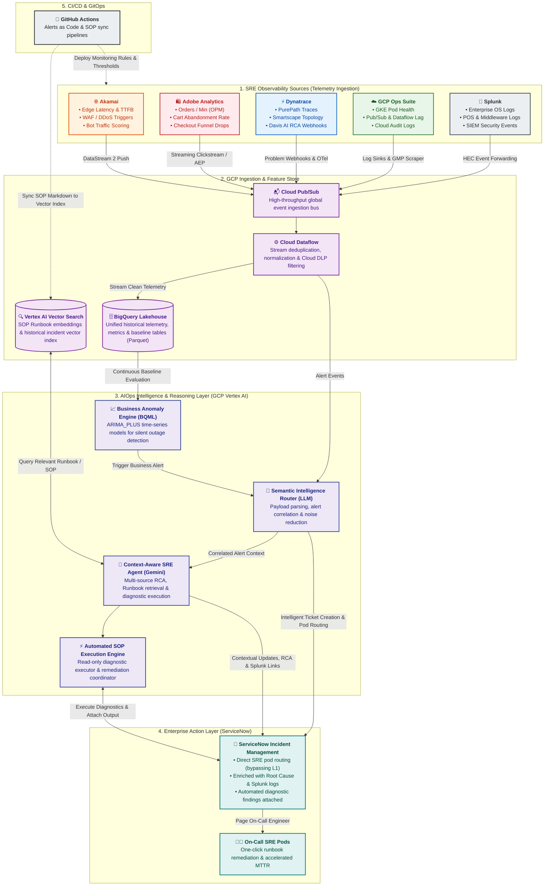

# AIOps Intelligence Layer - Architectural Design Document

> [!NOTE]
> This document is part of the modular [AIOps Architecture Documentation Tree](file:///c:/Users/ToanBX/dev/personal/aiops_architect/docs/README.md). You can also find the dedicated intelligence layer module at [03_intelligence_and_reasoning/aiops_intelligence_layer.md](file:///c:/Users/ToanBX/dev/personal/aiops_architect/docs/architecture/03_intelligence_and_reasoning/aiops_intelligence_layer.md).

## 1. Executive Summary

This document outlines the architectural blueprint for an enterprise **AIOps Intelligence Layer** designed to optimize incident response for the **Site Reliability Engineering (SRE) team of a global retail organization**. The system bridges the functional gap between multi-source observability feeds used by the SRE team—**Google Cloud Platform (GCP)**, **Dynatrace**, **Akamai**, **Splunk**, and **Adobe Analytics**—and the enterprise system of record (**ServiceNow**) by leveraging Semantic Intelligence and Context-Aware AI Agents natively on GCP.

```mermaid
flowchart LR
    subgraph Observability["1. SRE Observability Ecosystem"]
        direction TB
        S1["🌐 <b>Akamai</b><br/>Edge & Security"]
        S2["🛍️ <b>Adobe Analytics</b><br/>Business Funnel"]
        S3["⚡ <b>Dynatrace</b><br/>APM & Trace Graph"]
        S4["☁️ <b>GCP Operations</b><br/>Cloud & GKE Infra"]
        S5["📜 <b>Splunk</b><br/>Logs & Forensics"]
    end

    subgraph Core["2. GCP AIOps Core"]
        direction TB
        Ingest["<b>Event Bus & Ingestion</b><br/>Cloud Pub/Sub + Dataflow"]
        Lakehouse["<b>Unified Lakehouse</b><br/>BigQuery (BQML & Vector Embeddings)"]
        AI["<b>AIOps Intelligence</b><br/>Vertex AI + Gemini SRE Agents"]
    end

    subgraph Action["3. ITSM & Action"]
        direction TB
        SNOW["<b>ServiceNow ITSM</b><br/>Smart Ticket Routing & Enrichment"]
        SRE["<b>On-Call SRE Pods</b><br/>Automated SOP Diagnostics & Action"]
    end

    Observability ==>|Streaming & Event Feeds| Ingest
    Ingest --> Lakehouse
    Ingest --> AI
    Lakehouse <-->|Anomaly Baselines & SOPs| AI
    AI ==>|Enriched Incidents & RCA| SNOW
    SNOW --> SRE

    classDef akamai fill:#FFF3E0,stroke:#E65100,stroke-width:2px,color:#BF360C;
    classDef adobe fill:#FFEBEE,stroke:#C62828,stroke-width:2px,color:#B71C1C;
    classDef dyna fill:#E3F2FD,stroke:#1565C0,stroke-width:2px,color:#0D47A1;
    classDef gcp fill:#E8F5E9,stroke:#2E7D32,stroke-width:2px,color:#1B5E20;
    classDef splunk fill:#ECEFF1,stroke:#37474F,stroke-width:2px,color:#263238;
    classDef gcpCore fill:#EDE7F6,stroke:#512DA8,stroke-width:2px,color:#311B92;
    classDef snow fill:#E0F2F1,stroke:#00695C,stroke-width:2px,color:#004D40;

    class S1 akamai;
    class S2 adobe;
    class S3 dyna;
    class S4 gcp;
    class S5 splunk;
    class Ingest,Lakehouse,AI gcpCore;
    class SNOW,SRE snow;
```

**Business Driver**: For high-volume retail operations, every minute of downtime during peak trading windows (holiday seasons, promotional drops) results in hundreds of thousands of dollars in lost revenue and customer friction. SRE teams face overwhelming alert noise across fragmented tools. This AIOps layer correlates technical infrastructure metrics with live digital business transactions to minimize Mean Time to Detect (MTTD) and Mean Time to Resolve (MTTR).

---

## 2. Telemetry Ingestion from SRE Observability Tools

The AIOps system standardizes and ingests telemetry across the five primary tools in the SRE fleet:

| Observability Tool | Primary Domain & Role | Ingested Telemetry Types | Ingestion Mechanism into GCP |
| :--- | :--- | :--- | :--- |
| **Akamai** | Edge & Perimeter Observability | HTTP response codes, Time to First Byte (TTFB), WAF triggers, DDoS mitigation vectors, bot score/traffic classifications, origin health metrics. | Real-time push via **Akamai DataStream 2** to **Cloud Pub/Sub**; log archives batched to **Cloud Storage (GCS)** in Parquet/JSON. |
| **Dynatrace** | APM, Distributed Tracing & Topology | PurePath distributed call stacks, Smartscape entity graphs, code-level garbage collection/thread metrics, Davis AI problem & RCA webhooks. | **Dynatrace Webhooks** to **Cloud Run / Pub/Sub**; OpenTelemetry exporter; scheduled REST API pulls (`/api/v2/entities`) for topology updates. |
| **GCP Operations Suite** | Cloud Infrastructure & Platform Services | GKE pod CPU/Memory, container crash loops (`CrashLoopBackOff`), Pub/Sub message backlog age, Dataflow pipeline system lag, Cloud Audit Logs. | Native **GCP Log Router** sinks directly to **Cloud Pub/Sub**; metric exports via Managed Service for Prometheus (GMP) to **BigQuery**. |
| **Splunk** | Enterprise Log Hub & Security Forensics | Enterprise OS logs, POS/middleware audit logs, SAP backend logs, Splunk Enterprise Security (ES) notable events, SIEM alerts. | **Splunk HTTP Event Collector (HEC)** forwarding to **Cloud Pub/Sub**; on-demand REST API queries for targeted forensic lookups. |
| **Adobe Analytics** | Digital Experience & Business Telemetry | Real-time clickstream, Orders Per Minute (OPM), Cart Additions (`scAdd`), Checkout Funnel Drops (`scCheckout`), Payment gateway error rates. | **Adobe Experience Platform (AEP) Streaming Ingestion** to **Cloud Pub/Sub**; hourly raw data feeds to **GCS** and **BigQuery**. |

---

## 3. Critical Journeys & Use Cases

### 3.1 Semantic Incident Routing & Noise Reduction
* **Problem**: When a cascading infrastructure failure occurs (e.g., database connection pool exhaustion), dozens of noisy alerts trigger across Akamai (504 gateway timeouts), GCP (high pod CPU), and Splunk (error logs), overwhelming L1 triage.
* **Solution**: The **Semantic Intelligence Router** (powered by Vertex AI LLMs) ingests the correlated alert stream from **Cloud Pub/Sub**. It parses the unstructured payloads alongside **Dynatrace Smartscape** dependency graphs to determine the single root issue. The router synthesizes a consolidated incident and routes it directly to the responsible SRE pod via the **ServiceNow API**, bypassing manual L1 triage.

### 3.2 GitOps Alert & Rule Maintenance ("Alerts as Code")
* **Tooling**: **GitHub Actions** + **BigQuery**.
* **Problem**: Alerting thresholds across Dynatrace, GCP Monitoring, and Splunk become stale as services scale, causing alert fatigue and false positives.
* **Solution**: Monitoring rules are managed as code in Git repositories. The AIOps system tracks alert efficacy in BigQuery (e.g., alerts frequently closed without action). An automated agent generates Pull Requests in GitHub to tune thresholds, update Davis AI sensitivity, or retire redundant alert policies.

### 3.3 Context-Aware Incident Response & Automated SOP Execution
* **Problem**: When an alert fires (e.g., checkout degradation), SREs lose critical time searching for runbooks and running manual diagnostic CLI commands across tools.
* **Solution**: Upon incident generation, the **Context-Aware AI Agent (Gemini)** performs semantic similarity search against **Vertex AI Vector Search** to locate the matching Standard Operating Procedure (SOP).
* **SOP Format for Critical Retail Services**:
  * **Format**: "Runbooks as Code" using Markdown with YAML Frontmatter.
  * **Structure**:
    1. `metadata`: Target service (e.g., `checkout-service`), owner pod, required permissions.
    2. `symptoms`: "Adobe Analytics OPM drop > 20% AND Dynatrace p99 latency > 2.5s".
    3. `diagnostics`: SQL queries against BigQuery telemetry, Splunk forensic log filters ($\pm 10$ minutes), and Akamai edge cache status.
    4. `remediation`: Approved failover steps (e.g., route traffic away from degraded zone, switch payment gateway endpoint).
  * **Autonomous Diagnostics**: The agent executes all read-only diagnostic steps in real time and posts formatted findings directly onto the ServiceNow incident ticket before the SRE arrives.

### 3.4 Business Anomaly Detection ("Silent Outage" Prevention)
* **Problem**: A client-side JavaScript bug breaks the "Checkout" button after a release. Backend APIs return HTTP 200 OK because no requests arrive. Infrastructure monitoring shows green, but digital sales drop to zero.
* **Solution**: Live transaction metrics from **Adobe Analytics** (Orders Per Minute, Cart Conversion Rate) are streamed into BigQuery. **BigQuery ML (BQML)** runs continuous time-series forecasting (`ARIMA_PLUS`) that factors in seasonality, hour-of-day, and holiday trading peaks. When real-time orders deviate statistically from predicted bounds, BQML triggers a P1 Business Anomaly Alert. The Semantic Router correlates this with recent CI/CD deployments and Akamai/Dynatrace telemetry to isolate the bug immediately.

---

## 4. Core Architectural Principles

* **Multi-Source to GCP Core**: Ingest telemetry seamlessly from edge (Akamai), digital business (Adobe Analytics), APM (Dynatrace), enterprise logs (Splunk), and cloud platform (GCP Ops Suite). All centralized stream processing, machine learning models, vector stores, and reasoning engines execute natively on **Google Cloud Platform**.
* **ServiceNow as ITSM Core**: ServiceNow is the definitive enterprise system of record for incident lifecycle management, CMDB synchronization, SRE pod assignments, and automated runbook audit trails.
* **Event-Driven Architecture**: Decouple producers and consumers via **Cloud Pub/Sub**, ensuring burst resiliency during high-volume retail traffic spikes (e.g., Cyber Monday).
* **Data Centricity & Lakehouse**: Maintain raw, enriched, and aggregated telemetry in **BigQuery** and **Google Cloud Storage (Parquet format)** for cost-effective analytics and continuous model retraining.

---

## 5. End-to-End Architecture Diagram

---

## 6. Scale Estimates & Ingestion Breakdown

Designing for an enterprise retail organization with global digital traffic and hundreds of physical stores entails the following ingestion profile:

| Source | Telemetry Type | Raw Volume / Day | Event Rate (EPS) | Ingestion Latency Target | Transport / Ingestion Protocol |
| :--- | :--- | :--- | :--- | :--- | :--- |
| **Akamai** | Edge Access Logs, WAF/DDoS Events | 4 - 6 TB | 50,000 - 150,000 | Sub-10 seconds | DataStream 2 HTTPS Push ➔ Cloud Pub/Sub |
| **Dynatrace** | PurePath Spans, Davis RCA Alerts | 2 - 4 TB | 20,000 - 80,000 | Sub-5 seconds | Webhook to Cloud Run / Pub/Sub + OpenTelemetry Collector |
| **GCP Operations Suite** | GKE Metrics, Pub/Sub/Dataflow Metrics, Audit Logs | 3 - 5 TB | 40,000 - 100,000 | Sub-second to 1 min | Cloud Logging Log Router Sink ➔ Pub/Sub / BigQuery |
| **Splunk** | Enterprise & Middleware Logs, SIEM Alerts | 3 - 6 TB | 30,000 - 90,000 | 1 - 3 minutes | Splunk HEC ➔ Cloud Pub/Sub; REST API for ad-hoc forensic queries |
| **Adobe Analytics** | Real-time Clickstream, Order & Cart Events | 1 - 2 TB | 10,000 - 40,000 | 1 - 2 minutes | AEP Streaming Ingestion ➔ Pub/Sub; Daily/hourly batch to GCS |
| **Total Fleet** | **Consolidated Multi-Source Telemetry** | **13 - 23 TB / day** | **150,000 - 460,000 EPS** | **Near Real-Time** | **Normalized via Cloud Dataflow ➔ 3,000 - 10,000 Actionable EPS** |

---

## 7. Security, Compliance & Data Governance

* **PCI-DSS & PII Masking (Cloud DLP)**: Retail transactions contain payment card data and customer PII. Streaming pipelines in **Cloud Dataflow** pass incoming payloads through **Cloud Data Loss Prevention (DLP)** inspect and de-identify templates prior to writing records into BigQuery.
* **Secret & Credential Management**: API keys, webhooks, and mutual TLS certificates for Dynatrace, Akamai, Splunk, and Adobe Analytics connectors are stored and auto-rotated in **GCP Secret Manager**.
* **Data Encryption**: All telemetry in transit is encrypted using TLS 1.3. Telemetry stored in BigQuery, GCS, and Vertex AI is encrypted at rest using Customer-Managed Encryption Keys (CMEK) via **Cloud KMS**.
* **Role-Based Access Control (RBAC)**: ServiceNow integration utilizes least-privilege OAuth 2.0 service accounts scoped strictly to incident creation, update, and read-only CMDB entity queries.
