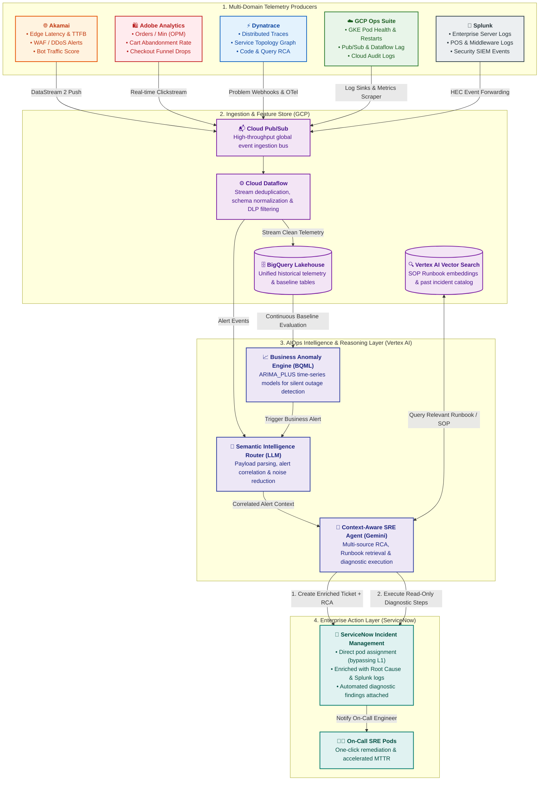

# Observability Ecosystem Guide for AI Architects

> [!NOTE]
> This document is part of the modular [AIOps Architecture Documentation Tree](file:///c:/Users/ToanBX/dev/personal/aiops_architect/docs/README.md). You can also find the dedicated module at [04_observability_ecosystem/observability_tools_guide.md](file:///c:/Users/ToanBX/dev/personal/aiops_architect/docs/architecture/04_observability_ecosystem/observability_tools_guide.md).

## 1. Executive Overview & AI Architect Lens

As an **AI Architect for Enterprise AIOps**, observability tools are not merely monitoring dashboards or alerting endpoints; they are **high-dimensional feature stores, real-time event streams, and topological knowledge sources**. 

When architecting an intelligent operations layer on **Google Cloud Platform (GCP)** integrated with **ServiceNow**, each tool occupies a unique functional domain in the IT operations lifecycle:

```mermaid
flowchart LR
    subgraph Sources["1. Telemetry Sources"]
        direction TB
        S1["🌐 <b>Akamai</b><br/>Edge & Security"]
        S2["🛍️ <b>Adobe Analytics</b><br/>Business Funnel"]
        S3["⚡ <b>Dynatrace</b><br/>APM & Trace Graph"]
        S4["☁️ <b>GCP Operations</b><br/>Cloud & GKE Infra"]
        S5["📜 <b>Splunk</b><br/>Logs & Forensics"]
    end

    subgraph Core["2. GCP AIOps Core"]
        direction TB
        Ingest["<b>Event Bus & ETL</b><br/>Pub/Sub + Dataflow"]
        Lakehouse["<b>Unified Lakehouse</b><br/>BigQuery (BQML)"]
        AI["<b>AI & Reasoning</b><br/>Vertex AI + Vector Search"]
    end

    subgraph Action["3. ITSM & Action"]
        direction TB
        ITSM["<b>ServiceNow ITSM</b><br/>Smart Ticket Routing"]
        SRE["<b>On-Call SRE Pods</b><br/>Automated SOP Execution"]
    end

    Sources ==>|Multi-Source Streams| Ingest
    Ingest --> Lakehouse
    Ingest --> AI
    Lakehouse <-->|Anomaly Baselines| AI
    AI ==>|Enriched Incidents & RCA| ITSM
    ITSM --> SRE

    classDef s1 fill:#FFF3E0,stroke:#E65100,stroke-width:2px,color:#BF360C;
    classDef s2 fill:#FFEBEE,stroke:#C62828,stroke-width:2px,color:#B71C1C;
    classDef s3 fill:#E3F2FD,stroke:#1565C0,stroke-width:2px,color:#0D47A1;
    classDef s4 fill:#E8F5E9,stroke:#2E7D32,stroke-width:2px,color:#1B5E20;
    classDef s5 fill:#ECEFF1,stroke:#37474F,stroke-width:2px,color:#263238;
    classDef gcp fill:#EDE7F6,stroke:#512DA8,stroke-width:2px,color:#311B92;
    classDef snow fill:#E0F2F1,stroke:#00695C,stroke-width:2px,color:#004D40;

    class S1 s1;
    class S2 s2;
    class S3 s3;
    class S4 s4;
    class S5 s5;
    class Ingest,Lakehouse,AI gcp;
    class ITSM,SRE snow;
```

---

## 2. In-Depth Tool Analysis for AI Architects

### 2.1. Akamai (Edge & Perimeter Observability)

#### Architectural Role
Akamai operates at the network edge (over 4,000 locations worldwide), acting as the first point of contact for all external user traffic, API requests, and bot interactions.

#### Telemetry & Data Types Emitted
* **Edge Access Logs & Request Streams**: HTTP response codes, TTFB (Time to First Byte), TLS handshake duration, client geographic location, ISP latency.
* **Security & Bot Telemetry**: WAF triggers, DDoS mitigation vectors, bot score/classification (scrapers, credential stuffers, search engine crawlers), rate-limiting events.
* **Origin Performance Metrics**: Round-trip time (RTT) from edge to GCP/AWS origin, origin error rates (502/503/504), origin bandwidth offload %.

#### Ingestion Strategy into GCP Core
* **Real-Time Streaming**: Akamai **DataStream 2** pushes real-time telemetry (sub-10 second latency) directly to **GCP Cloud Pub/Sub** via HTTPS push endpoint or Google Cloud Storage (GCS) connector.
* **Log Ingestion**: Raw log archives batched to Cloud Storage buckets partitioned by date/hour in Parquet or compressed JSON format.

#### AI / ML Capabilities & Use Cases
1. **Edge Anomaly Detection**: Unsupervised clustering (DBSCAN/Isolation Forests) on request volume per geography to detect regional routing failures or ISP-level blackouts.
2. **Bot-Induced Noise Filtering**: Training classification models to distinguish between bot-driven traffic surges (e.g., sneaker bots) vs. legitimate organic flash sales, preventing false-positive scale alerts.
3. **Multi-CDN & Origin Health Prediction**: Time-series forecasting (ARIMA_PLUS on BigQuery ML) predicting origin saturation before edge cache buffers deplete.

---

### 2.2. Dynatrace (Application Performance Monitoring & Distributed Tracing)

#### Architectural Role
Dynatrace provides full-stack, automatic instrumentation from host operating systems to application runtimes and microservices code-level execution.

#### Telemetry & Data Types Emitted
* **Distributed Traces (PurePath)**: End-to-end call stacks spanning microservices across Kubernetes clusters, tracking synchronous HTTP/gRPC calls and asynchronous message queues.
* **Topological Entity Graphs (Smartscape)**: Dynamic graph of application components, processes, host nodes, containers, and services, capturing runtime dependencies.
* **Code-Level Metrics**: Garbage collection pause times, thread pool exhaustion, database query execution times, unhandled exceptions, method-level CPU profiling.
* **AI Alerts (Davis AI Engine)**: Pre-correlated root cause events, anomaly detections on response time percentiles (p95, p99), and failure rates.

#### Ingestion Strategy into GCP Core
* **Event & Alert Webhooks**: Dynatrace Webhook integration streams problem notifications and RCA payloads directly into a **Cloud Functions** or **Cloud Run** endpoint backed by **Cloud Pub/Sub**.
* **Metrics & Topology API**: Scheduled Cloud Run jobs query Dynatrace REST APIs (`/api/v2/entities`, `/api/v2/metrics`) to sync topological graph changes into **BigQuery** or a Graph database for continuous dependency mapping.
* **OpenTelemetry Export**: Dynatrace OTel collector forwarding raw spans to GCP Cloud Trace / Pub/Sub.

#### AI / ML Capabilities & Use Cases
1. **Graph Neural Networks (GNN) for Impact Analysis**: Feeding Dynatrace's topology graph into a GNN model on Vertex AI to predict cascading failures across downstream microservices.
2. **Semantic Root Cause Extraction**: Using LLMs (Gemini on Vertex AI) to parse Dynatrace RCA summaries and code stack traces, generating human-readable technical explanations for SREs.
3. **Automated Diagnostic Runbook Execution**: Extracting the exact SQL query or endpoint from Dynatrace traces to dynamically populate parameters in automated diagnostic scripts.

---

### 2.3. Google Cloud Operations Suite (GCP Cloud Monitoring & Logging)

#### Architectural Role
The native observability backbone for all workloads running natively inside Google Cloud (GKE clusters, Compute Engine, Dataflow pipelines, BigQuery jobs, Cloud Pub/Sub topics).

#### Telemetry & Data Types Emitted
* **System & Infrastructure Metrics**: CPU/Memory utilization, disk I/O, network packet throughput, container restart counts, Kubernetes pod crash loops (`CrashLoopBackOff`).
* **Service Health Metrics**: Pub/Sub unacknowledged message counts/oldest unacked message age, Dataflow system lag, BigQuery slot allocation and query concurrency.
* **Audit & Syslogs**: GCP Cloud Audit Logs (Admin Activity, System Event, Data Access), VPC Flow Logs, Firewall logs.

#### Ingestion Strategy into GCP Core
* **Native Log Sinks (Log Router)**: Filtered log sinks route real-time log entries directly to **Cloud Pub/Sub** or **BigQuery** with zero egress cost and sub-second latency.
* **Cloud Monitoring Metrics Scraper**: Native metrics export to BigQuery via Monitoring Metrics Export or scraped by Managed Service for Prometheus (GMP).

#### AI / ML Capabilities & Use Cases
1. **Pipeline Backpressure & Saturation Forecasting**: Using BigQuery ML time-series models on `subscription/oldest_unacked_message_age` to forecast ingestion pipeline bottlenecks 30 minutes in advance.
2. **Audit Log Anomaly Detection**: Clustering administrative actions using autoencoders to identify suspicious configuration drifts or rogue CI/CD deployments triggering outages.
3. **Capacity & Resource Optimization**: Reinforcement learning / predictive auto-scaling algorithms recommending GKE pod resource requests and limits based on historical trends.

---

### 2.4. Splunk (Enterprise Log Hub & Security Intelligence)

#### Architectural Role
The central enterprise logging and SIEM hub, indexing high-volume structured, semi-structured, and unstructured log streams across multi-cloud and legacy on-premise environments.

#### Telemetry & Data Types Emitted
* **Enterprise Infrastructure Logs**: Linux/Windows OS event logs, active directory authentication logs, network firewall/VPN connection logs, database transaction logs.
* **Middleware & Business System Logs**: SAP logs, ERP backend audit logs, message broker logs (IBM MQ, Kafka), point-of-sale (POS) terminal logs.
* **Security Incidents & Alerts**: Splunk Enterprise Security (ES) notable events, threat intelligence matches, compliance violations (PCI-DSS, SOC2).

#### Ingestion Strategy into GCP Core
* **Splunk HTTP Event Collector (HEC) / Add-on for GCP**: Splunk forwards alert payloads and summarized log indexes to **GCP Cloud Pub/Sub** via HTTPS.
* **GCP Log Ingestion Connector**: High-throughput Dataflow streaming job consuming batched Splunk telemetry or querying Splunk REST API for forensic enrichment when an incident occurs.

#### AI / ML Capabilities & Use Cases
1. **Cross-Domain Log Semantic Clustering**: Vertex AI LLMs embedding unstructured error strings to group disparate log lines across 50+ services into single root incident themes.
2. **Forensic Context Enrichment for SRE**: When a ServiceNow ticket is created, the AI agent automatically executes targeted SPL (Splunk Processing Language) queries for the affected timestamp $\pm 10$ minutes and attaches summarized findings to the incident.
3. **Security Incident Co-Relation**: Correlating IT infrastructure failures with concurrent security alerts (e.g., sudden database lockouts caused by automated security revocation).

---

### 2.5. Adobe Analytics (Digital Experience & Business Telemetry)

#### Architectural Role
Adobe Analytics tracks user journeys, clickstream interactions, business transactions, and conversion funnels across web portals and mobile applications.

#### Telemetry & Data Types Emitted
* **User Engagement & Funnel Events**: Product views, cart additions (`scAdd`), checkout initiations (`scCheckout`), purchases/orders (`purchase`), search queries.
* **Business Performance KPIs**: Orders Per Minute (OPM), Gross Merchandise Value (GMV) per minute, payment failure rates by gateway, cart abandonment rate.
* **Client-Side Behavioral Context**: Browser version, OS, JavaScript error events, page load render times (Experience Cloud ID - ECID).

#### Ingestion Strategy into GCP Core
* **Adobe Experience Platform (AEP) Streaming Ingestion / Cloud Connect**: Real-time event forwarding to **GCP Cloud Pub/Sub** via Webhook or Kafka connectors.
* **Adobe Data Feeds (Raw Clickstream)**: Daily or hourly batch uploads of raw, sanitized clickstream files into **Google Cloud Storage (GCS)**, parsed and ingested into **BigQuery** partitioned tables.

#### AI / ML Capabilities & Use Cases
1. **Silent Outage & Business Anomaly Detection**: 
   * *Problem*: Backend APIs return HTTP 200 OK, but a broken UI element prevents checkout.
   * *AI Solution*: BigQuery ML `ARIMA_PLUS` models monitoring Orders Per Minute (OPM) and Cart Conversion Rate in real time. Any deviation from seasonal baseline triggers an urgent P1 incident in ServiceNow.
2. **Business Impact Prioritization**: When multiple IT alerts fire concurrently, the AI Agent correlates them with Adobe Analytics data to calculate real-time financial impact ($/minute lost) and rank ticket severity in ServiceNow.
3. **Customer Segment Isolation**: Unsupervised clustering detecting if an incident is isolated to specific cohorts (e.g., iOS users on version 17.4 in Western Europe).

---

## 3. Tool Matrix & Architectural Mapping

| Dimension | Akamai | Dynatrace | GCP Ops Suite | Splunk | Adobe Analytics |
| :--- | :--- | :--- | :--- | :--- | :--- |
| **Telemetry Layer** | Edge / CDN / Network Perimeter | Application / Code / Microservices | Cloud Infrastructure & PaaS | Enterprise Logs & Security | Business / User Journey / Clickstream |
| **Data Format** | JSON streams, WAF events, Syslog | OpenTelemetry Spans, Metrics, Smartscape Graph | GCP Cloud Metrics, Cloud Audit JSON | Raw Unstructured Logs, CIM JSON | Clickstream HIT records, JSON events |
| **Latency Profile** | Real-time (< 10s) | Near real-time (< 5s) | Sub-second to 1 min | Near real-time (1-5 min) | Near real-time (1-2 min) / Batch feeds |
| **Key AI/ML Input** | Edge anomaly vectors, traffic spike curves | Code execution graphs, failure traces | Infra utilization time-series | Unstructured log embeddings (LLM) | Business KPI time-series (OPM, Conversion) |
| **Primary ServiceNow Output** | Edge latency ticket, DDoS incident alert | Root cause code defect, pod crash ticket | Node capacity warning, quota exhaustion | Security audit ticket, deep forensic link | P1 Business Outage ticket with revenue impact |

---

## 4. End-to-End AIOps Architectural Flow

---

## 5. Summary Blueprint for the AI Architect

1. **Edge & Perimeter**: Treat **Akamai** as the early-warning perimeter radar for latency anomalies, DDoS attacks, and regional traffic degradation.
2. **Business Telemetry**: Ingest **Adobe Analytics** streams into BigQuery ML to detect "silent outages" where infrastructure looks healthy but revenue-critical customer flows fail.
3. **Application Intelligence**: Leverage **Dynatrace** for high-resolution distributed traces and dependency graphs to pinpoint code/service-level root causes.
4. **Cloud Infrastructure**: Use **GCP Operations Suite** for native GKE, serverless, and data pipeline resource health and capacity forecasting.
5. **Log Forensics**: Query **Splunk** selectively to pull deep diagnostic and security context for active incident tickets.
6. **Consolidated AI Core on GCP**: Ingest and unify all 5 streams into **Cloud Pub/Sub ➔ Dataflow ➔ BigQuery**, running Vertex AI LLM agents to deduplicate alerts, correlate root causes, and push structured, actionable tickets to **ServiceNow**.
