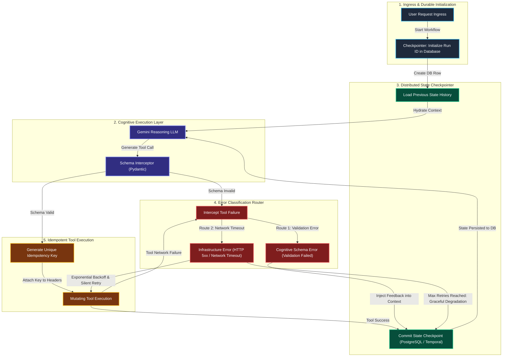

# AI Agent Architecture: Distributed State Recovery & Idempotency

This architectural guide details the engineering principles and production workflow designs required to handle **mid-flight server crashes**, **durable state recovery**, and **idempotent tool execution** in autonomous multi-step AI agents.

---

## 1. Executive Summary & Problem Breakdown

When AI agents are deployed from local scripts into production cloud environments (Kubernetes, AWS Lambda, Google Cloud Run), they become vulnerable to the ephemeral nature of cloud infrastructure.

| Failure Mode | Mechanism | Production Impact |
| :--- | :--- | :--- |
| **Mid-Flight Process Crashes** | The server running the agent is preempted, runs out of memory, or recycles during Step 3 of a 6-step task. | In-memory variables are destroyed. The agent loses all context, stranding the user request in a broken, half-completed state. |
| **Non-Idempotent Retries** | The system blindly restarts a failed workflow from Step 1 after a crash. | The agent executes mutating tools multiple times (e.g., charging a credit card twice, sending duplicate emails). |
| **Conflated Error Handling** | The orchestrator treats all tool failures identically, passing downstream 503 network timeouts back to the LLM. | The LLM hallucinates new parameters to "fix" a non-existent cognitive error, breaking the workflow payload. |

---

## 2. Production Agent State Architecture

The solution requires decoupling the Agent's "Brain" (the LLM API) from the Agent's "Memory" (the execution state), enforcing durability and strict error routing.



---

## 3. Deep-Dive: Core Architectural Principles

### Principle 1: Durable State Checkpointing
**Never store execution state in local RAM variables.**
* Tools like **Temporal.io** or **LangGraph with Postgres Checkpointers** save the agent's memory to a database *after every single turn*.
* If the underlying pod/container crashes at Step 3, the orchestrator detects the dropped task, spins up a new pod, queries the database for the `run_id`, loads the state up to Step 3, and resumes seamlessly. The LLM does not even know the server crashed.

### Principle 2: Strict Tool Idempotency
**Mutating actions must never double-execute.**
* Before calling an external API (like ServiceNow or Stripe), the orchestrator automatically generates a unique `idempotency_key` tied to the specific step in the workflow (e.g., `hash(run_id + step_number)`).
* If the server crashes after the API executes but before the DB saves the state, the new server will retry the action. The downstream API will receive the exact same `idempotency_key`, recognize it, and safely return the cached success response without performing the destructive action twice.

### Principle 3: Bifurcated Error Routing (The Probe Solution)
When a tool call fails, treating all errors the same destroys agent reliability. The architecture must explicitly route errors:

* **Infrastructure Errors (HTTP 500, 503, Timeouts, Rate Limits):**
  - **Origin:** Downstream service failure. The LLM's logic was flawless.
  - **Action:** Handled entirely at the transport layer. Use an exponential backoff loop (`retry(max=3, backoff=jitter)`).
  - **Rule:** *Never pass 503 stack traces into the LLM context.* It causes hallucination cascades.

* **Cognitive Schema Errors (HTTP 400, Pydantic Validation Error):**
  - **Origin:** The LLM hallucinated an invalid argument (e.g., sent a string instead of a UUID).
  - **Action:** Intercepted instantly by the Pydantic validator before hitting the network.
  - **Rule:** *Always pass schema validation errors back to the LLM.* The agent requires this observation to self-correct its reasoning on the next turn.

---

## 4. Reference Implementation Blueprint (Python)

This blueprint demonstrates decoupling state from memory and bifurcating error handling.

```python
import asyncio
import uuid
import httpx
from typing import Dict, Any
from pydantic import BaseModel, ValidationError

# ---------------------------------------------------------
# 1. Durable State Interface (Mock)
# ---------------------------------------------------------
class DatabaseCheckpointer:
    """Simulates a PostgreSQL / Redis durable state store"""
    def __init__(self):
        self.db = {}

    def save_checkpoint(self, run_id: str, step: int, context: list):
        self.db[run_id] = {"step": step, "context": context}
        print(f"[DB] Checkpoint saved for Run {run_id} at Step {step}")

    def load_checkpoint(self, run_id: str):
        return self.db.get(run_id, {"step": 0, "context": []})

# ---------------------------------------------------------
# 2. Tool Execution with Idempotency & Error Routing
# ---------------------------------------------------------
class RefundRequest(BaseModel):
    user_id: str
    amount: float

async def execute_refund_tool(args: Dict[str, Any], idempotency_key: str) -> str:
    # Route 1: Cognitive Schema Error Interception
    try:
        valid_args = RefundRequest(**args)
    except ValidationError as e:
        # Pass feedback to LLM
        return f"SCHEMA ERROR: {e.errors()}. Please correct your arguments."

    # Route 2: Network Execution & Infra Error Handling
    headers = {"Idempotency-Key": idempotency_key}
    
    # Exponential backoff loop (Transport Layer)
    for attempt in range(1, 4):
        try:
            print(f"[Network] Issuing Refund with Key {idempotency_key} (Attempt {attempt})")
            # async with httpx.AsyncClient() as client:
            #     response = await client.post("https://api.stripe.com/refund", json=valid_args.dict(), headers=headers)
            #     response.raise_for_status()
            
            # Simulate Success
            await asyncio.sleep(0.5)
            return "SUCCESS: Refund processed."
            
        except httpx.HTTPStatusError as e:
            if e.response.status_code in [500, 502, 503, 504]:
                # Infrastructure error: Silent retry
                await asyncio.sleep(2 ** attempt) 
                continue
            else:
                # Other HTTP 4xx (Authentication, etc)
                return f"API ERROR: {e.response.text}"
                
    # If all infra retries fail, return a clean message to the LLM
    return "SYSTEM ERROR: Downstream refund API is currently unavailable. Please notify the user."

# ---------------------------------------------------------
# 3. Durable Workflow Execution
# ---------------------------------------------------------
async def run_durable_agent(run_id: str, db: DatabaseCheckpointer):
    # 1. Hydrate state from DB (Handles Server Crash Recovery)
    state = db.load_checkpoint(run_id)
    current_step = state["step"]
    context_history = state["context"]
    
    print(f"\n--- Resuming Run {run_id} from Step {current_step} ---")
    
    while current_step < 3:
        current_step += 1
        
        # Generate Deterministic Idempotency Key based on Step + Run ID
        step_idempotency_key = str(uuid.uuid5(uuid.NAMESPACE_DNS, f"{run_id}_step_{current_step}"))
        
        # Mock LLM Action (Simulate Hallucination on Step 1, Success on Step 2)
        if current_step == 1:
            llm_action = {"user_id": "john_doe", "amount": 50.0} # "john_doe" violates UUID schema
        else:
            llm_action = {"user_id": "123e4567-e89b-12d3-a456-426614174000", "amount": 50.0}
            
        print(f"\n[Step {current_step}] Executing Tool...")
        observation = await execute_refund_tool(llm_action, step_idempotency_key)
        
        context_history.append({"step": current_step, "obs": observation})
        
        # 2. Commit Checkpoint to DB
        db.save_checkpoint(run_id, current_step, context_history)
        
        if "SUCCESS" in observation:
            print("Task completed successfully.")
            break

if __name__ == "__main__":
    db_instance = DatabaseCheckpointer()
    asyncio.run(run_durable_agent("run_abc123", db_instance))
```

---

## 5. Interviewer & Interviewee Takeaway Checklist

| Aspect | What Interviewers Look For | What Candidates Should Emphasize |
| :--- | :--- | :--- |
| **State Persistence** | Decoupling state from memory using DB checkpointers (Temporal / LangGraph). | Explaining how the orchestrator re-hydrates context after a Kubernetes pod eviction. |
| **Idempotency** | Automatically injecting `Idempotency-Key` headers into mutating APIs. | Understanding that without idempotency, auto-retries cause double-billing or destructive duplicates. |
| **Error Handling** | Hard separation of transport-layer backoffs (5xx) vs. schema validation feedback (400s). | Never passing raw stack traces to the LLM, and handling network timeouts silently at the HTTP client layer. |
