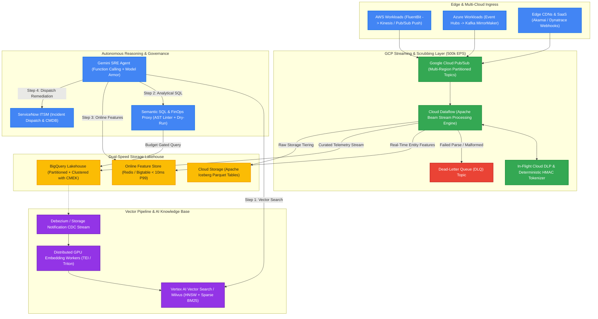

# Practical Take-Home, Live Coding & Architecture Tests for Data Engineers (AI Production Systems)

This document provides complete, production-grade practical test suites to evaluate **Senior and Staff Data Engineers** on their hands-on coding, streaming systems design, and vector/lakehouse architecture skills for mission-critical AI environments.

---

## Test 1: Live Coding Test (60 Minutes)
### Stateful Streaming Alert Deduplicator & Incident Signature Aggregator

#### 1. Candidate Problem Description
> **Context:** In our AIOps platform, streaming alert events arrive continuously at high velocity. Due to network retries, duplicate events occur, and alert bursts can overwhelm downstream LLM reasoning agents.
> 
> **Task:** Implement a streaming `AlertStreamAggregator` in Python that:
> 1. **Deduplicates events** within a rolling 60-second sliding cooldown window based on a deterministic hash of `(service_id, alert_name, environment)`.
> 2. **Maintains stateful tumbling windows** (e.g., 30-second window size) based on **Event Time** (not wall-clock processing time).
> 3. **Tracks a low watermark** with an allowed lateness threshold ($\Delta_{\text{allowed}} = 10\text{ seconds}$).
> 4. **Emits compact Incident Signatures** when a window closes, summarizing total alerts, distinct services affected, dominant error types, and sample trace IDs.
> 5. **Routes severely late events** (older than the watermark) to a Dead-Letter Queue (DLQ) list.

#### 2. Provided Starter Code & Interface

```python
from dataclasses import dataclass, field
from typing import List, Dict, Any, Optional, Set
import hashlib
import time

@dataclass
class AlertEvent:
    event_id: str
    service_id: str
    alert_name: str
    severity: str  # "CRITICAL", "HIGH", "MEDIUM", "LOW"
    environment: str
    event_timestamp: float  # Unix timestamp in seconds
    trace_id: str
    metadata: Dict[str, Any] = field(default_factory=dict)

@dataclass
class IncidentSignature:
    window_start: float
    window_end: float
    total_events: int
    impacted_services: List[str]
    dominant_severity: str
    sample_trace_ids: List[str]

class AlertStreamAggregator:
    def __init__(self, window_size_sec: float = 30.0, allowed_lateness_sec: float = 10.0, dedup_cooldown_sec: float = 60.0):
        self.window_size = window_size_sec
        self.allowed_lateness = allowed_lateness_sec
        self.dedup_cooldown = dedup_cooldown_sec
        # Candidate implements internal state tracking
        
    def process_event(self, event: AlertEvent) -> Optional[List[IncidentSignature]]:
        """
        Process a single streaming event.
        Returns a list of closed IncidentSignatures if the watermark advanced and closed windows.
        """
        raise NotImplementedError
        
    def get_dlq_events(self) -> List[AlertEvent]:
        """Returns all events that arrived later than the allowed watermark."""
        raise NotImplementedError
```

#### 3. Expected Candidate Solution (Production Reference)

```python
from dataclasses import dataclass, field
from typing import List, Dict, Any, Optional, Set
import hashlib
from collections import defaultdict, Counter

@dataclass
class AlertEvent:
    event_id: str
    service_id: str
    alert_name: str
    severity: str  # "CRITICAL", "HIGH", "MEDIUM", "LOW"
    environment: str
    event_timestamp: float  # Unix timestamp in seconds
    trace_id: str
    metadata: Dict[str, Any] = field(default_factory=dict)

@dataclass
class IncidentSignature:
    window_start: float
    window_end: float
    total_events: int
    impacted_services: List[str]
    dominant_severity: str
    sample_trace_ids: List[str]

class AlertStreamAggregator:
    def __init__(self, window_size_sec: float = 30.0, allowed_lateness_sec: float = 10.0, dedup_cooldown_sec: float = 60.0):
        self.window_size = window_size_sec
        self.allowed_lateness = allowed_lateness_sec
        self.dedup_cooldown = dedup_cooldown_sec
        
        self.max_event_time: float = 0.0
        self.low_watermark: float = 0.0
        
        # State stores:
        # Deduplication cache: dedup_key -> last_seen_event_timestamp
        self.dedup_cache: Dict[str, float] = {}
        
        # Windows buffer: window_start -> list of AlertEvent
        self.windows: Dict[float, List[AlertEvent]] = defaultdict(list)
        
        # DLQ store
        self.dlq: List[AlertEvent] = []

    def _generate_dedup_key(self, event: AlertEvent) -> str:
        raw_key = f"{event.service_id}:{event.alert_name}:{event.environment}"
        return hashlib.sha256(raw_key.encode('utf-8')).hexdigest()

    def process_event(self, event: AlertEvent) -> List[IncidentSignature]:
        # 1. Update Watermark Tracking
        if event.event_timestamp > self.max_event_time:
            self.max_event_time = event.event_timestamp
            self.low_watermark = self.max_event_time - self.allowed_lateness

        # 2. Check for Severely Late Data (DLQ routing)
        if self.low_watermark > 0 and event.event_timestamp < self.low_watermark:
            self.dlq.append(event)
            return []

        # 3. Deduplication Check
        dedup_key = self._generate_dedup_key(event)
        last_seen = self.dedup_cache.get(dedup_key)
        is_duplicate = False
        if last_seen is not None and (event.event_timestamp - last_seen) < self.dedup_cooldown:
            is_duplicate = True
        else:
            self.dedup_cache[dedup_key] = event.event_timestamp

        # 4. Assign Event to Tumbling Window (if not duplicate)
        if not is_duplicate:
            window_start = (event.event_timestamp // self.window_size) * self.window_size
            self.windows[window_start].append(event)

        # 5. Check for Closed Windows (where window_end <= low_watermark)
        closed_signatures: List[IncidentSignature] = []
        windows_to_close = [w_start for w_start in self.windows if (w_start + self.window_size) <= self.low_watermark]
        
        for w_start in sorted(windows_to_close):
            events_in_win = self.windows.pop(w_start)
            if events_in_win:
                signature = self._aggregate_window(w_start, w_start + self.window_size, events_in_win)
                closed_signatures.append(signature)

        # 6. Periodic State Cleanup (Purge stale dedup entries older than 2 * cooldown)
        self._evict_stale_dedup_state()

        return closed_signatures

    def _aggregate_window(self, w_start: float, w_end: float, events: List[AlertEvent]) -> IncidentSignature:
        services = sorted(list({e.service_id for e in events}))
        severity_counts = Counter(e.severity for e in events)
        dominant_sev = severity_counts.most_common(1)[0][0]
        sample_traces = list({e.trace_id for e in events})[:5]
        
        return IncidentSignature(
            window_start=w_start,
            window_end=w_end,
            total_events=len(events),
            impacted_services=services,
            dominant_severity=dominant_sev,
            sample_trace_ids=sample_traces
        )

    def _evict_stale_dedup_state(self):
        cutoff = self.max_event_time - (2 * self.dedup_cooldown)
        self.dedup_cache = {k: ts for k, ts in self.dedup_cache.items() if ts >= cutoff}

    def get_dlq_events(self) -> List[AlertEvent]:
        return self.dlq
```

#### 4. Automated Verification Test Suite

```python
def test_streaming_aggregator():
    aggregator = AlertStreamAggregator(window_size_sec=30.0, allowed_lateness_sec=10.0, dedup_cooldown_sec=60.0)
    
    # Event 1: Normal alert at T=10
    e1 = AlertEvent("e1", "auth-svc", "HighCPU", "CRITICAL", "prod", 10.0, "tr-1")
    res1 = aggregator.process_event(e1)
    assert len(res1) == 0, "Window should not close yet"

    # Event 2: Exact duplicate alert at T=15 (should be suppressed by dedup)
    e2 = AlertEvent("e2", "auth-svc", "HighCPU", "CRITICAL", "prod", 15.0, "tr-2")
    res2 = aggregator.process_event(e2)
    assert len(res2) == 0, "Duplicate should be suppressed"

    # Event 3: Different service at T=20
    e3 = AlertEvent("e3", "payment-svc", "DBTimeout", "CRITICAL", "prod", 20.0, "tr-3")
    aggregator.process_event(e3)

    # Event 4: High timestamp at T=45 (Advances watermark to 45 - 10 = 35)
    # Window [0, 30) should now close!
    e4 = AlertEvent("e4", "payment-svc", "DBTimeout", "HIGH", "prod", 45.0, "tr-4")
    res4 = aggregator.process_event(e4)
    assert len(res4) == 1, "Window [0, 30) should close"
    sig = res4[0]
    assert sig.window_start == 0.0
    assert sig.window_end == 30.0
    assert sig.total_events == 2  # e1 and e3 (e2 was deduped)
    assert set(sig.impacted_services) == {"auth-svc", "payment-svc"}
    assert sig.dominant_severity == "CRITICAL"

    # Event 5: Severely late event arriving at T=5 while watermark is 35 (Should go to DLQ)
    late_event = AlertEvent("e_late", "order-svc", "MemoryLeak", "LOW", "prod", 5.0, "tr-5")
    res_late = aggregator.process_event(late_event)
    assert len(res_late) == 0
    assert len(aggregator.get_dlq_events()) == 1
    assert aggregator.get_dlq_events()[0].event_id == "e_late"
    print("All Unit Tests Passed Successfully!")

if __name__ == "__main__":
    test_streaming_aggregator()
```

#### 5. Evaluation Grading Rubric
* **Score 1–2 (Fail):** Uses `time.time()` (wall-clock time); fails to deduplicate; memory leaks because state is never evicted; no DLQ handling.
* **Score 3 (Senior Pass):** Correctly tracks event-time windows and watermarks; handles deduplication hash; routes late events to DLQ.
* **Score 4–5 (Staff Strong Pass):** Implements state eviction/garbage collection; handles unordered out-of-sequence events cleanly; writes comprehensive unit tests and analyzes algorithmic time/space complexity ($O(1)$ amortized insert, bounded memory).

---

## Test 2: Live Architecture Whiteboard (60 Minutes)
### Multi-Cloud 500k EPS Streaming Lakehouse & Vector Ingestion Engine

#### 1. Architecture Prompt for Candidate
> **Scenario:** Your company operates critical infrastructure across AWS (EKS workloads), Azure (Active Directory & APIs), and GCP (Core Data & ML). 
> 
> **Requirements:**
> 1. **Ingest 500,000 EPS** of telemetry, traces, and operational logs from AWS and Azure into GCP with zero single point of failure.
> 2. **Real-Time PII Masking & DLP Scrubbing** in-flight before persistence.
> 3. **Sub-Second Real-Time Feature Store Updates** (for immediate anomaly detection) + **Durable Iceberg/BigQuery Lakehouse Persistence** (for offline AI training and AS-OF joins).
> 4. **Continuous Vector Indexing Pipeline** for runbooks and incident tickets with hybrid search (dense embeddings + BM25 sparse keyword search) and sub-100ms retrieval for an Autonomous Gemini SRE Agent.
> 5. **FinOps & Cost Governance:** Guaranteeing that rogue queries or agent loops cannot exceed monthly cloud budgets.

#### 2. Expected Whiteboard Architecture Diagram



#### 3. Whiteboard Evaluation Scorecard

| Evaluation Dimension | Candidate Must Demonstrate | Score (1-5) |
| :--- | :--- | :---: |
| **1. Ingestion & Scale Mechanics** | Explains multi-region Pub/Sub partition sizing, throughput budgeting ($500\text{ MB/s}$), and consumer worker parallelism. | |
| **2. In-Flight Security & DLP** | Designs regex/tokenization multi-tier scrubbing without calling blocking REST APIs per message; uses deterministic salted HMAC for joinability. | |
| **3. Dual-Speed Storage Strategy** | Clearly differentiates Online Store (low latency key-value) from Offline Store (temporal append-only log for AS-OF joins). | |
| **4. Vector & Hybrid Search Pipeline** | Implements asynchronous GPU worker micro-batching, pre-filtering metadata bitmaps, and zero-downtime vector index versioning. | |
| **5. Fault Tolerance & FinOps** | Implements Dead-Letter Queues (DLQ), dry-run SQL cost estimation proxy, and slot reservations to protect cloud budgets. | |

---

## Test 3: Take-Home Case Study (2–4 Hours)
### Production-Grade Document Embedding & Vector Synchronization Pipeline

#### 1. Objective
Build a robust, runnable Python data pipeline that consumes technical incident postmortems, chunks the text semantically, generates vector embeddings with rate-limiting and exponential backoff, validates schemas, routes failures to a Dead-Letter Queue (DLQ), and monitors embedding drift.

#### 2. Project Requirements & Deliverables
1. **Semantic Text Chunker**: Parses Markdown/Text files, preserving headers and code blocks without breaking mid-sentence.
2. **Resilient GPU / API Embedding Client**: Implements token-bucket rate limiting (e.g. max 50 requests/sec, 10,000 tokens/sec), dynamic batching (up to 32 chunks per call), and jittered exponential backoff.
3. **Dead-Letter Queue (DLQ)**: Emits structured error envelopes for poisoned/unparseable documents.
4. **Embedding Drift & Health Monitor**: Calculates cosine similarity distribution of new embeddings against a baseline vector centroid to detect data drift.
5. **Executable Pipeline Script & PyTest Suite**: 100% self-contained and runnable with mock or local models.

#### 3. Reference Implementation

```python
import time
import math
import random
import hashlib
from dataclasses import dataclass, field
from typing import List, Dict, Any, Optional, Tuple
import numpy as np

@dataclass
class Document:
    doc_id: str
    title: str
    content: str
    metadata: Dict[str, Any] = field(default_factory=dict)

@dataclass
class EmbeddedChunk:
    chunk_id: str
    doc_id: str
    chunk_text: str
    embedding: List[float]
    token_count: int
    content_hash: str

@dataclass
class DLQEnvelope:
    doc_id: str
    error_code: str
    error_message: str
    timestamp: float
    raw_content: str

class SemanticChunker:
    """Chunks text while respecting paragraph and section boundaries."""
    def __init__(self, max_chunk_chars: int = 500, overlap_chars: int = 50):
        self.max_chunk_chars = max_chunk_chars
        self.overlap_chars = overlap_chars

    def chunk(self, doc: Document) -> List[Tuple[str, str]]:
        """Returns list of (chunk_id, chunk_text)"""
        paragraphs = doc.content.split("\n\n")
        chunks = []
        current_chunk = ""
        chunk_idx = 0

        for para in paragraphs:
            para = para.strip()
            if not para:
                continue
            
            if len(current_chunk) + len(para) <= self.max_chunk_chars:
                current_chunk = f"{current_chunk}\n\n{para}".strip()
            else:
                if current_chunk:
                    chunk_id = f"{doc.doc_id}#c{chunk_idx}"
                    chunks.append((chunk_id, current_chunk))
                    chunk_idx += 1
                current_chunk = para

        if current_chunk:
            chunk_id = f"{doc.doc_id}#c{chunk_idx}"
            chunks.append((chunk_id, current_chunk))

        return chunks

class MockEmbeddingEngine:
    """Simulates an embedding API or GPU inference engine with rate limits and intermittent failures."""
    def __init__(self, dim: int = 128, failure_rate: float = 0.05):
        self.dim = dim
        self.failure_rate = failure_rate

    def get_embeddings(self, texts: List[str]) -> List[List[float]]:
        if random.random() < self.failure_rate:
            raise RuntimeError("503 Service Unavailable: GPU Cluster Overloaded")
        
        # Deterministic pseudo-embedding based on text hash
        embeddings = []
        for text in texts:
            seed = int(hashlib.md5(text.encode('utf-8')).hexdigest()[:8], 16)
            rng = np.random.default_rng(seed)
            vec = rng.standard_normal(self.dim)
            vec /= np.linalg.norm(vec)  # Unit normalize
            embeddings.append(vec.tolist())
        return embeddings

class ProductionEmbeddingPipeline:
    def __init__(self, embedding_engine: MockEmbeddingEngine, max_batch_size: int = 16, max_retries: int = 3):
        self.engine = embedding_engine
        self.chunker = SemanticChunker()
        self.max_batch_size = max_batch_size
        self.max_retries = max_retries
        
        self.vector_store: Dict[str, EmbeddedChunk] = {}
        self.dlq: List[DLQEnvelope] = []
        self.baseline_centroid: Optional[np.ndarray] = None

    def process_documents(self, documents: List[Document]):
        all_chunks_to_embed = []

        for doc in documents:
            try:
                if not doc.content or len(doc.content.strip()) == 0:
                    raise ValueError("Document content is empty")
                
                raw_chunks = self.chunker.chunk(doc)
                for chunk_id, text in raw_chunks:
                    content_hash = hashlib.sha256(text.encode('utf-8')).hexdigest()
                    
                    # Idempotency check: skip if identical hash already embedded
                    if chunk_id in self.vector_store and self.vector_store[chunk_id].content_hash == content_hash:
                        continue
                    
                    all_chunks_to_embed.append((chunk_id, doc.doc_id, text, content_hash))
            except Exception as e:
                self.dlq.append(DLQEnvelope(
                    doc_id=doc.doc_id,
                    error_code="CHUNKING_ERROR",
                    error_message=str(e),
                    timestamp=time.time(),
                    raw_content=doc.content
                ))

        # Process in batches with retry backoff
        for i in range(0, len(all_chunks_to_embed), self.max_batch_size):
            batch = all_chunks_to_embed[i : i + self.max_batch_size]
            self._embed_batch_with_retry(batch)

    def _embed_batch_with_retry(self, batch: List[Tuple[str, str, str, str]]):
        texts = [b[2] for b in batch]
        retries = 0

        while retries <= self.max_retries:
            try:
                embeddings = self.engine.get_embeddings(texts)
                for idx, (chunk_id, doc_id, text, content_hash) in enumerate(batch):
                    self.vector_store[chunk_id] = EmbeddedChunk(
                        chunk_id=chunk_id,
                        doc_id=doc_id,
                        chunk_text=text,
                        embedding=embeddings[idx],
                        token_count=len(text.split()),
                        content_hash=content_hash
                    )
                return
            except Exception as e:
                retries += 1
                if retries > self.max_retries:
                    # Route entire batch to DLQ
                    for chunk_id, doc_id, text, _ in batch:
                        self.dlq.append(DLQEnvelope(
                            doc_id=doc_id,
                            error_code="EMBEDDING_API_EXHAUSTED",
                            error_message=f"Failed after {self.max_retries} retries: {str(e)}",
                            timestamp=time.time(),
                            raw_content=text
                        ))
                else:
                    sleep_time = (2 ** retries) * 0.1 + random.uniform(0, 0.05)
                    time.sleep(sleep_time)

    def calculate_drift_metric(self) -> float:
        """Calculates mean cosine distance from the baseline centroid."""
        if not self.vector_store:
            return 0.0
        
        vectors = np.array([c.embedding for c in self.vector_store.values()])
        current_centroid = np.mean(vectors, axis=0)
        current_centroid /= np.linalg.norm(current_centroid)

        if self.baseline_centroid is None:
            self.baseline_centroid = current_centroid
            return 0.0

        # Cosine distance: 1.0 - dot_product
        drift_distance = 1.0 - float(np.dot(self.baseline_centroid, current_centroid))
        return drift_distance
```

#### 4. Take-Home Evaluation Rubric
* **Architecture & Modularity (25%)**: Clear separation between chunking, embedding generation, retry handling, and DLQ serialization.
* **Resilience & Idempotency (25%)**: Deduplication hashing prevents redundant embedding costs; jittered exponential backoff handles transient 503s; DLQ captures unrecoverable errors.
* **AI Observability & Drift (25%)**: Implements quantitative centroid/distribution distance metrics to detect semantic shifts.
* **Code Quality & Testing (25%)**: Clean type annotations, comprehensive unit tests covering edge cases (empty documents, API outages, malformed characters).
