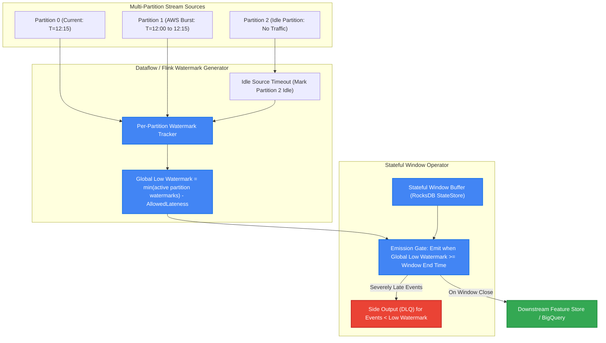
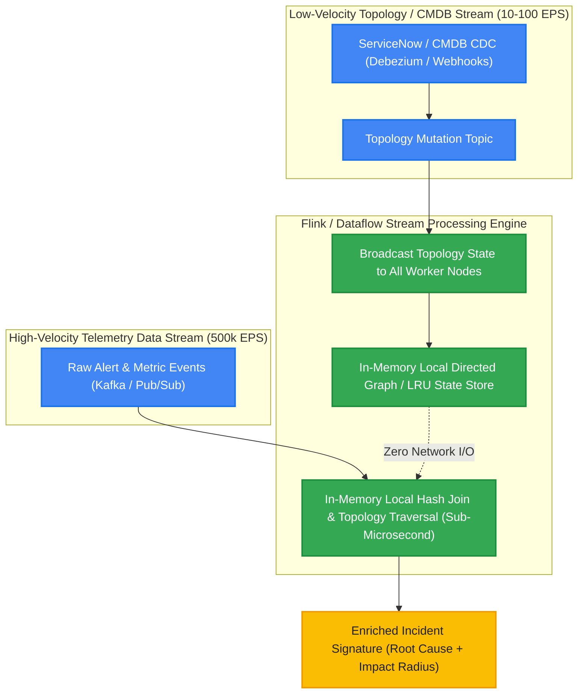
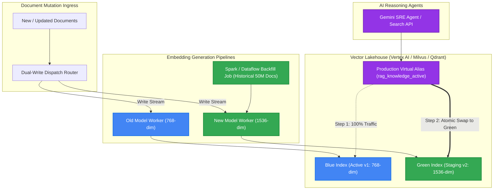
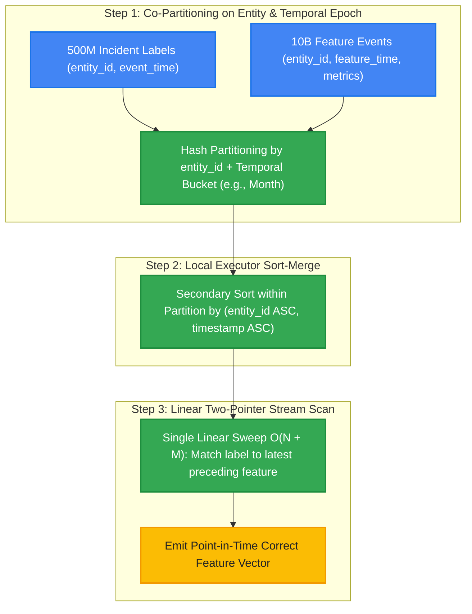
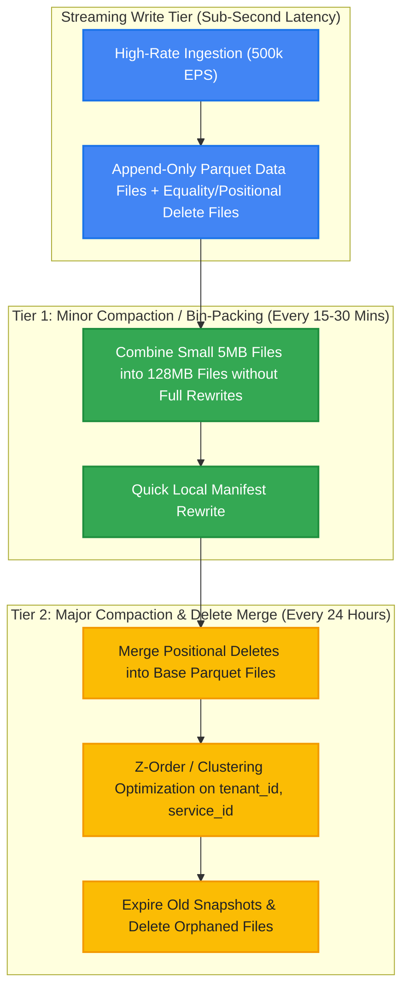
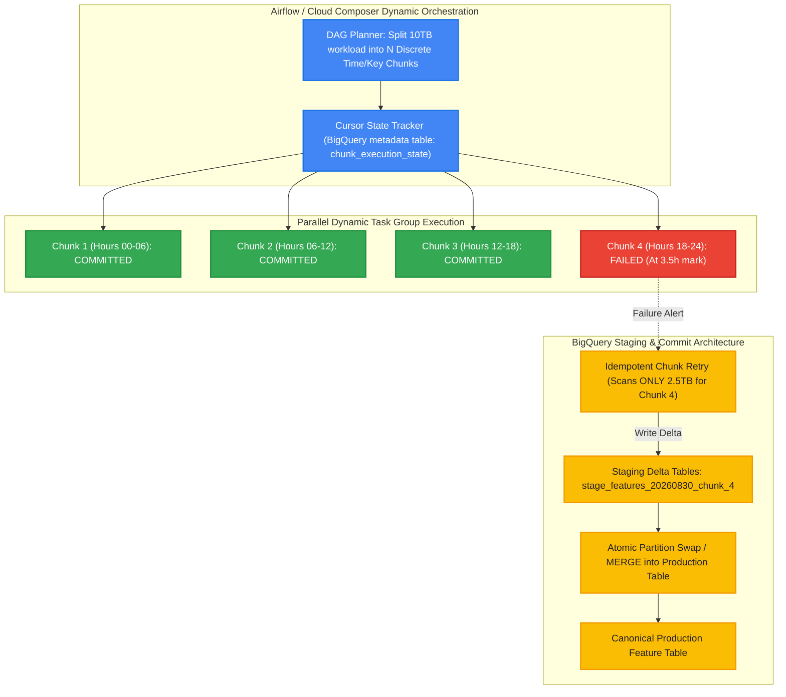

# Follow-Up Probes: Deep-Dive Technical Analysis & Master Answers (Data Engineering for AI)

This document provides exhaustive, Staff-level technical breakdowns for the follow-up probes in the **Data Engineer (AI & Production Big Data Systems) Interview Guide**. It reveals the interviewer psychology, under-the-hood mechanics, architectural diagrams, mathematical formulations, and master answers expected from top-tier Senior and Staff candidates.

---

## Index of Follow-Up Probes

1. [Probe 1: Watermark Lag & Network Burst Reconciliation in Distributed Streams](#probe-1-watermark-lag--network-burst-reconciliation-in-distributed-streams)
2. [Probe 2: Dynamic In-Stream CMDB Graph Enrichment at 500k EPS](#probe-2-dynamic-in-stream-cmdb-graph-enrichment-at-500k-eps)
3. [Probe 3: Zero-Downtime Migration of 50M Vectors Across Dimensional Spaces](#probe-3-zero-downtime-migration-of-50m-vectors-across-dimensional-spaces)
4. [Probe 4: Single-Stage Filtered Hybrid Search vs. Naive Post-Filtering](#probe-4-single-stage-filtered-hybrid-search-vs-naive-post-filtering)
5. [Probe 5: High-Performance AS-OF Temporal Joins at Multi-Billion Scale](#probe-5-high-performance-as-of-temporal-joins-at-multi-billion-scale)
6. [Probe 6: Merge-on-Read Compaction Strategies in Petabyte Lakehouses](#probe-6-merge-on-read-compaction-strategies-in-petabyte-lakehouses)
7. [Probe 7: Real-Time Feature Staleness Detection & Inference Graceful Degradation](#probe-7-real-time-feature-staleness-detection--inference-graceful-degradation)
8. [Probe 8: Compliant Break-Glass Re-Identification for Pseudonymized Telemetry](#probe-8-compliant-break-glass-re-identification-for-pseudonymized-telemetry)
9. [Probe 9: Self-Healing Dead-Letter Queue (DLQ) Schema Inference & Replay](#probe-9-self-healing-dead-letter-queue-dlq-schema-inference--replay)
10. [Probe 10: Spark Adaptive Query Execution (AQE) vs. Manual Key Salting](#probe-10-spark-adaptive-query-execution-aqe-vs-manual-key-salting)
11. [Probe 11: Semantic SQL Proxy & Dynamic FinOps Guardrails for AI Agents](#probe-11-semantic-sql-proxy--dynamic-finops-guardrails-for-ai-agents)
12. [Probe 12: Mid-Task Checkpointing & Chunked Resumption in Long-Running BigQuery DAGs](#probe-12-mid-task-checkpointing--chunked-resumption-in-long-running-bigquery-dags)

---

## Probe 1: Watermark Lag & Network Burst Reconciliation in Distributed Streams

> **Probe:** *"If a sudden network partition causes 15 minutes of buffered events from AWS to dump into GCP all at once, how does your watermark progress, and how do you prevent your sliding windows from emitting hundreds of duplicate or partial aggregations?"*

### 1. Interviewer Psychology & Trap
* **The Trap:** Candidates who give a textbook definition of watermarks often assume watermarks monotonically jump forward with the highest event timestamp in the incoming burst. If the watermark jumps immediately to $T_{\text{burst\_latest}}$, all subsequent interleaved events within that 15-minute gap will be treated as "late data" and dropped or emitted as partial garbage.
* **What We Look For:** A Staff engineer understands how distributed source watermarks are computed (minimum of partition watermarks), how watermarking algorithms (e.g., Punctuated vs. Periodic with Bounded-Out-Of-Orderness) handle sudden bursts, and how to configure idle-source detection and allowed lateness.

### 2. Under-the-Hood Technical Mechanics



### 3. Quantitative Formulation
In an $N$-partition distributed stream, the Global Low Watermark $W(t)$ at processing time $t$ is governed by:
$$W(t) = \min_{p \in \text{Active Partitions}} \left( \max_{e \in p} (T_{\text{event}}(e)) \right) - \Delta_{\text{allowed\_lateness}}$$

If an idle partition stops sending data, $W(t)$ stops advancing unless an **Idle Source Detection Timeout** ($\tau_{\text{idle}}$) temporarily excludes that partition from the $\min()$ aggregation.

### 4. Master Answer
"When a 15-minute buffered dump arrives from a reconnected cloud partition, two failure modes threaten window integrity:
1. **Partition Watermark Skew**: The reconnected partition has historical timestamps ($T=12:00$), while healthy partitions have modern timestamps ($T=12:15$). In Flink/Dataflow, the Global Low Watermark is computed as the *minimum* across all active partition watermarks minus the bounded out-of-orderness threshold ($\Delta$). Therefore, the global watermark does *not* jump forward to $12:15$; it gracefully holds at $12:00 - \Delta$ until the burst partition catches up.
2. **Preventing Premature Window Triggering & Storms**: To prevent emitting incomplete windows, we configure `AllowedLateness = 15 min` with an **Accumulating and Retracting Fire Trigger** or emit only upon full watermark traversal. For idle partitions that could hold back the watermark forever, we configure `withIdleness(Duration.ofMinutes(1))` so healthy streams are not indefinitely blocked.
3. **Severe Outliers**: Any residual event with $T_{\text{event}} < W(t)$ is routed via Flink `SideOutput` / Dataflow dead-letter PCollection to a historical reconciliation table in BigQuery, preserving 100% data fidelity without corrupting active real-time AI inference windows."

---

## Probe 2: Dynamic In-Stream CMDB Graph Enrichment at 500k EPS

> **Probe:** *"How do you handle topology enrichment in a 500k EPS stream when the dependency graph (CMDB) changes dynamically while the stream is running, without making millions of external REST API calls?"*

### 1. Interviewer Psychology & Trap
* **The Trap:** Candidates who propose calling ServiceNow REST APIs, Neo4j, or Redis synchronously per event will bottleneck the pipeline immediately. At 500,000 EPS, 500k network roundtrips per second would require an astronomical connection pool and induce tens of seconds of latency.
* **What We Look For:** Candidate proposes **Stream-Table Duality** or **Broadcast State Pattern** (e.g., Apache Flink Broadcast Stream or Apache Beam Side Inputs with dynamic refreshing).

### 2. Under-the-Hood Technical Mechanics



### 3. Master Answer
"At 500k EPS, making point-to-point network lookups against an external CMDB or graph database is an anti-pattern that violates production SLAs. Instead, we implement the **Broadcast State Pattern** (in Apache Flink) or **Dynamically Refreshed Side Inputs** (in Cloud Dataflow):
1. **CDC Stream for Graph Topology**: We capture all CMDB and service topology mutations from ServiceNow/cloud inventory via CDC (Debezium/Kafka) as a low-velocity control stream ($<100\text{ EPS}$).
2. **Broadcast State to Local Memory**: This control stream is broadcast to the local memory of every parallel worker processing the high-velocity telemetry stream ($500\text{k EPS}$). Each worker maintains a read-only in-memory adjacency list/graph state (e.g., in off-heap memory or local RocksDB).
3. **Sub-Microsecond Zero-I/O Lookups**: When an alert event arrives on a worker, the pipeline performs an in-memory hash join and upstream parent-service traversal in $<1\text{ }\mu\text{s}$ with zero network I/O.
4. **Consistency & Versioning**: Graph updates are versioned with a monotonic sequence ID. If an alert arrives with a topology version newer than the local broadcast cache, a short 100ms buffering window allows the broadcast state to synchronize before completing enrichment."

---

## Probe 3: Zero-Downtime Migration of 50M Vectors Across Dimensional Spaces

> **Probe:** *"When you decide to upgrade your embedding model from a 768-dimensional model to a 1536-dimensional model, how do you migrate 50 million production vectors with zero downtime and zero query degradation for active RAG agents?"*

### 1. Interviewer Psychology & Trap
* **The Trap:** Candidates who propose updating vectors in place or shutting down the vector search cluster to rebuild the index. In-place updates across differing dimensionalities ($768 \to 1536$) are impossible within the same index schema and would corrupt ongoing similarity computations.
* **What We Look For:** Candidate demonstrates a complete **Blue/Green Index Deployment with Dual-Writing, Asynchronous Backfilling, Shadow Scoring, and Atomic Aliasing**.

### 2. Under-the-Hood Technical Mechanics



### 3. Master Answer
"Migrating between incompatible vector dimensionalities requires a zero-downtime **Blue/Green Dual-Write and Alias Swap Strategy**:
1. **Dual-Writing Ingress**: We update the real-time ingestion router to dual-write incoming document updates. Worker A embeds into the 768-dim `Blue Index`, while Worker B embeds into the new 1536-dim `Green Index`.
2. **Distributed Offline Backfill**: A distributed Spark/Dataflow batch job reads the historical 50M documents from the lakehouse, chunks the text, batches inference calls through our GPU worker pool (TEI/Triton), and bulk-loads the 1536-dim vectors into `Green Index` using high-throughput bulk import endpoints.
3. **Idempotency & Version Reconciliation**: Vectors are keyed by `doc_id + chunk_id + content_hash`. Any document updated during the backfill naturally overwrites older embeddings in the Green index.
4. **Shadow Validation & Recall Benchmarking**: Before cutting over, we route 5% of production search queries in shadow mode (dual-querying both indices) to verify query latency, Mean Reciprocal Rank (MRR), and NDCG@10 on the 1536-dim index.
5. **Atomic Alias Cutover**: Once Green index parity is $100\%$, we execute an atomic index pointer update on the virtual search alias `rag_knowledge_active -> Green Index`.
6. **Graceful Decommissioning**: The Blue index is maintained in read-only mode for 48 hours as a rollback safety net before resources are reclaimed."

---

## Probe 4: Single-Stage Filtered Hybrid Search vs. Naive Post-Filtering

> **Probe:** *"Why does naive post-filtering (performing vector search for Top-100, then applying `WHERE tenant_id = 'XYZ'`) cause severe recall drops and empty result sets in multi-tenant RAG systems, and how do modern vector engines solve this?"*

### 1. Interviewer Psychology & Trap
* **The Trap:** Candidates who think filtering is a simple `WHERE` clause executed after cosine distance calculation. They fail to understand how vector space distributions interact with restrictive metadata filters in multi-tenant systems.
* **What We Look For:** Detailed mathematical and algorithmic explanation of **Post-filtering (Recall Collapse)** vs. **Pre-filtering (Index Inefficiency)** vs. **Single-Stage Filtered HNSW Traversal (Iterative Graph Search with In-Traversal Bitmaps)**.

### 2. Under-the-Hood Technical Mechanics

#### Naive Post-Filtering (Why it Collapses):
Suppose Tenant XYZ owns $1\%$ of the documents in a 10M vector store. A query asks for top $k=10$ nearest neighbors for Tenant XYZ.
If the engine retrieves the top $K_{\text{ann}} = 100$ global vectors, the expected number of vectors belonging to Tenant XYZ in that pool is:
$$E[\text{Tenant XYZ vectors}] = 100 \times 0.01 = 1 \text{ vector}$$
$99\%$ of the retrieved neighbors belong to other tenants and are discarded by the post-filter, returning only 1 result (or 0 results) instead of the requested 10. Recall drops to $\approx 10\%$.

#### Single-Stage In-Traversal Filtering (How Modern Engines Fix It):

```mermaid
flowchart TD
    QUERY["Agent Search Query + Filter: tenant_id = 'XYZ'"] --> BITMAP["Generate Roaring Bitmap of Valid Document IDs for tenant_id = 'XYZ'"]
    BITMAP --> HNSW_GRAPH["HNSW Graph Traversal Engine"]
    
    subgraph GraphTraverse["Iterative In-Traversal Step"]
        NODE["Inspect Candidate Node N in HNSW Graph"]
        CHECK{"Is Node ID present in Roaring Bitmap?"}
        EVAL_DIST["Calculate Vector Distance (Cosine / Dot Product)"]
        SKIP["Skip Score Computation but Traverse Outgoing Graph Edges"]
    end

    HNSW_GRAPH --> NODE
    NODE --> CHECK
    CHECK -->|Yes (Valid Tenant)| EVAL_DIST
    CHECK -->|No (Other Tenant)| SKIP
    EVAL_DIST --> ACCUM["Add to Priority Queue (Top-K Matches)"]
    SKIP -.->|Explore Neighbors| NODE
    ACCUM --> RETURN["Guaranteed Exactly K Relevant Matches for Tenant XYZ"]

    classDef query fill:#4285F4,stroke:#1A73E8,stroke-width:2px,color:#fff;
    classDef graph fill:#34A853,stroke:#1E8E3E,stroke-width:2px,color:#fff;
    classDef result fill:#FBBC04,stroke:#F29900,stroke-width:2px,color:#202124;

    class QUERY,BITMAP query;
    class HNSW_GRAPH,NODE,CHECK,EVAL_DIST,SKIP,ACCUM graph;
    class RETURN result;
```

### 3. Master Answer
"Naive post-filtering retrieves the Top-$N$ global nearest neighbors in vector space and then drops records where `tenant_id != target`. When a tenant represents a small percentage of total data (e.g., $1\%$), almost all Top-$N$ candidates belong to other tenants and get filtered out, resulting in empty returns and catastrophic recall failure.

To solve this, we utilize **Single-Stage In-Traversal Filtered Search** (supported in engines like Vertex AI Vector Search, Qdrant, and Milvus):
1. **Pre-Computed Roaring Bitmaps**: The engine evaluates the metadata predicate first using inverted indices, generating a compressed Roaring Bitmap of valid document IDs.
2. **In-Traversal Graph Routing**: During HNSW graph exploration, the search algorithm explores the structural connectivity of the graph across all nodes, but only evaluates vector similarity distance and admits nodes into the candidate priority queue if their bit is active in the filter bitmap.
3. **Dynamic Acorn / Filtered HNSW**: If the filter predicate is extremely restrictive ($<0.1\%$ of dataset), the engine dynamically falls back to an exact inverted index scan with vector ranking, preventing graph traversal disconnection. This guarantees that Top-$K$ results always return $K$ valid tenant records at high recall ($>99\%$) in $<10\text{ms}$."

---

## Probe 5: High-Performance AS-OF Temporal Joins at Multi-Billion Scale

> **Probe:** *"How do you optimize an AS-OF join query across 500 million incident labels and 10 billion metric feature events in BigQuery or Spark without causing massive shuffle memory spills?"*

### 1. Interviewer Psychology & Trap
* **The Trap:** Candidates who write an unconstrained Cartesian join `FROM labels l JOIN features f ON l.entity_id = f.entity_id WHERE f.timestamp <= l.timestamp` and attempt a `GROUP BY` with `MAX(f.timestamp)`. This produces an $O(N \times M)$ intermediate explosion, blowing up Spark driver/executor memory and failing on billions of records.
* **What We Look For:** Candidate structures the join using **Temporal Partition Co-Locality, Range Partitioning, Windowed Binary Search, or Native Engine AS-OF constructs**.

### 2. Under-the-Hood Technical Mechanics



### 3. Master Answer
"An unoptimized AS-OF join on 10 billion rows causes an explosive intermediate shuffle that results in executor Out-Of-Memory (OOM) errors. We optimize this into an $O(N \log N + M \log M)$ execution using **Co-Partitioning and Linear Two-Pointer Sorting**:
1. **Composite Range Co-Partitioning**: Both dataset streams are partitioned by `HASH(entity_id)` and coarsely bucketed by time (e.g., monthly). This guarantees that an entity's labels and metric history reside on the exact same Spark executor or BigQuery storage slot.
2. **Local Secondary Sorting**: Within each partition, records are sorted by `(entity_id ASC, timestamp ASC)`.
3. **Linear Sweep Two-Pointer Scan**: In Spark/Beam, we apply a custom map-partitions operator that maintains two pointers scanning forward through time. For each label timestamp $T_L$, the feature pointer advances to the largest $T_F \le T_L$. This replaces quadratic nested loops with a single $O(N + M)$ streaming sweep through local partition memory with zero shuffle spill.
4. **Engine Native AS-OF in BigQuery / DuckDB**: When executing in BigQuery/DuckDB, we leverage native `ASOF JOIN` syntax (`labels ASOF JOIN features ON labels.entity_id = features.entity_id AND labels.event_time >= features.feature_time`), which leverages storage-metadata indexing to prune irrelevant storage blocks."

---

## Probe 6: Merge-on-Read Compaction Strategies in Petabyte Lakehouses

> **Probe:** *"When using Merge-on-Read (MoR) in Apache Iceberg or Delta Lake, real-time read latency increases as deletion/equality vectors accumulate. What specific compaction strategy do you implement to balance write throughput against read SLA?"*

### 1. Interviewer Psychology & Trap
* **The Trap:** Candidates who say "just run full compaction every hour." Full compaction of petabyte tables burns massive cloud compute credits and creates write-conflict locks on concurrent ingestion jobs.
* **What We Look For:** Candidate articulates the difference between **Bin-Packing (Minor Compaction / Rewrite Data Files)** and **Full Sort/Z-Order (Major Compaction)**, and implements a multi-tier compaction scheduler based on file size thresholds and delete-file ratios.

### 2. Under-the-Hood Technical Mechanics



### 3. Master Answer
"Merge-on-Read (MoR) enables high-throughput streaming writes by writing delta/delete files rather than rewriting full 512MB Parquet blocks. However, as delete files accumulate, readers must perform expensive hash joins at query time to filter deleted rows.

We implement a **Two-Tier Compaction Strategy**:
1. **Tier 1 - Minor Compaction (Bin-Packing, every 15–30 mins)**:
   - Scans partitions where file sizes are $<32\text{ MB}$.
   - Combines small data files into optimal $128\text{ MB}-512\text{ MB}$ Parquet chunks without touching delete files.
   - Runs with lightweight compute resources, preserving streaming write concurrency.
2. **Tier 2 - Major Compaction (Delete Merge & Clustering, daily during off-peak hours)**:
   - Triggers when `delete_file_count / data_file_count > 0.2` on a partition.
   - Merges positional and equality delete vectors into the base Parquet files, producing clean, zero-delete Parquet files.
   - Re-applies Z-Ordering / clustering on `(tenant_id, service_id)` for high query pruning efficiency.
3. **Snapshot Lifecycle Governance**:
   - Calls `expire_snapshots()` to retain only the last 7 days of time-travel metadata, cleaning up unreferenced orphaned Parquet files from Cloud Storage."

---

## Probe 7: Real-Time Feature Staleness Detection & Inference Graceful Degradation

> **Probe:** *"If a critical hot feature's upstream Kafka consumer lags by 90 seconds during a Dataflow worker restart, how does your inference service detect the staleness, decide whether to proceed with a stale value or block the request, and propagate that decision for downstream model monitoring?"*

### 1. Interviewer Psychology & Trap
* **The Trap:** Candidates who assume online feature stores (Redis/Bigtable) are always fresh or propose failing the customer request immediately whenever feature lag is detected. This causes production service outages for non-critical feature delays.
* **What We Look For:** Candidate designs **Feature Metadata Envelopes (Value + Freshness Timestamp)**, calculates **Feature Staleness Budgets ($\Delta t_{\text{max}}$)**, and implements a **Tolerant Fallback & Observability Tagging Policy**.

### 2. Under-the-Hood Technical Mechanics

```mermaid
flowchart TD
    subgraph FeatureStore["Online Feature Store (Redis / Bigtable)"]
        VAL["Feature Value Blob: { cpu_rate: 94.2, timestamp_epoch: 1725028800 }"]
    end

    subgraph InferenceService["Real-Time Model Inference Service (FastAPI / Vertex AI)"]
        GET_FEAT["1. Fetch Feature + Metadata Timestamp (2ms)"]
        CALC_LAG["2. Compute Lag: Delta_t = Current_Time - Timestamp_Epoch"]
        EVAL_BUDGET{"Is Delta_t <= Max Staleness SLA (e.g., 30s)?"}
        FRESH["Proceed with Fresh Feature"]
        DEGRADE_CHECK{"Is Feature Critical or Secondary?"}
        FALLBACK["Apply Model Default Imputation / Baseline Z-Score"]
        BLOCK_ERR["Reject Request: Fallback to Deterministic Circuit Breaker Rule"]
        TAG_SPAN["3. Tag OpenTelemetry Span: model_feature_stale=true, lag_sec=90"]
        PREDICT["Execute Model Inference"]
    end

    subgraph DownstreamEval["Model Monitoring & Retraining (BigQuery)"]
        LOG_BQ["Logged Feature Vector + Staleness Flag in lakehouse_inference_logs"]
    end

    GET_FEAT --> CALC_LAG
    CALC_LAG --> EVAL_BUDGET
    EVAL_BUDGET -->|Fresh: <= 30s| FRESH
    EVAL_BUDGET -->|Stale: > 30s (e.g. 90s)| DEGRADE_CHECK
    DEGRADE_CHECK -->|Secondary Feature| FALLBACK
    DEGRADE_CHECK -->|Critical Safety Feature| BLOCK_ERR
    FRESH --> TAG_SPAN
    FALLBACK --> TAG_SPAN
    TAG_SPAN --> PREDICT
    PREDICT --> LOG_BQ

    classDef store fill:#4285F4,stroke:#1A73E8,stroke-width:2px,color:#fff;
    classDef process fill:#34A853,stroke:#1E8E3E,stroke-width:2px,color:#fff;
    classDef alert fill:#EA4335,stroke:#C5221F,stroke-width:2px,color:#fff;
    classDef action fill:#FBBC04,stroke:#F29900,stroke-width:2px,color:#202124;

    class VAL store;
    class GET_FEAT,CALC_LAG,FRESH,FALLBACK,TAG_SPAN,PREDICT process;
    class EVAL_BUDGET,DEGRADE_CHECK,BLOCK_ERR alert;
    class LOG_BQ action;
```

### 3. Master Answer
"Silent staleness in real-time feature stores produces degraded model predictions that can compromise anomaly detection. We handle feature lag through **Metadata Freshness Envelopes, Multi-Tier Staleness Budgets, and Observability Tagging**:
1. **Value + Timestamp Metadata Storage**: Features in Redis/Bigtable are stored not as raw scalars, but as structured records: `{"val": 94.2, "updated_at": 1725028800.12}`.
2. **Runtime Lag Calculation**: Upon retrieval, the inference service computes $\Delta t = t_{\text{current}} - t_{\text{updated}}$.
3. **Multi-Tier Feature Freshness Policy**:
   - **Tier 1 (Non-Critical Features)**: If $\Delta t > 30\text{s}$, the service proceeds with the stale value but tags the inference span with `feature_staleness_flag=True` and `lag_seconds=90`.
   - **Tier 2 (Critical Anomaly Triggers)**: If $\Delta t > \Delta t_{\text{critical\_budget}}$ (e.g., 60s), the service substitutes a safe imputed baseline (e.g., historical rolling mean) or invokes the deterministic rule circuit breaker.
4. **Audit Logging & Training Masking**: The exact feature snapshot, along with its staleness flags, is logged asynchronously to BigQuery `inference_audit_logs`. During offline model evaluation, records tagged with `feature_staleness_flag=True` are isolated to evaluate whether model predictions were harmed by feature lag, preventing contaminated data from polluting future training datasets."

---

## Probe 8: Compliant Break-Glass Re-Identification for Pseudonymized Telemetry

> **Probe:** *"If a downstream SRE engineer legitimately needs to decrypt a pseudonymized user ID to resolve a critical Sev-1 incident, how do you architect a break-glass re-identification workflow that remains strictly audited and compliant?"*

### 1. Interviewer Psychology & Trap
* **The Trap:** Storing the decryption key in an environment variable or giving SREs direct query access to a plaintext lookup table. This violates GDPR Article 32 and PCI-DSS compliance audits.
* **What We Look For:** Candidate designs a cryptographic **Envelope Pseudonymization & Ephemeral Key-Exchange Architecture** governed by ServiceNow incident approval, short-lived IAM credentials, and immutable audit logging.

### 2. Under-the-Hood Technical Mechanics

```mermaid
flowchart TD
    subgraph IncidentContext["Sev-1 Incident Triage"]
        SRE["On-Call SRE Engineer"]
        SNOW["ServiceNow Sev-1 Incident Record (Approved State)"]
    end

    subgraph SecurityBroker["Break-Glass Cryptographic Proxy (Cloud Run / KMS)"]
        GATEWAY["Break-Glass IAM Token Exchange Gateway"]
        KMS["Cloud KMS (Hardware HSM Key: Key-Encryption-Key)"]
        AUDIT["Immutable Audit Log (Cloud Audit Logs -> Cloud Storage Lock)"]
    end

    subgraph BigQueryLake["Encrypted BigQuery Lakehouse"]
        VAULT["Secure Identity Vault (Salted HMAC Hash <-> Encrypted DEK Blob)"]
    end

    SRE -->|Request Break-Glass Token with Incident #| SNOW
    SNOW -->|Verify State & Manager Approval| GATEWAY
    GATEWAY -->|Log Reason & SRE Identity| AUDIT
    GATEWAY -->|Request Ephemeral KMS Decrypt| KMS
    GATEWAY -->|Retrieve Encrypted DEK| VAULT
    KMS -->|Return Ephemeral Decryption Key (15 Min TTL)| GATEWAY
    GATEWAY -->|Return Plaintext Identifier for Specific Incident Scope| SRE

    classDef actor fill:#4285F4,stroke:#1A73E8,stroke-width:2px,color:#fff;
    classDef security fill:#EA4335,stroke:#C5221F,stroke-width:2px,color:#fff;
    classDef data fill:#34A853,stroke:#1E8E3E,stroke-width:2px,color:#fff;

    class SRE,SNOW actor;
    class GATEWAY,KMS,AUDIT security;
    class VAULT data;
```

### 3. Master Answer
"In-flight telemetry replaces raw PII with deterministic HMAC-SHA256 tokens using a rotating cryptographic salt. To enable audited break-glass re-identification during Sev-1 outages:
1. **Separation of Identity Vault**: The mapping between `HMAC_Token` and encrypted `PII_Ciphertext` is stored in an isolated, restricted BigQuery dataset protected by Customer-Managed Encryption Keys (CMEK) and Row-Level Security. SREs have zero direct read permissions on this table.
2. **ServiceNow Incident Gating**: The SRE triggers a break-glass workflow by submitting the active Sev-1 incident ID. An automated IAM broker validates with ServiceNow that the incident is verified active and assigned to the requesting user.
3. **Short-Lived Ephemeral Token**: Upon approval, Cloud KMS generates a time-bounded (15-minute TTL) decryption key that decrypts *only* the specific HMAC tokens tied to the incident scope.
4. **Immutable Audit Logging**: Every decryption event writes an immutable Cloud Audit Log entry containing the SRE identity, incident number, timestamp, and accessed token hash, which is replicated to an immutable Cloud Storage bucket with Object Retention Lock."

---

## Probe 9: Self-Healing Dead-Letter Queue (DLQ) Schema Inference & Replay

> **Probe:** *"How do you structure the metadata envelope in your DLQ messages to enable automated schema-inference and self-healing replay pipelines?"*

### 1. Interviewer Psychology & Trap
* **The Trap:** Dumping the raw payload string into an error topic without metadata. Downstream consumers cannot know why it failed, which pipeline version processed it, or how many retry attempts occurred.
* **What We Look For:** Candidate defines a standardized **CloudEvents-compliant DLQ Envelope** with diagnostic metadata, failure categorizations, and automated routing for quarantine vs. self-healing replay.

### 2. Standardized DLQ Envelope Specification

```json
{
  "specversion": "1.0",
  "id": "dlq-7f9a8b1c-34d2-4e91",
  "source": "/ingestion/pipelines/telemetry-processor-v3",
  "type": "com.aiops.error.schema_violation",
  "time": "2026-08-30T13:45:00.120Z",
  "datacontenttype": "application/json",
  "data": {
    "raw_payload_base64": "eyJldmVudF9pZCI6ICJ4eXoiLCAibmV3X2ZpZWxkIjogOTl9",
    "error_metadata": {
      "error_code": "ERR_SCHEMA_VALIDATION_FAILED",
      "error_message": "Field 'latency_ms' expected FLOAT, received STRING 'NaN'",
      "failing_step": "DataContractValidator_DoFn",
      "pipeline_id": "dataflow-telemetry-prod-08",
      "retry_count": 3,
      "first_failed_at": "2026-08-30T13:44:50.000Z",
      "producer_id": "payment-auth-service-us-east"
    },
    "schema_context": {
      "expected_schema_id": "proto.telemetry.v2.MetricPayload",
      "inferred_diff": "+ field 'new_field' (INT64)"
    }
  }
}
```

### 3. Master Answer
"A resilient DLQ must be self-describing to support automated triage and zero-data-loss replay:
1. **Standardized Envelope**: Every failed message is wrapped in a CloudEvents-compatible schema containing:
   - `raw_payload_base64`: Preserves byte-for-byte fidelity of the unparseable message.
   - `error_metadata`: Error classification (`DESERIALIZATION_ERROR`, `SCHEMA_MISMATCH`, `DLP_REDACTION_TIMEOUT`), retry count, execution host, and stack trace.
   - `schema_context`: Registered schema version versus observed payload diff.
2. **Automated Triage Classifier**: A lightweight Cloud Function / Kafka Streams app listens to the DLQ. If the failure is classified as **Transient/Parser-Bug** and a new pipeline version is deployed, it triggers an automated batch replay into the primary ingress topic.
3. **Automated Data Contract Violation Alerts**: If the failure is classified as an **Unannounced Producer Schema Mutation**, an automated notification is dispatched to the producer team containing the exact schema diff, while isolating the traffic to prevent pipeline degradation."

---

## Probe 10: Spark Adaptive Query Execution (AQE) vs. Manual Key Salting

> **Probe:** *"Explain how Spark Adaptive Query Execution (AQE) handles skewed joins automatically at runtime, and when does AQE fail, requiring manual key salting?"*

### 1. Interviewer Psychology & Trap
* **The Trap:** Claiming that AQE solves 100% of data skew problems and manual salting is obsolete.
* **What We Look For:** Candidate understands the exact internal mechanics of AQE skew join optimization (`spark.sql.adaptive.skewJoin.enabled`), its partition-splitting limitations, and scenarios where AQE fails (e.g., skewed Cartesian joins, non-equi joins, or grouping before shuffle).

### 2. Under-the-Hood Technical Mechanics

```mermaid
flowchart TD
    subgraph AQESkewHandling["How Spark AQE Skew Join Optimization Works"]
        PART_STATS["Stage 1: Runtime Shuffle Map Statistics Collected"]
        DETECT{"Is Partition Size > skewJoin.skewedPartitionFactor * Median AND > thresholdInBytes?"}
        SPLIT["Split Skewed Partition P0 into N Sub-Partitions (P0_1, P0_2)"]
        DUPLICATE["Duplicate Matching Partition on Side B (B0 -> B0_1, B0_2)"]
        PARALLEL_JOIN["Join Sub-Partitions in Parallel across N Executor Tasks"]
    end

    PART_STATS --> DETECT
    DETECT -->|Yes (Skew Detected)| SPLIT
    SPLIT --> DUPLICATE
    DUPLICATE --> PARALLEL_JOIN
    DETECT -->|No| NORMAL_JOIN["Standard Sort-Merge Join"]

    classDef check fill:#4285F4,stroke:#1A73E8,stroke-width:2px,color:#fff;
    classDef process fill:#34A853,stroke:#1E8E3E,stroke-width:2px,color:#fff;
    classDef action fill:#FBBC04,stroke:#F29900,stroke-width:2px,color:#202124;

    class DETECT check;
    class PART_STATS,SPLIT,DUPLICATE process;
    class PARALLEL_JOIN,NORMAL_JOIN action;
```

### 3. Quantitative Formulation of AQE Skew Detection
Spark flags a partition as skewed when:
$$\text{PartitionSize} > \text{MedianPartitionSize} \times \text{skewedPartitionFactor} \quad \text{AND} \quad \text{PartitionSize} > \text{skewedPartitionThresholdInBytes}$$
*(Defaults: factor = 5, threshold = 64 MB).*

### 4. Master Answer
"Spark Adaptive Query Execution (AQE) mitigates join skew dynamically at runtime:
1. **How AQE Works**: After the shuffle map stage, AQE inspects actual partition size statistics. If a partition exceeds the median size by a factor of 5 and is larger than 64MB, Spark splits that large partition into smaller sub-partitions and duplicates the corresponding partition from the other join side, executing the join in parallel without executor OOM.
2. **Where AQE Fails**:
   - **Skew in `groupByKey` / `reduceByKey` Aggregations**: AQE skew optimization applies *only to joins*, not to stateful streaming aggregations or `GROUP BY` operations on high-cardinality skewed keys.
   - **Extreme Single-Key Skew**: If billions of records share a single null or `'default'` key within a single record stream, splitting partitions still incurs massive overhead if the records cannot be divided evenly.
   - **Non-Equi Joins and Broadcast Disables**: AQE cannot optimize joins without equality predicates.
3. **When Manual Salting is Mandatory**: For heavy `GROUP BY` aggregations on skewed telemetry keys (e.g., 90% of logs have `tenant_id = 'system'`), we manually append a random salt $k \in [0, 63]$ to the key: `salted_key = CONCAT(tenant_id, '_', CAST(RAND() * 64 AS INT))`. We perform an intermediate aggregation on `salted_key` (reducing data volume by $99\%$), strip the salt, and perform the final global rollup."

---

## Probe 11: Semantic SQL Proxy & Dynamic FinOps Guardrails for AI Agents

> **Probe:** *"How do you design a semantic proxy layer between autonomous AI agents and BigQuery that enforces query cost estimation, semantic caching, and dynamic query rewriting before any SQL hits the database engine?"*

### 1. Interviewer Psychology & Trap
* **The Trap:** Letting LLM agents execute arbitrary SQL strings directly against BigQuery using a broad Service Account. A single hallucinated `CROSS JOIN` or unpartitioned `SELECT *` over 500TB will cost $3,125 per query.
* **What We Look For:** Candidate designs an **Intermediary SQL Semantic Proxy & Query Firewall** with dry-run estimation, token-based semantic caching, partition injection, and strict quota enforcement.

### 2. Under-the-Hood Technical Mechanics

```mermaid
flowchart TD
    AGENT["Autonomous Gemini SRE Agent"] -->|Generated SQL Query| PROXY["Semantic SQL Proxy & Firewall (FastAPI / Rust)"]

    subgraph SecurityAndFinOps["Semantic SQL Proxy Guardrail Engine"]
        LINT["1. SQL Parser & AST Analyzer (sqlglot / Calcite)"]
        CHECK_RULES{"AST Security Check: Reject SELECT *, Require Partition Filter"}
        SEM_CACHE{"2. Vector Semantic Cache Lookup (Redis / Qdrant)"}
        DRY_RUN["3. BigQuery Dry-Run API (Bytes Billed Calculation)"]
        COST_GATE{"Bytes Scanned <= Max Budget Threshold (e.g. 25 GB)?"}
    end

    subgraph StorageEngine["BigQuery Storage Engine"]
        BQ_EXEC["Execute Query on BigQuery Enterprise Slots"]
    end

    PROXY --> LINT
    LINT --> CHECK_RULES
    CHECK_RULES -->|Passed| SEM_CACHE
    CHECK_RULES -->|Failed (SELECT * or No Filter)| REJECT_LINT["Reject to Agent with Specific AST Error"]
    SEM_CACHE -->|Cache Hit (Exact / Semantic)| RETURN_CACHE["Return Cached Result (0ms, $0.00)"]
    SEM_CACHE -->|Cache Miss| DRY_RUN
    DRY_RUN --> COST_GATE
    COST_GATE -->|Yes| BQ_EXEC
    COST_GATE -->|No (Exceeds 25 GB)| REJECT_COST["Reject Query: Estimated Cost Exceeds Budget"]
    BQ_EXEC --> CACHE_PUT["Update Semantic Cache"]
    CACHE_PUT --> RESULT["Return Clean Result to Agent"]

    classDef agent fill:#9334E6,stroke:#7627BB,stroke-width:2px,color:#fff;
    classDef proxy fill:#4285F4,stroke:#1A73E8,stroke-width:2px,color:#fff;
    classDef allow fill:#34A853,stroke:#1E8E3E,stroke-width:2px,color:#fff;
    classDef reject fill:#EA4335,stroke:#C5221F,stroke-width:2px,color:#fff;

    class AGENT agent;
    class PROXY,LINT,DRY_RUN proxy;
    class RETURN_CACHE,BQ_EXEC,CACHE_PUT,RESULT allow;
    class CHECK_RULES,SEM_CACHE,COST_GATE proxy;
    class REJECT_LINT,REJECT_COST reject;
```

### 3. Master Answer
"Autonomous AI agents must never have direct write or execution access to cloud data warehouses. We place a **Semantic SQL Proxy & Query Firewall** between the LLM agent and BigQuery:
1. **Abstract Syntax Tree (AST) Inspection & Rewriting**: The proxy parses incoming SQL using `sqlglot`. It rejects any query containing `SELECT *`, non-indexed table scans, or dangerous DDL/DML. If partition filters are missing, the AST rewriter dynamically injects default lookback bounds (`timestamp >= NOW() - INTERVAL 6 HOUR`).
2. **Semantic Result Caching**: Frequent queries (e.g., 'Check error rate for service X over last hour') are hashed semantically. Results are cached in Redis with a 60-second TTL, serving repeat agent queries at $0.00$ cost and $<5\text{ms}$ latency.
3. **Dry-Run Pre-Flight Cost Estimation**: If a cache miss occurs, the proxy calls the BigQuery Dry-Run API (`dry_run=True`), which computes exact bytes to be scanned without executing the query.
4. **Hard Cost Gate & Execution Quota**: If the estimated scan exceeds $25\text{ GB}$ (or $\$0.15$), the query is blocked, and the proxy returns a structured error to the LLM: *'Query rejected: Scan size (1.2 TB) exceeds 25 GB limit. Narrow your time filter or filter by service_id'*, prompting the agent to refine its SQL autonomously without incurring unexpected billing."

---

## Probe 12: Mid-Task Checkpointing & Chunked Resumption in Long-Running BigQuery DAGs

> **Probe:** *"If Stage 3 is a 4-hour BigQuery transformation that processes 10TB of data and fails after 3.5 hours, what specific strategies do you use to implement mid-task checkpointing so that a retry resumes from the 3.5-hour mark rather than restarting the full 10TB scan?"*

### 1. Interviewer Psychology & Trap
* **The Trap:** Candidates who propose simply bumping task timeouts, adding global Airflow retries, or writing huge monolithic `INSERT INTO ... SELECT` queries that fail atomically after 3.9 hours. Monolithic queries restart from zero on transient network drops or slot preemption, burning terabytes of redundant query scans.
* **What We Look For:** Candidate demonstrates knowledge of **Micro-Partition Dynamic Task Mapping**, **Deterministic Staging Cursors**, **Stateful Delta Materialization Tables**, and **Two-Phase Atomic Table Swaps (`MERGE` / Partition Copy)**.

### 2. Under-the-Hood Technical Mechanics



### 3. Master Answer
"Running a single monolithic 4-hour query over 10TB without checkpointing is an anti-pattern that violates production reliability. We architect mid-task resumption using **Dynamic Chunk Mapping and Delta Staging Cursors**:
1. **Dynamic Task Chunking**: Instead of one monolithic query, we use Airflow Dynamic Task Mapping (`.expand()`) to divide the 10TB dataset into $N$ discrete temporal or hash-keyed chunks (e.g., 4 chunks of 6-hour windows, $\approx 2.5\text{ TB}$ each).
2. **Stateful Checkpoint Ledger**: A lightweight BigQuery metadata table (`etl_checkpoint_state`) records `(dag_run_id, chunk_id, status, rows_written, commit_hash)`.
3. **Idempotent Delta Staging Tables**: Each chunk task writes to an isolated intermediate staging table `stage_feature_chunk_{chunk_id}` with deterministic overwrite semantics (`CREATE OR REPLACE TABLE`).
4. **Resumption on Failure**: When Stage 3 fails after 3.5 hours on Chunk 4, Chunks 1, 2, and 3 are already marked `COMMITTED`. The Airflow retry runner queries the checkpoint ledger, skips Chunks 1–3, and re-executes *only Chunk 4* ($\approx 2.5\text{ TB}$ scan instead of the full 10TB), finishing in 30 minutes instead of 4 hours.
5. **Final Atomic Commit**: A fast consolidation task executes an atomic partition swap or multi-part merge into the production table once all chunks pass checksum verification."


